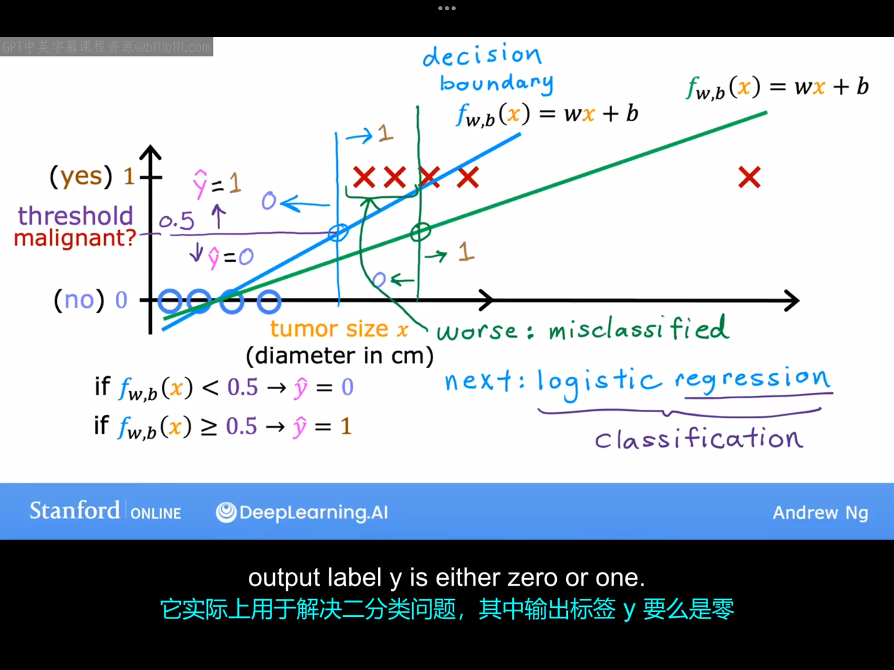
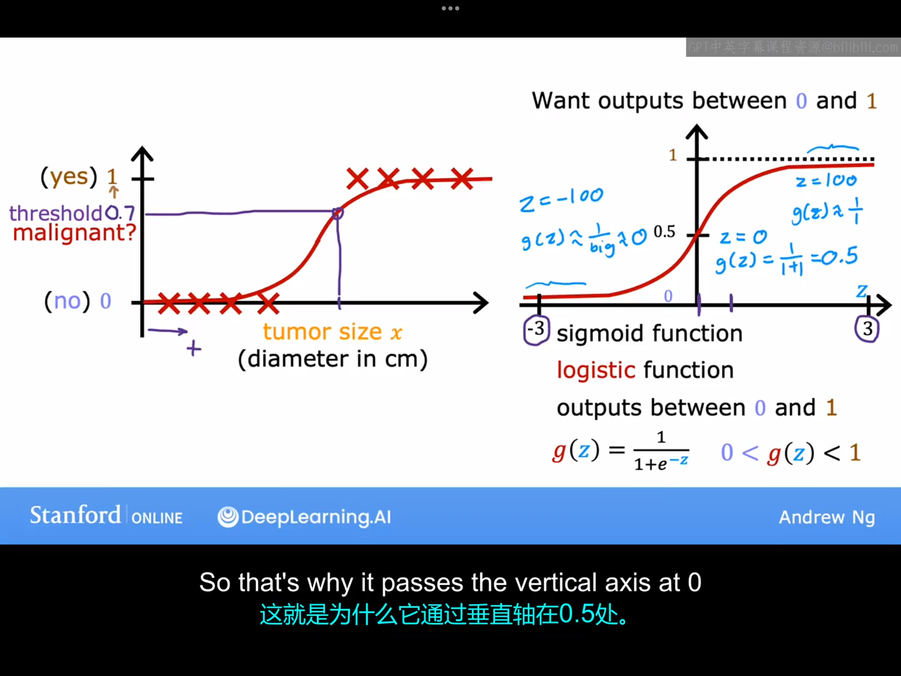
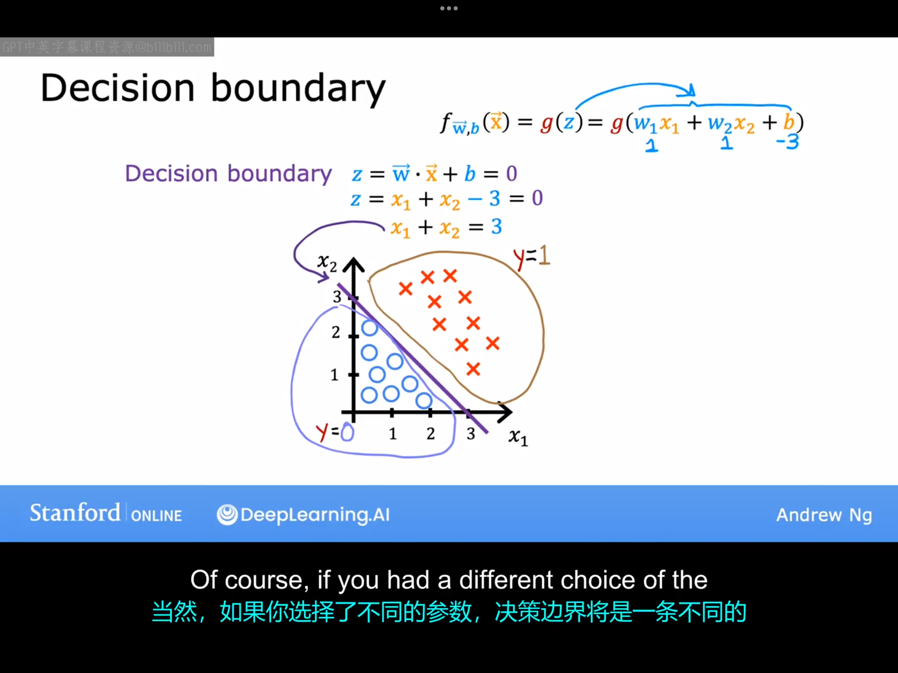
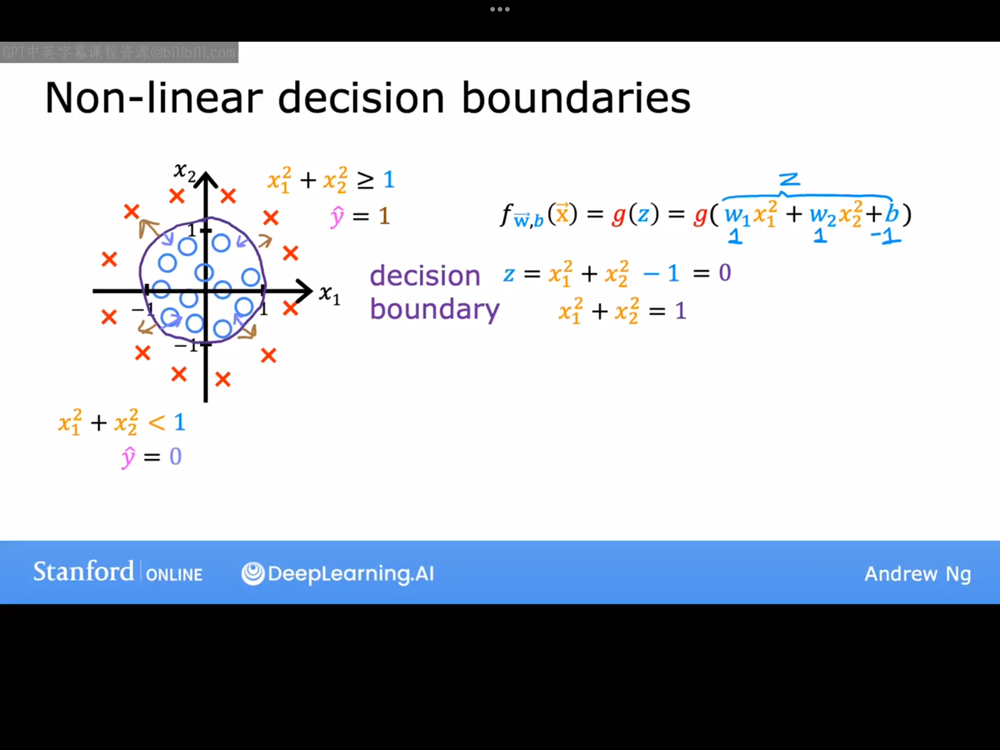

# 7.1 motivition
上周，我们学习了线性回归，它用于预测一个数值。本周我们将学习分类，它的输出变量y只能取一小部分可能值之一，而不是无限范围内的任意数值。事实证明，线性回归并不是解决分类问题的良好算法，（关于这点，我们下面会举例说明。）这将导致我们不得不发展一种新的算法，称为逻辑回归，这是当今最流行和广泛使用的学习算法之一，以下是一些分类问题的示例：
|Question|Answer "y"|
|---|---|
|Is this email spam? Is the trnsaction fraudulent Is the tumor malignant|no yes no yes no yes|

在这些问题中，您希望预测的变量只能是两个可能值之一。这种只有两个可能输出的分类问题叫做“二元分类”（binary classification）。“二元”指的是只有两个可能的类别或者两个可能的分类。在下面的内容中，我将不加区分地使用"class"与"category"这两个术语。按照惯例，我们可以用几种常见的方式来指代这两个类别或分类。我们通常将类别指定为"no"或"yes",有时等同于"true"或"false"，还有时会使用计算机科学里面的"0"和"1"。我们通常会使用数字"0"和"1"来表示答案y,因为这将最符合我们想要实现的这类学习算法。常用的术语是将"false"和"0"类称为负类（negative class）,将"true"和"1"类称为正类。例如，在垃圾邮件分类中，一封不是垃圾邮件的电子邮件可能被称为负类，因为它对“是否为垃圾邮件”的问题的输出是“false” or "0"。需要明确的是，负和正并不意味着坏与好。这里的正负只代表一个对立的概念。所以规定哪种情况对应正类，哪种情况对应负类是无所谓的。那么，如何构建一个分类算法呢，这里是一个用于分类肿瘤是否为恶性的训练集示例：

我们这里将良性肿瘤定义为"0",将恶性肿瘤定义为"1"。一开始，假设数据集不包括最右上方的那个点，我们先使用线性回归法拟合出了蓝色的那条直线。接下来我们貌似可以这样操作；先选择一个阈值，比如0.5,然后使用该线性回归模型，如果某次预测的输出变量$y\geq0.50$,则判断该肿瘤是恶性的，反之则为良性。这时候我们可以求出回归直线上纵坐标为0.5的点对应的横坐标，并做一条垂直于x轴的直线，当输入特征x在这条垂线的右边时，可以认为该肿瘤为恶性肿瘤。
至此，我们看到，线性回归算法在这个特定的数据集上貌似可以工作，但实际上，数据集一旦发生改变，该算法就会出现很大的问题。例如，如果数据集包含了最右边的那个点，这时依靠线性回归算法得到的直线如图中绿色直线所示，这时如果依然选取0.5作为阈值，决策边界（那条绿色的垂直于x轴的直线）会右移，这时显然以来此模型预测出来的结果与真实结果就会存在较大的差异。
为了解决分类问题，我们将在下节课介绍一个称为逻辑回归的算法，其中输出值将始终处于0~1之间。顺便说一下，关于逻辑回归这个名字的一个令人困惑的地方是，尽管它包含"回归"这个词，但它实际上用于分类问题，实际上它将用于解决二分类问题

# 7.2 逻辑回归

这节课我们来谈谈逻辑回归算法，这可能是世界上使用最广泛的分类算法了。让我们继续以判断一个肿瘤是否为恶性肿瘤为例，数据集如下图所示：

上节课我们看到，用线性回归算法是解决不了这个问题的。相比之下，逻辑回归最终会拟合这样出一条s型曲线（如上图中左图所示），如果这时候我们某个输入特征x对应于曲线上的点的纵坐标是0.7，则代表这个肿瘤大概率是恶性的（数字0.7具体代表什么我们后面会说）。
为了构建逻辑回归算法，这里必须得引入一个函数——sigmod函数（有时又称逻辑函数），其数学表达式为：
$$
g(z)=\frac{1}{e^{-z}+1}
$$
其函数图像如上图中右图所示，现在，让我们用这个函数来构建逻辑回归算法。
第一步：构建一个线性函数$z=\vec{w}\cdot\vec{x}+b$
第二步：将第一步得到的z代入sigmod函数：$g(z)=\frac{1}{e^{-z}+1}$。
经过上面两步我们就得到了逻辑回归模型：
$$
f_{\vec{w},b}(x)=g(\vec{w}\cdot\vec{x}+b)=\frac{1}{e^{-(\vec{w}\cdot\vec{x}+b)}+1}
$$
它的作用是输入一组特征x,然后输出一个介于0~1之间的数。那么，到底应该如何理解逻辑函数回归模型的输出呢？我们一般这样去理解：逻辑回归模型的输出是当给定输入x时，输出值y为1的概率，即：
$$
f_{\vec{w},b(x)}=p(y=1|x,\vec{w},b)
$$
学到这里，我们知道了什么是逻辑回归模型以及定义逻辑回归的数学公式，在很长一段时间内，很多互联网广告实际上都是由逻辑回归的一个小变种驱动的。下节课，我们将更深入地了解逻辑回归，我们将看到一些可视化内容，并研究所谓的决策边界，浙江为你提供几种不同的方法，将模型输出的数字（如0.3,0.7）映射到y实际上是0还是1。

# 7.3 决策边界（decision boundary）
 上节课我们引入了sigmod函数并定义了逻辑回归模型：
 $$
 f_{\vec{w},b}(x)=g(\vec{w}\cdot\vec{x}+b)=\frac{1}{1+e^{-(\vec{w}\cdot\vec{x}+b)}}=p(y=1|\vec{x};\vec{w},b)
 $$
显然，模型f的输出值是一个处于0~1之间的数，那现在你如何去决定该模型输出的某个数字对应于y=0还是y=1呢？一种做法是设置一个阈值，高于该阈值时预测$\hat{y}$为1，低于该阈值时预测$\hat{y}$为0。一个常见的选择是选择0.5的阈值，因此如果$f(x)\geq0.5$时，则预测$\hat{y}=1$,反之则为0。接下来我们将更深入探讨何时应预测$\hat{y}=1$，即何时如下条件会被满足:
$f_{\vec{w},b}(x)\geq0.5 \leftrightarrow g(z)\geq0.5\leftrightarrow z\geq0 \leftrightarrow \vec{x} \cdot \vec{w}+b \geq 0$

下面我们将举一个有两个输入特征的分类问题，数据集如下图所示，圆圈代表负类，红叉代表正类：
这里我们依旧将阈值设置为0.5，这时预测$\hat{y}=0 \space or 1$的分界线就是如上节课所讨论的：
$$
w_1x_1+w_2x_2+b=0
$$
假设模型中参数$w_1=1,w_2=1,b=-3$,上式就对应于图中那条紫色的直线，这条线也被我们称之为决策边界。选择不同的参数，决策边界就对应于不同的直线。
下面我们再看一个更复杂的例子，其中决策边界不再是一条直线。

针对如图所示的数据集，我们假设$z=w_1x_1^2+w_2x_2^2+b$,此时决策边界依旧由z=0来确定，如果参数$w_1=1，w_2=1,b=-1$,则此时决策边界对应于图上那个圆环。实际上，还有很多更加复杂的决策边界，这完全取决于你的数据集。换句话说，逻辑回归适用于相当复杂的数据。当然，如果你的z中不包括任何的高阶项，只包括一阶的特征，那么决策边界始终是一条直线。
下节课我们将学习如何具体地训练一个逻辑回归模型，我们将从查看逻辑回归的代价函数开始，之后再弄清楚如何对其应用梯度下降。
