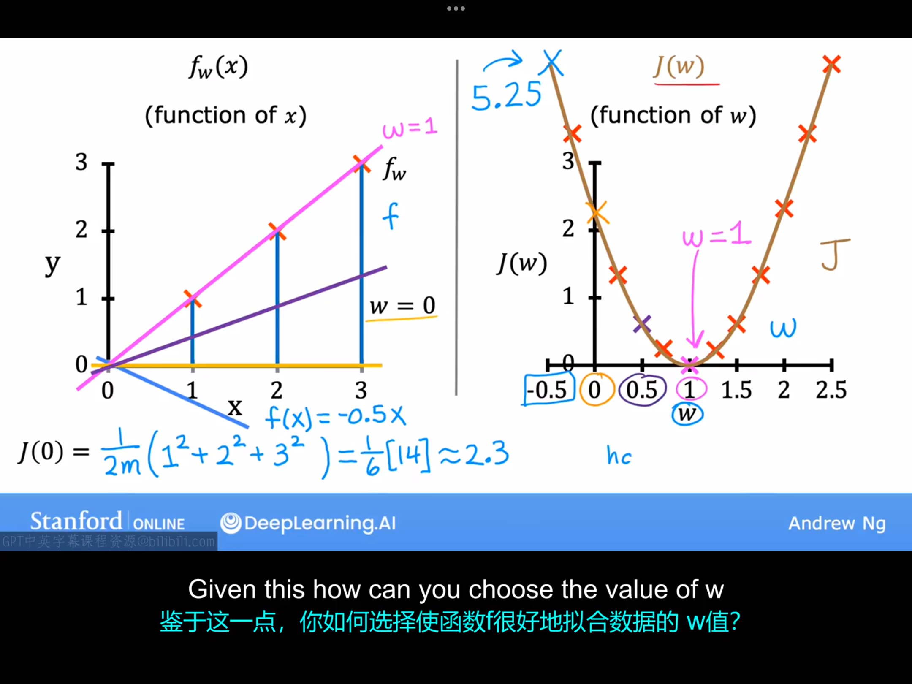
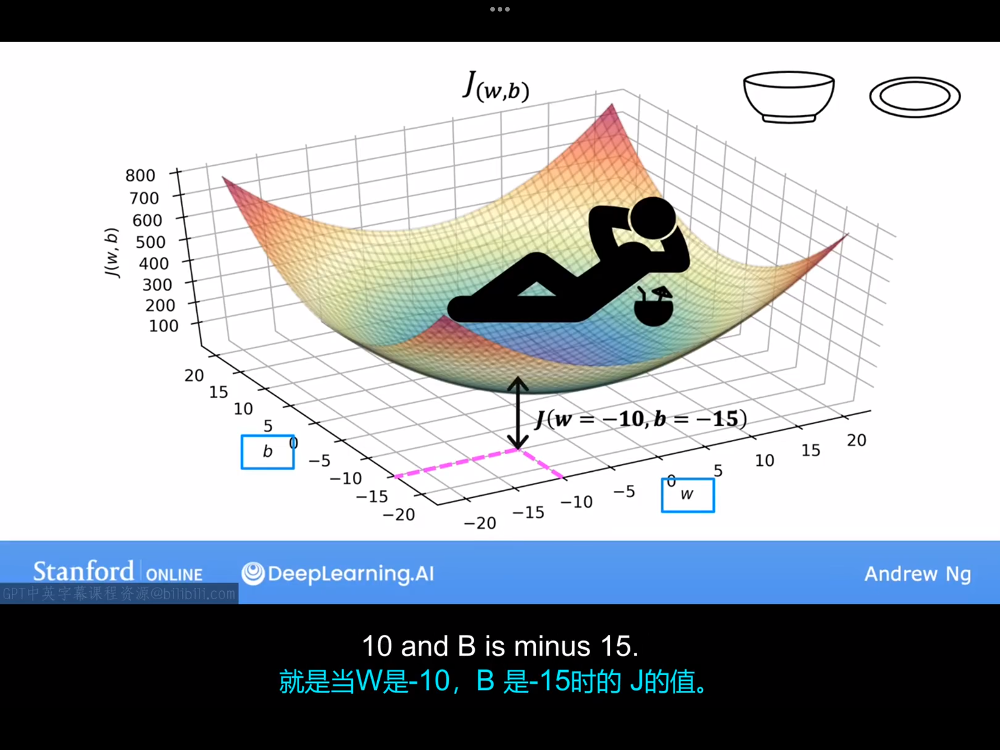
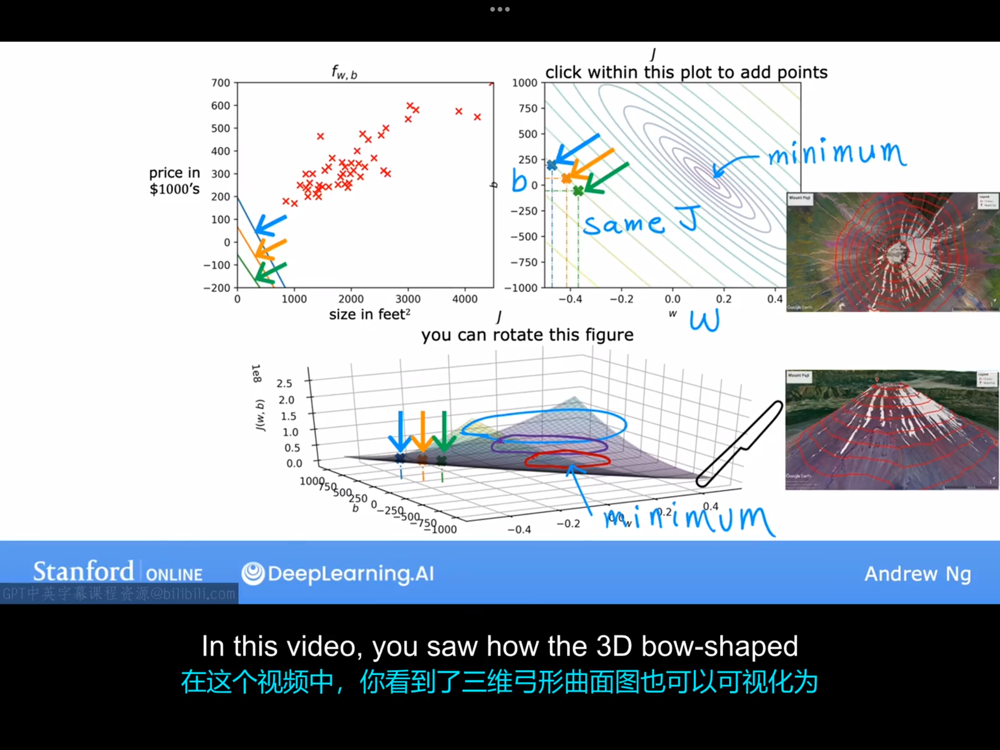
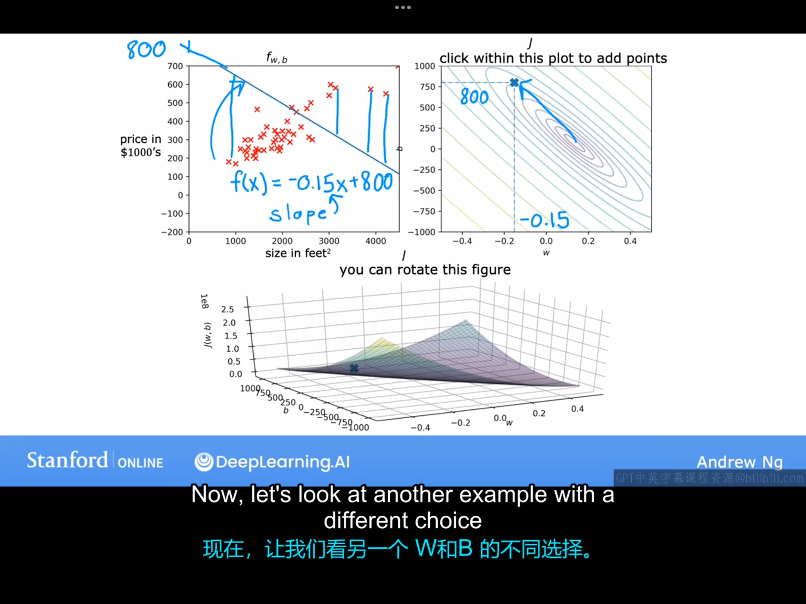
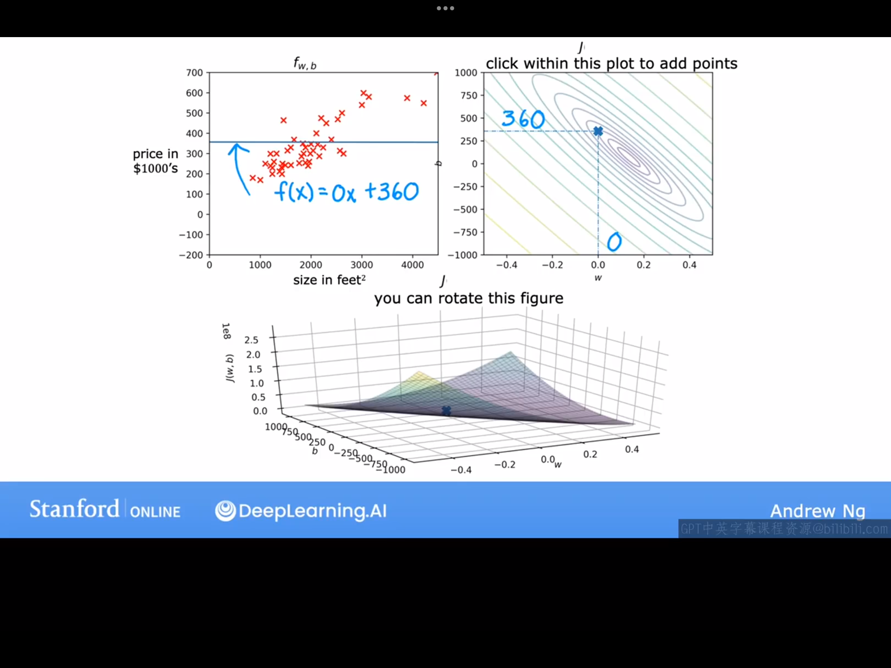
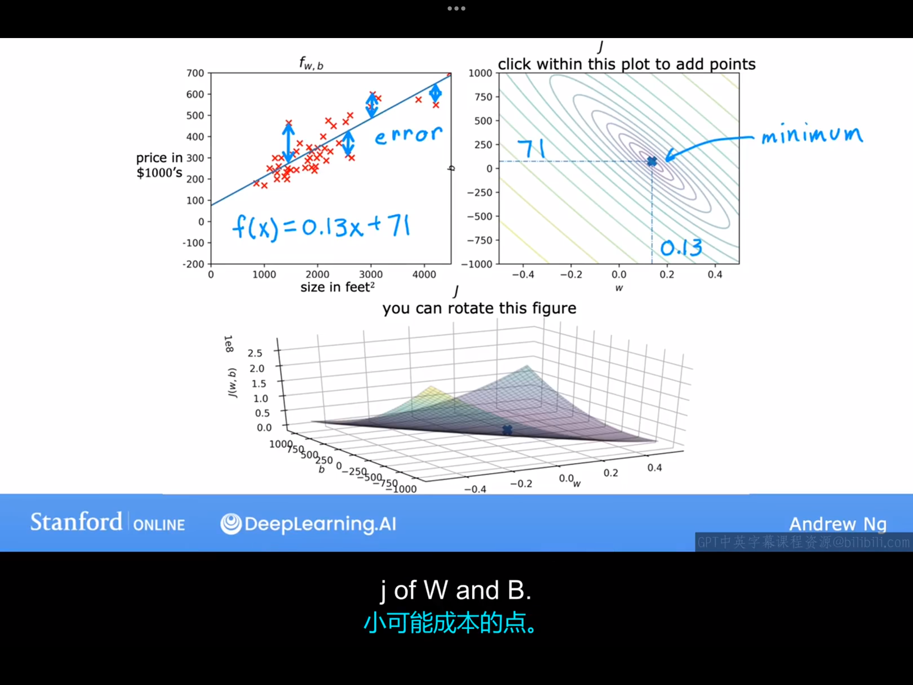

# 3.1 线性回归模型 part 1
接下来的几节课讨论的范围限定在Linear Regression with One Variable:

现在介绍本节课的第一个模型：线性回归模型，这意味着将一条直线你回到你的数据上。例如：在某个特定的地区，根据房屋大小预测房价（这个例子高中就很熟悉了，此处不再赘述）。

下面介绍在机器学习中用到的一些常用的记号（notations）和术语（tetminology）:

术语：
1.数据集（training set）：用于训练模型的数据。

记号:
x:代表输入变量（input variable），有时也被称为特征（feature）或输入特征(input feature)。
y:表示输出变量（output variable），有时也叫目标变量(target
variable)
m:数据集中的样本总数
(x，y):单个训练样本。
($x^i$,$y^i$)：第i个样本。

# 3.2 线性回归模型 part 2

回顾一下，监督学习中的训练集中包括输入特征(例如船体的大小)以及输出目标(例如船体的价格)。为了训练模型，你将训练集输入学习算法中，然后你的学习算法将生成一些生成一些函数（不同算法将生成不同函数）$f$，$f$的作用是接受新的输入并输出一个预测值$\hat{y}$，函数$f$往往被称为模型(model)。注：注意区分$y$与$\hat{y}$。现在的关键问题是如何获得$f$。现在我们只考虑线性回归模型，故$f$是一条直线，记为$f_{w,b}(x)=wx+b$。更具体地说，这是一个单变量线性回归模型（univariate linear regression）

# 3.3 成本函数（cost function）公式

为了衡量不同学习算法给出的模型的好坏，我们需要定义一个被称为成本函数（cost function）的东西。在线性回归模型中，不同模型的差异体现在w与b的不同。机器学习中，通常把w,b这类变量称为参数，参数是可以调整的。我们现在希望找到一组参数（w，b）使得对于所有的$(x^{(i)},y^{(i)})$,$\hat{y}^{(i)}$都尽可能接近$y^{(i)}$。出于以上想法，线性回归模型中的代价函数通常被定义为：
$$
J(w,b)=\frac{1}{2m}\sum_{i=1}^{m}(\hat{y}-y)^2
$$
（注：代价函数中出现的$\frac{1}{2}$这一因子只是为了后续出现的一些计算结果更加简洁），其中$\hat{y}^{(i)}-y^{(i)}$这一项被称为误差。这个误差函数也被称为平方误差代价函数（squared error cost function）。在机器学习中，不同的人在不同的领域会使用不同的成本函数。

# 3.4成本函数的直观感受
整理一下前面的内容：
1.首先，我们为了将一组数据拟合到一条直线上，我们选择了一个线性模型:$f_{w,b}(x)=wx+b$。
2.这个模型中涉及两个参数：$w,b$。不同的参数给出不同的直线。
3.为了找到最合适的参数，使得直线拟合的效果最好，我们定义了代价函数去衡量拟合的效果。
4.在本节课的后面我们将会看到，我们的目标是minimize $J(w,b)$。

为了能让初学者方便理解，我们举一个简化的例子：
假设先让b=0，这时模型变为一条过原点的直线。选择不同的w会得到不同的直线，又因为J是w的函数，所以可以画出J关于w的函数图像。
例如，对于数据集(1,1),(2,2),(3,3),我们可以根据刚才的讨论绘制出如下图像。

在这个例子中，我们可以看到，w=1对应的直线对数据拟合最好，同时w=1时，代价函数J取最小值。所以，线性回归算法的目标就是找到代价函数J取最小值时对应的的参数（w，b）的值。

# 3.5 可视化成本函数

上节课我们看到，令b=0时，J(w)的图像是一个二次函数。这节课我们看考滤更一般的情况，当w,b可以任意取值时，J(w,b)的图像是什么样。为了可视化成本函数，我们可以绘制以下两种不同的图像来表示J(w,b)。

1.三维曲面图。

2.等高线图。

# 3.6 可视化示例
一些不合适的拟合：
|  | |
|---|---|

合适的拟合：

接下来的问题是如何找到那组使得J取最小值的（w，b）,下节课我们将介绍梯度下降法来解决这个问题。

