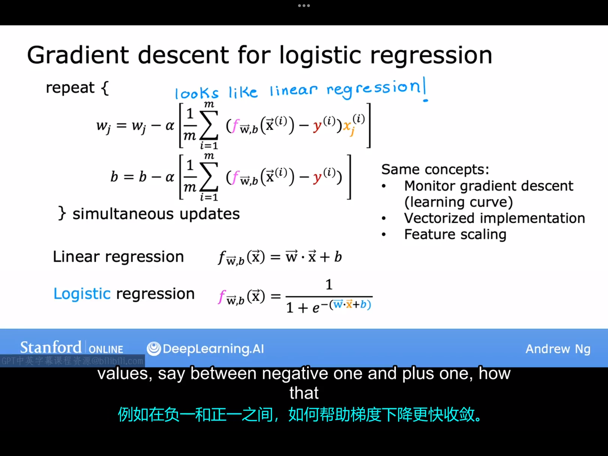

# 9.1 梯度下降实现
需要最小化的代价函数：
$$
J(\vec{w},b)=\frac{1}{m} \sum_{i=1}^{m}[-y^{(i)}log(f_{\vec{w},b}(x^{(i)}))-(1-y^{(i)})log(1-f_{\vec{w},b}(\vec{x}^{(i)}))]
$$
梯度下降中参数的更新规则：
$$
w_j=w_j-\alpha \frac{\partial}{\partial w_j}J(\vec{w},b)\\
b=b-\alpha \frac{\partial}{\partial b}J(\vec{w},b)
$$
通过计算可以得出（这结果和线性回归中的结果一样）：
$$
\frac{\partial}{\partial w_j}J(\vec{w},b)=\frac{1}{m} \sum_{i=1}^{m}(f_{\vec{w},b}(\vec{x}^{(i)})-y^{(i)})x_j^{(i)}\\
\frac{\partial}{\partial b}J(\vec{w},b)=\frac{1}{m} \sum_{i=1}^{m}(f_{\vec{w},b}(\vec{x}^{(i)})-y^{(i)})
$$
将上述数学计算结果代入梯度下降的参数更新规则，即可得参数更新规则的具体数学表达，并与线性回归中的表达式对比，可得如下图所示的结果：

逻辑回归与线性回归的梯度下降的参数更新的具体数学表达式的区别只在于$f_{\vec{w},b}(x)$的表达式不同。此外，线性回归的梯度下降法中的一些概念\方法在逻辑回归的梯度下降法这里也适用，比如说监控梯度下降是否收敛的方法，向量化方法，特征缩放方法。
