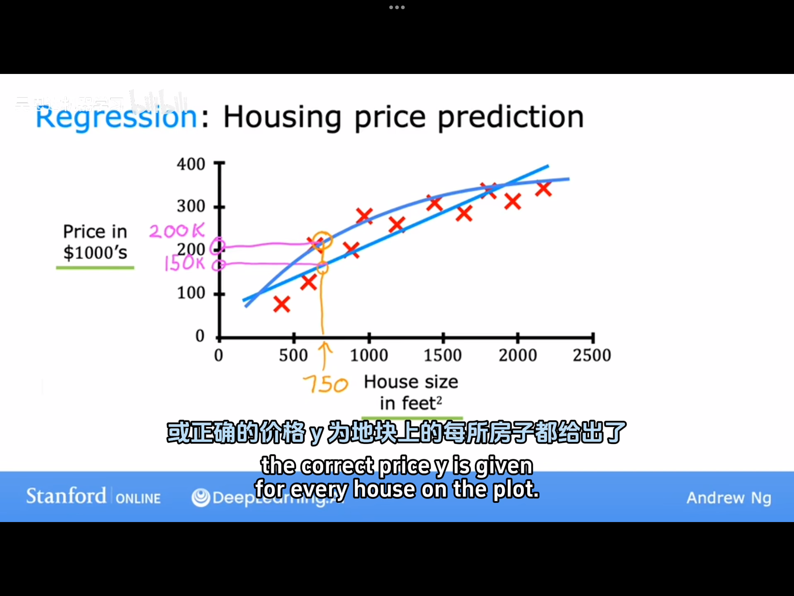
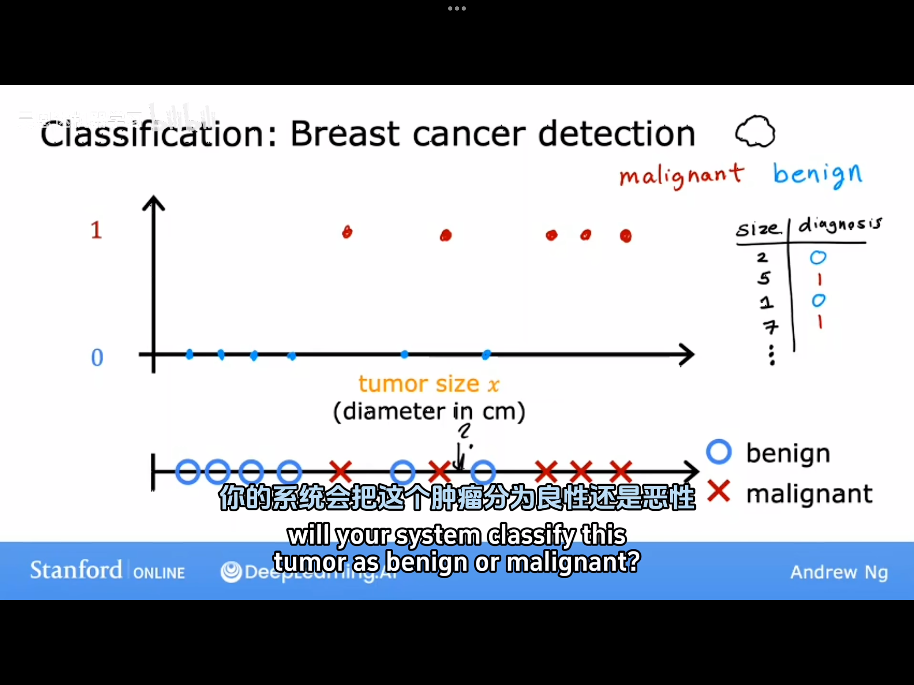
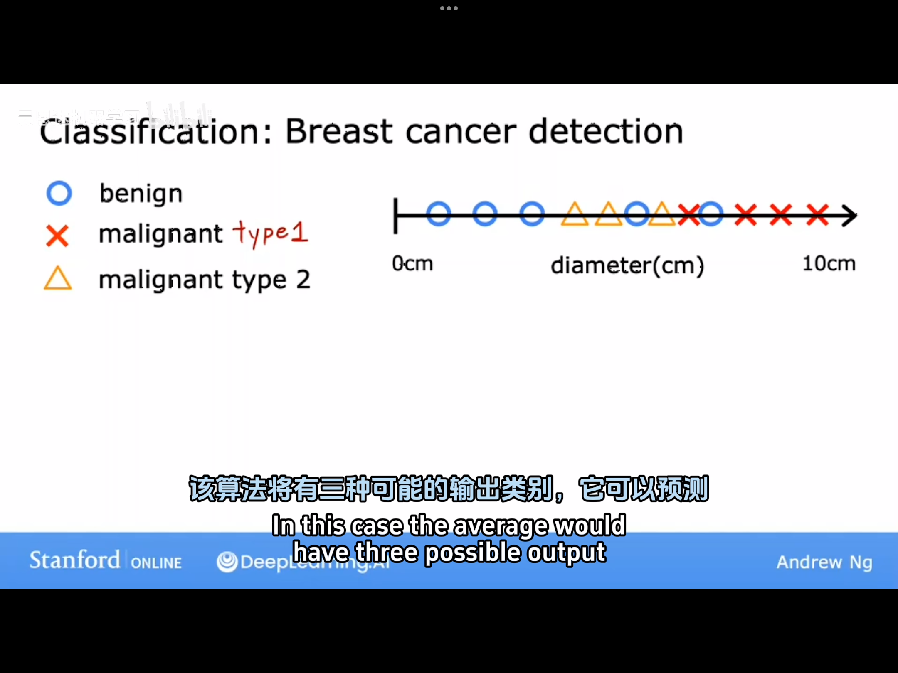
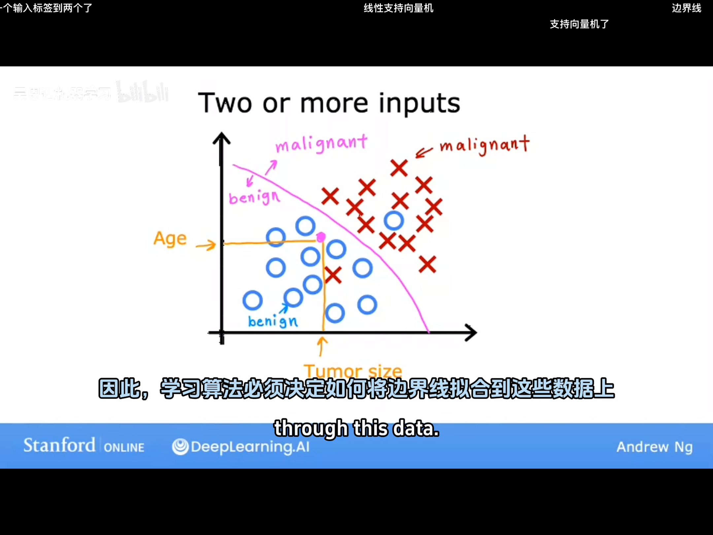
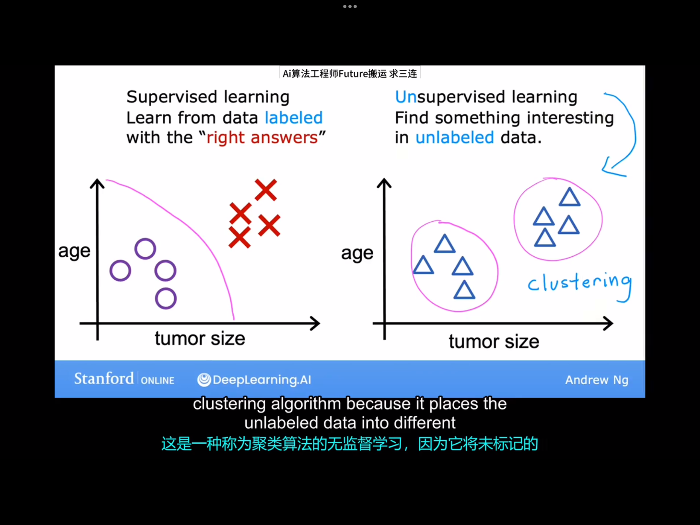
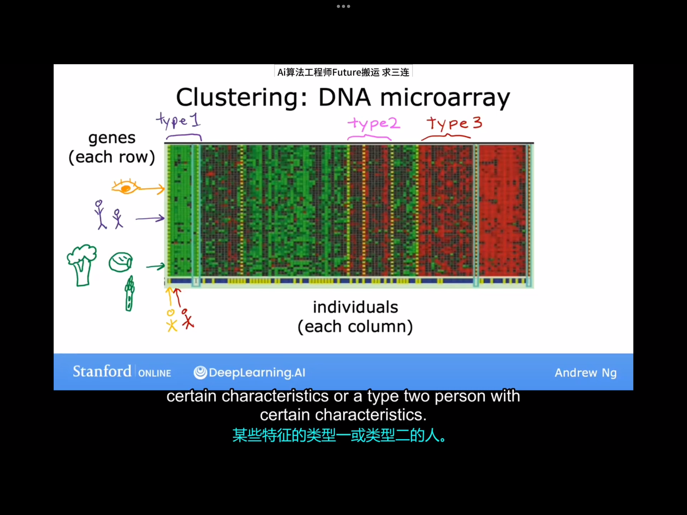
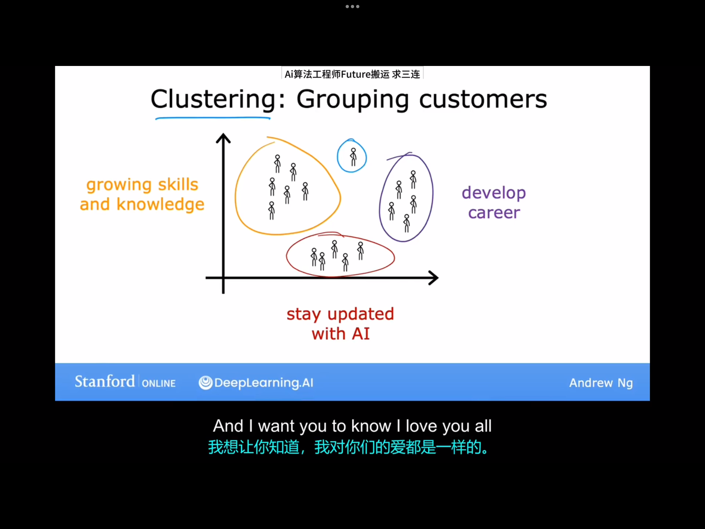

# 2.1 什么是机器学习
当今世界最常用的两种机器学习算法：监督学习、无监督学习。除了这两种外，强化学习也属于一种机器学习算法，但本课程不会涉及太多。
# 2.2 监督学习(Supervised learning)  part1
Supervise learing:是一种学习从x到y或者说是学习从输入到输出映射的算法。监督学习的关键特征：人为提供示例以供学习。人为提供的数据包括输入标签x以及与x对应的输出标签y，通过监督学习算法，机器最终可以只接受输入而无需输出标签，并根据输入标签预测可能得输出标签。
>ds给出的定义：**监督学习**是一种机器学习方法，通过从已标注的训练数据（输入-输出对）中学习输入到输出的映射关系，从而对未知数据做出预测。其核心任务是**分类**（预测离散标签，如图像识别）和**回归**（预测连续值，如房价预测），依赖人工标注的监督信号优化模型，例如垃圾邮件分类（输入邮件文本，输出“垃圾/非垃圾”标签）。

举例：
| Input(X) | Output(Y) | Application |
|:-----|:----|:----|
|email |spam?(0/1)|spam filtering|
|audio |text transcripts|speech recognition|
|ad,user info|click(0/1)|online advertising|

回归模型：房价预测（拟合曲线不一定是得选择直线，可以选更复杂的曲线）：

这里的回归模型的作用是从无数穷多个可能得数字中预测出一个数字。
# 2.3监督学习(Supervised learing) part2
上节课中我们学习的回归算法属于监督学习算法中的一种，它可以从无穷多个（连续的）可能的数据中预测出一个数据。这里介绍第二种主要的监督学习算法——分类算法。

Example:
Breast cancer detection:判断肿瘤是良性的还是恶性的。现有一个数据集，里面有不同大小的肿瘤，它们中有些事良性的，有些是恶性的。我们可以用数字0代表良性，数字1代表恶性。与回归不同的是，这里的输出结果只可能有两个：0或1。我们可以把这个数据集画在如下两种图上：

现在的问题是：如果现在有一个肿瘤处于图二黑笔标注的位置，预测这个肿瘤是恶性还是良性？

实际上，在分类问题中，可以有两个以上可能得输出类别。比如说，如果一个肿瘤已经确定是恶性的了，但它可以属于恶性肿瘤中的不同种类。这时可以修改机器学习算法使它可以输出多种类型的癌症诊断.如下图所示：

分类算法预测的是类别，类别不一定是数字，它可以预测一张照片是猫还是狗，可以预测肿瘤是良性的还是恶性的，类别也可以是数字，例如0和1。
分类与回归的区别之一：分类预测的是一个小的，有限的一组可能的输出类别(output category)，而回归预测的是无穷多个所有可能的类别。

我们前面提到的监督学习算法只有一个输入，即肿瘤的大小。但实际上完全可以有多个输入，例如如果此时既知道患者的肿瘤大小，又知道患者的年龄，则可以以患者的年龄和肿瘤的大小这两个信息作为输入。这时当有一个新病人进来时，即可通过患者的年龄、肿瘤的大小这两个信息来预测是良性肿瘤还是恶性肿瘤。

为了预测肿瘤的良性与否，分类算法现在要做的是寻找一条边界以区分恶性肿瘤与良性肿瘤。显然，这个边界取决于训练集中的数据。这里我们举了一个两个输入的例子。实际上，在其他机器学习任务中，可能用到更多输入。比如实际中的乳腺癌检测这一任务中，就会使用一些额外输入。比如肿瘤团块的厚度、细胞大小的均匀性等。

总结一下监督学习：
监督学习是从给定的一些“正确答案”（数据集？）中学习，它主要包括了分类与回归两大类。分类是从有限个可能的输出类别中预测输出，而回归是从无穷多个可能的数据中预测一个输出数据。

# 2.4 非监督学习(Unsupervised learning) part1
>ds给出的定义：无监督学习是一种机器学习方法，通过分析未标注数据​（无明确输出标签）自动发现隐藏的模式或结构，无需人工监督。核心任务包括聚类​（如客户分群）、降维​（如PCA）、异常检测​（如欺诈识别）和关联规则学习​（如购物篮分析）。典型例子：对新闻文章自动分组（无预定义类别）。

在无监督学习中，我们得到的数据不带有任何输出标签。比如，我们得到了一组数据，数据包含了患者的年龄、肿瘤大小，但是并未包含肿瘤是否为良性这一信息。这时我们接到的任务也不在是判断某一未知肿瘤是否为良性（因为毕竟数据集中都未包含该信息），而是“find something interesting in the data”。

之所以称呼这种算法为无监督学习算法，是因为我们并不试图监督算法为每个输入提供某种预测的答案，相反，我们要去算法自己找出数据中可能有趣的或者存在的"patterns" or "structures".如上图所示，算法可能将我们给定的未标记数据分成了两个组（groups）或簇（clusters）。这是一种被称为聚类算法（clustering algorithm）的无监督学习，因为它将未标记的数据放入了不同的簇中。

下面再举几个无监督学习的例子：
对不同基因型的人进行分类：

对某公司的客户群体进行分类：

总结：聚类算法是一种无监督算法，它可以将未贴标签的一组数据分组到不同的簇（cluster）中。

# 2.5 非监督学习 part2
给非监督学习下个正式的定义：数据集中只有输入x，没有输出标签y。算法必须找出数据中的结构或模式。
本课程中，除了聚类算法，还将学习另外两种算法：
1.异常检测（Anomaly detection）：用于检测异常事件。
2.降维（Dimensionality reduction）:将大的数据集压缩为小的多的数据集，同时尽可能少地丢失信息。

# 2.6 Jupyter notebook
课程提供的可选实验是Jupyter notebook类型，该文件内容中包含两种单元格：一是Markdown单元格，另一种是代码单元格。按下Shift+Enter快捷键可以运行单元格内的Markdown语言和python语言。

>ds对于jupyter notebook与markdown的介绍：
>**Markdown** 是一种轻量级标记语言（Lightweight Markup Language），采用简单直观的语法（如 `# 标题`、`**加粗**`、`- 列表`）对文本进行结构化格式化，使其可转换为 HTML 或其他格式。它专注于内容与格式分离，适用于编写文档、博客、GitHub README 等，但本身不具备编程语言的逻辑功能。  
>
>**Jupyter Notebook** 是一个开源的交互式计算环境，核心功能是支持**混合执行代码**（如 Python、R）和编写富文本（使用 Markdown）。其特点包括：
>  
>1. **单元格结构**：  
>  - **代码单元格**：直接运行代码并显示结果（如数据表格、可视化图表）。 
>  
>   - **Markdown 单元格**：用 Markdown 语法编写说明文档，支持数学公式（LaTeX）、图片、链接等。  
>2. **多语言支持**：通过内核扩展支持 Python、Julia、R 等语言。  
>3. **数据科学工具链**：常与 Pandas、Matplotlib、TensorFlow 等库结>合，用于数据分析、机器学习开发和教学演示。  
>
>**两者关系**：Jupyter Notebook 的文本部分依赖 Markdown 实现富文本编辑，但 Jupyter 的核心是**交互式代码执行**，而 Markdown 仅是其文档化功能的组成部分。文件以 `.ipynb` 格式存储，可在 GitHub 或 Jupyter Lab 中直接预览。  
>
>（若需使用：`pip install jupyterlab` 安装，通过 `jupyter notebook` 启动本地服务。） 

