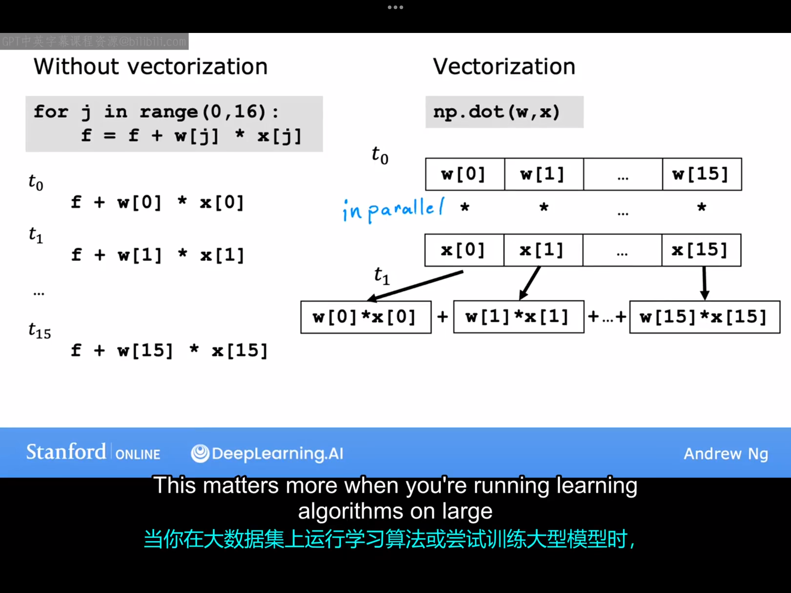
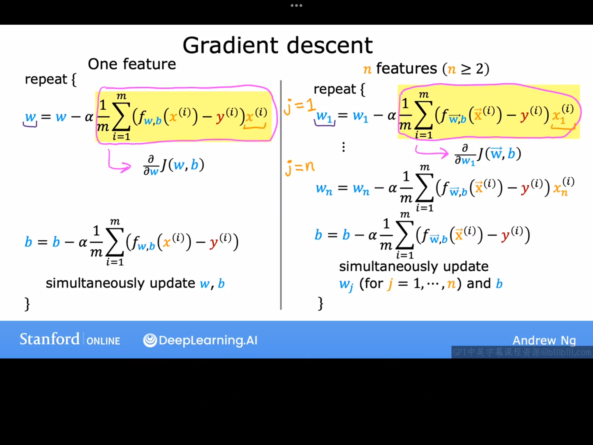

# 5.1 多特征（multiple features）
在前面的课程中，我们学习的线性回归模型中输入变量（特征）只有一个，比如房价预测模型中的输入特征只含有房屋面积这一个特征，本节课我们将学习输入特征不止一个的线性回归模型（即多元线性回归模型，multiple linear regression）。这里还是以房屋价格预测为例，但假设这时房屋价格不只受房屋面积这一单一因素的影响，还受一些其他因素的影响，比如卧室个数、浴室个数、房屋楼层数、房屋年龄等，并且假设房价与这些影响因素之间的关系都是线性的。假设数据集如下图所示（注：下图中还给出了多元线性回归这类问题中一些记号的含义）。


现在我们来看看多元线性回归模型长什么样。
已知前面学过的单输入变量的线性回归模型：$f_{w,b}(x)=wx+b$。
将上式推广即可得n元线性回归模型，即：
$$
f_{w_1,w_2,w_3,...,w_n,b}(x)=w_1x_1+w_2x_2+w_3x_3+...+w_nx_n+b
$$
可以将上式表示为更简洁的向量形式：
$$
f_{\vec{w},b}(\vec{x})=\vec{w} \cdot \vec{x}+b
$$
这一过程称为向量化。
>补充（内容来源ds）：
注意区分mlitiple linear regression(多元线性回归)与multivariate regression（多元回归）的区别：
​多元线性回归专注于探索单个因变量与多个自变量之间的线性关系。例如，我们希望通过房屋的面积、房龄和地理位置（自变量）来预测其售价（唯一因变量），模型可表示为：
售价 = β₀ + β₁×面积 + β₂×房龄 + β₃×经度 + β₄×纬度 + ε
其核心特点是：​因变量只有一个，分析的是多因素对单一结果的影响路径。
>
>而多元回归则研究多个因变量与多个自变量的联合关系。例如，在房屋分析中，我们可能需要同时预测售价、租金收益率和成交周期（三个因变量），这些变量可能彼此关联且共享相同影响因素（如面积、地段）。此时模型需扩展为方程组形式：
售价      = α₀ + α₁×面积 + ... + ε₁  
租金收益率 = β₀ + β₁×面积 + ... + ε₂  
成交周期  = γ₀ + γ₁×面积 + ... + ε₃
关键在于：​因变量有多个，且模型需考虑因变量间的潜在相关性（如售价与租金的内在联系）。

# 5.2 向量化 part 1
本节课我们将介绍一个非常有用的方法，叫做向量化。当你在实现一个算法时，使用向量化不仅能让你的代码看上去更整洁，还会让代码的运行速度变快。学习如何编写向量化代码将使你能够利用现代数值线性代数库，甚至可能是GPU硬件，即图形处理单元。这种硬件最初被设计用于加速计算机图形处理，但事实证明，当你编写向量化代码时，它可以让你的代码运行速度更快。下面举些具体的python示例来帮助你理解具体什么是向量化。
考虑一个三元线性回归模型，所有参数已知，其中$\vec{w}=[1.0 \space 2.5 \space -3.3]，b=4$现要求用该模型预测：当输入为$\vec{x}=[10 \space 20 \space 30]$时对应的输出为多少？
(注意：线性代数中，各分量的下标是从'1'开始，例如：$\vec{w}=[w_1 \space w_2 \space w_3 \space\dots]$。但python(甚至大多数编程语言)中，索引是从0开始，例如：$x[0],x[1],x[2]...$)

代码示例一：
```python
w=np.array([1.0,2.5,-3,3])
b=4
x=np.array([10,20,30])
f=w[1]*x[1]+w[2]*x[2]+w[3]*x[3]+b
```
以上这种代码写法在输入特征数n比较小的时候还不算麻烦，但一旦n比较大时，我们就需要采用for循环来简化代码，下面给出代码示例二：
```python
w=np.array([1.0,2.5,-3,3])
b=4
x=np.array([10,20,30])
n=3
f=0
for i in range(0,n):
    f=f+w[i]*x[i]
f=f+b
```
以上这种写法虽然在n较大时可以有效地简化代码，但还未使用向量化的方法，且n较大时，效率远低于用向量化方法处理后的代码。下面给出向量化后的代码。
代码示例三：
```python
f=np.dot(w,x)+b
```
由此可见，向量化后的代码不但运行速度快，还十分简洁易读。
下节课我们将介绍为什么计算机运行向量化后的代码速度更快。

# 5.3 向量化 part 2
本节课我们来看一下向量化后的代码在计算机后台是如何工作的，通过这节课的学习你就会明白为什么向量化后的代码运行速率会大幅提高。
先来看一个未向量化的for循环代码：
```python
for i in range(0,16):
    f=f+w[i]*x[i]
```
计算机是这样运行上述代码的：
$t_0$时刻，计算f+w[0]*x[0];
$t_1$时刻，计算f+w[1]*x[1];
.
.
.
$t_{15}$时刻，计算f+w[15]*x[15];
可见，计算机是一步一步按时间顺序去一次次运行for循环内的代码的。那我们接下来来看一下向量化后的代码是如何运行的。
```pyhton
f=np.dot(w,x)
```
上面这个就是向量化后的代码，计算机是这样运行这段代码的：
$t_0$时刻，计算机会同时获取$\vec{w}$和$\vec{x}$的十六个分量，并将它们分别存储在不同的位置，然后并行地计算十六组对应分量的积。
$t_1$时刻，计算机将上一步得到的十六个结果相加。
上述过程的示意图如下；

。
通过上述分析，我们很容易明白为什么向量化后的代码运行速度更快。特别地，当我们在面对较大的数据集时或我们在训练大模型时，向量化这一方法将显得更加重要。
下面我们来举个具体的向量化的例子，来看看向量化在梯度下降算法中是如何操作的（注：下面这个例子先不考虑参数b）。
$\vec{w}=(w_1 \space w_2 \space \dots w_{16})$
$\vec{d}=(d_1 \space d_2 \space \dots d_{16})$
其中$d_i=\frac{\partial J}{\partial w_i}$。
我们目的是：compute $w_j=w_j-\alpha d_j$，假设这里的$\alpha=0.1$
1.未向量化的代码：
```python
for i in range(0,16):
    w[i]=w[i]-0.1*d[i]
```
2.向量化后的代码：
```pyhon
w=w-0.1*d
```
如果你只有十六个输入特征，这两个输入算法的运行时间可能差异不大，但如果你有成千上万个输入特征，两种算法运行时间的差异可能是几分钟与几个小时的差异。
下节课我们将把向量化与多元线性回归结合起来，这样以来你将实现带有向量化的多元线性回归的梯度下降。

# 5.4 多元线性回归的梯度下降。
仿照一元线性回归的梯度下降公式的推导过程，即可得多元线性回归的梯度下降公式。这里省略具体的推导过程，只给出最后的结果，最终结果如下图所示。



至此我们已经学完了本课程中关于梯度下降法的全部内容，下面再简单介绍一下另外一种求解线性回归模型中的参数的方法。这个方法被叫做正规方程法("normal equation"),但该方法只使用于线性回归模型（梯度下降法几乎适用于任何函数求极小值）。
该方法的特点：
1.只适用于线性回归模型
2.通过使用高级线性代数库一次性解出$\vec{w},b$，无需迭代（ilteration）.
该方法的缺点：
1.不能推广到别的机器学习算法，只使用于线性回归模型。
2.当特征数量n很大（n>10000）时，该方法会运行起来会很慢。
几乎没有从事机器学习的人员需要自己亲自实现正规方程这种算法，你只需要知道当你使用成熟的机器学习库并调用线性回归，后台可能会使用这种方法来求解$\vec{w},b$。

到目前为止，你已经学习了多元线性回归方法，这可能是当今世界上使用最广泛的机器学习算法了。更进一步地，只需几个技巧，如适当选择、特征缩放，以及适当选择学习率等，都可以让该方法工作地更好。下面几节课我们将具体学习这些技巧。
