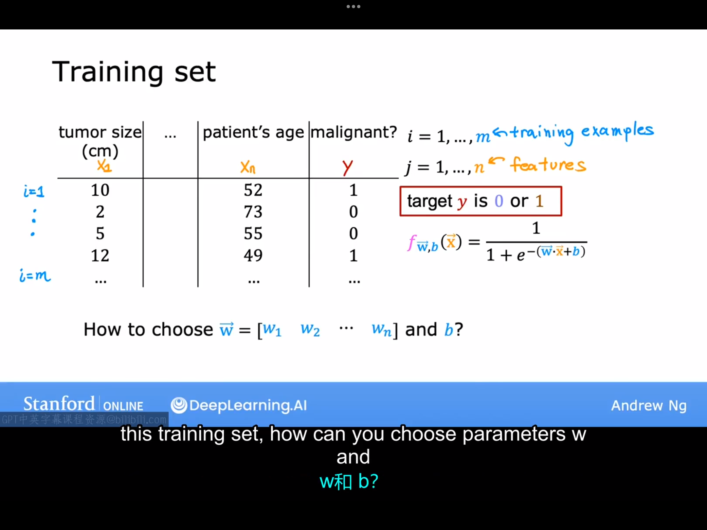
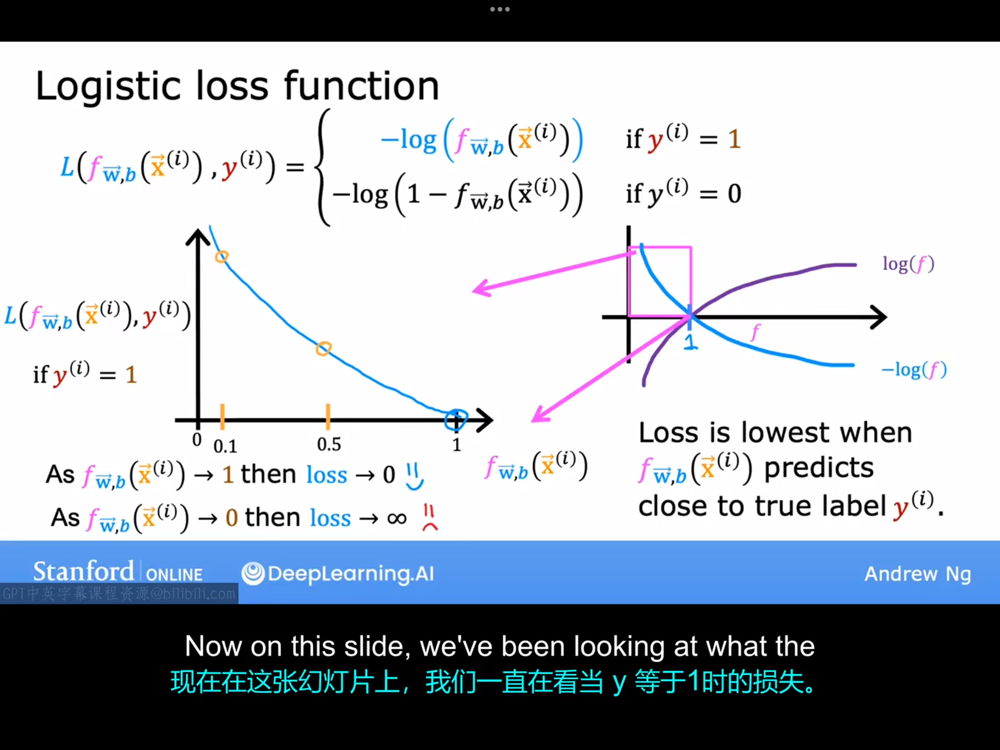

# 8.1 逻辑回归的代价函数
前面我们说过，代价函数提供了一种衡量特定参数集对训练数据拟合程度的方法，从而能够让你更好地选择参数。本节课中，我们将看到平方误差代价函数对于逻辑回归来说并不是一个理想的代价函数，并且我们将介绍一种不同的代价函数，它可以帮助我们为逻辑回归选择更好的参数。

下面是一个逻辑回归模型的训练集可能的样子，其中每一行可能对应一位患者去看医生最终得到的某种诊断结果。这是一个二分类任务，y的取值只有两个：0/1。现在我们面临的问题是如何选择$\vec{w}=[w_1 \space w_2 \space ... \space w_n]$和b。

在线性回归中。定义了代价函数：
$$
J(\vec{w},b)=\frac{1}{m} \sum_{i=1}^{m}\frac{1}{2}(f(\vec{x}^{(i)})-y^i)^2
$$
在线性回归中，$f_{\vec{w},b}(x)=\vec{w} \cdot{ \vec{x}}+b$,将此式代入代价函数表达式中,得到的代价函数是一个凸函数，很容易就可以通过梯度下降法求得全局最小值（该凸函数只有一个局部最小值，这个局部最小值也是全局最小值）。但如果把逻辑回归模型的表达式代入上面的代价函数的表达式中，得到的函数却是一个非凸函数，难以通过梯度下降直接找到全局最小值。

通过以上讨论我们可以看到，对于逻辑回归来说，这个平方误差代价函数并不是一个很好的代价函数。下面我们会定义一个新的的代价函数使得代入逻辑回归模型后该代价函数仍然是一个凸函数。适用于逻辑回归的代价函数：
$$
J(\vec{w},b)=\frac{1}{m} \sum_{i=1}^{m} L(f_{\vec{w},b}(\vec{x}^{(i)}),y^{(i)})
$$
其中，求和符号内部的项，我们称之为单个训练样本上的损失。、对于逻辑回归的问题来说，
$$
L(f_{\vec{w},b}(\vec{x}^{(i)}),y^{(i)})=
\begin{cases}
  -log(f(x^{(i)})) ,\space \text{if} \space y^{(i)}=1\\
  -log(1-f(x^{(i)})) ,\space \text{if} \space y^{(i)}=0  
\end{cases}
$$

下面我们从直观上理解一下这个损失函数。假设数据集中第i组数据的$y^{(i)}=1$,此时单个训练样本上的损失函数的图像如上图左图所示，如果$f(x^{(i)})$是一个非常接近1的数（这代表$\hat{y}=1$的概率非常接近1），则对应的单个训练样本上的代价很小。若$f(x^{(i)})$是一个非常接近0的数，说明$\hat{y}=1$的概率很小，但实际上$y^{(i)}=1$,故模型应该为自己的错误预测付出很高的代价。也就是说，当真实标签为1时，算法会强烈激励不要预测得过于接近0。

所以本节课中，你看到了为什么平方误差成本函数不适用于逻辑回归，我们还未逻辑回归定义了单个训练样本的损失，并未逻辑回归提出了一个新的损失函数的定义。事实证明，通过这种损失函数的选择，整体成本函数将是凸函数，因此你可以放心地使用梯度下降法达到全局最小值（证明这个函数是凸的超过了本课程的范围）。

下节课我们将回到单个训练样本的损失函数，并使用它来定义整个训练集的整体成本函数。我们还将找出一种更简单的方式来写出成本函数，以便我们稍后能运行梯度下降法来找到逻辑回归的良好参数。

# 8.2 简化后的逻辑回归成本函数

简化后的单样本逻辑回归的成本函数：
$$
L(f_{\vec{w},b}(x^{(i)}),y^{(i)})=-y^{(i)}log(f_{\vec{w},b}(\vec{x}^{(i)}))-(1-y^{(i)})log(1-f_{\vec{w},b}(\vec{x}^{(i)}))
$$
总损失函数：
$$
J(\vec{w},b)=\frac{1}{m} \sum_{i=1}^{m}L(f_{\vec{w},b}(\vec{x}^{(i)}),y^{(i)})
$$
注：
这个特定的代价函数是从统计学中使用极大似然估计这一统计原理推导出来的，这是统计学中关于如何高效地为不同模型找到参数的一个概念。