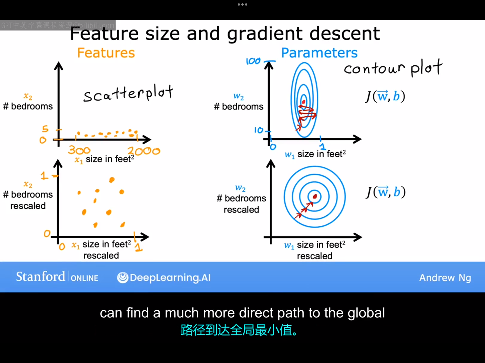
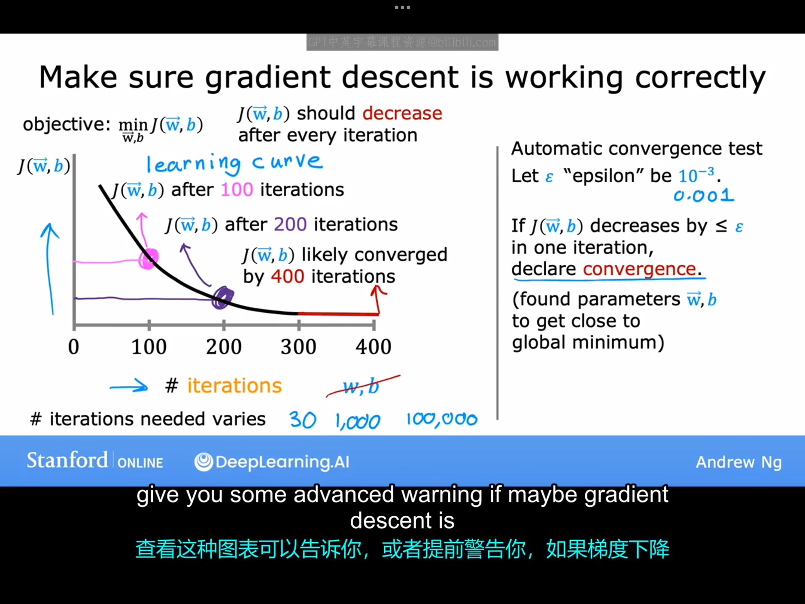
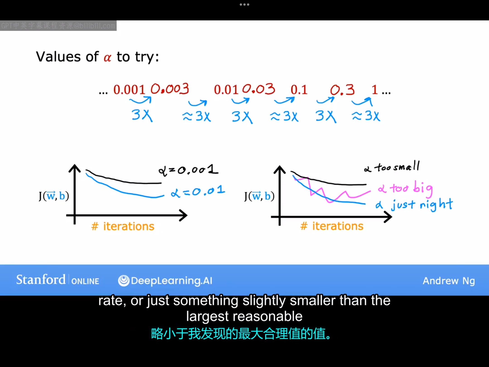
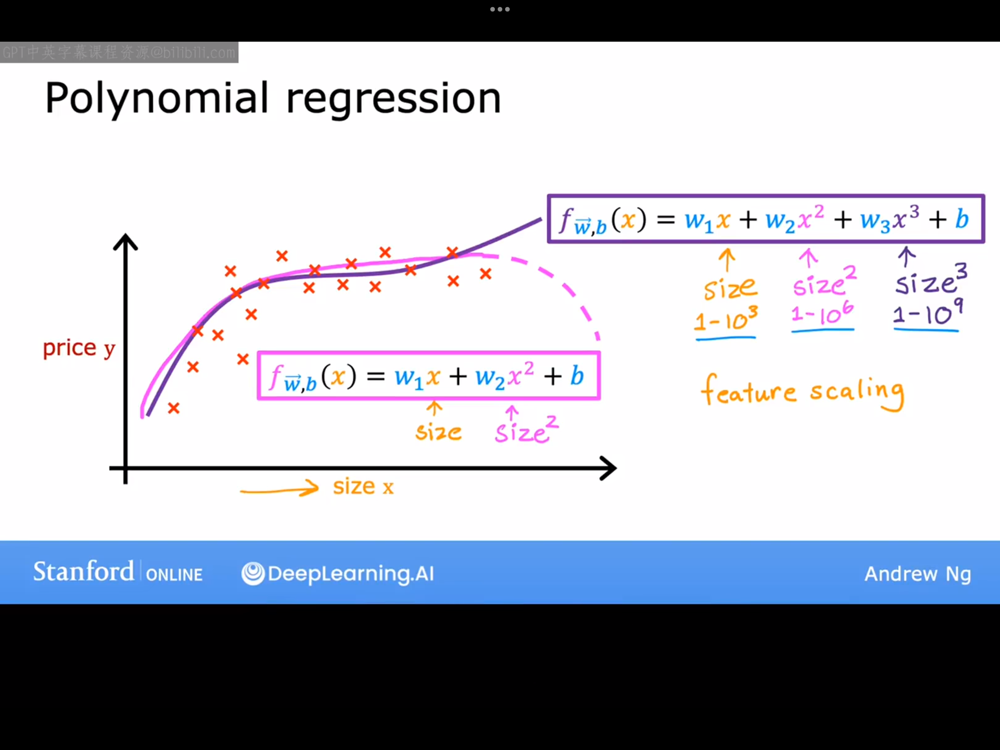

# 6.1 特征缩放(Feature Scaling) part 1

本节课，我们将学习一种名为梯度缩放的技巧，它可以让我们的梯度下降算法运行更快。我们先来看一下特征的大小（即特征的数值大小）与其相关参数的大小之间的关系。举个具体的例子，假设我们用房屋大小和卧室数量这两个特征来预测房价。房屋面积这一特征用$x_1$来表示，卧室数量这一特征用$x_2$来表示。一般来说，$x_1$的取值范围一般是300-2000（单位：平方英尺），$x_2$的取值范围一般是0-5（单位：个）。在这个例子中，$x_1$的取值比$x_2$大很多。
假设现在有一个房子，面积是2000，卧室数量是5，房价是500k。针对这一数据，我们给出了两组可能的参数预测值，下面来具体看看哪组值更合理。
1.第一组参数预测值：$w_1=50,w_2=0.1,b=50$。
依照这组参数预测出的房价为：$\hat{y}=50*2000+0.1*5+50=100050.5k$
2.第二组参数预测值：$w_1=0.1,w_2=50,b=50$。
依照这组参数预测出的房价为：$\hat{y}=0.1*2000+50*5+50=500k$
显然，第二组参数预测值更加合理。通过这个例子我们注意到，当特征的可能取值范围较大时，一个好的模型中该特征对应的参数应该较小。同样地，当特征的取值范围较大时，一个好的模型中该特征对应的参数取值应该较大。

上图左边一列给出了输入特征的散点图，右边给出了对应的代价函数的函数图。
第一行描述的是未进行特征缩放的情况，先来看下这种情况有何特点：
先看第一行第一个图：$x_1$对应的取值范围很大，$x_2$对应的取值范围很小。对应于第一行第二张图：参数$w_1$的合理的取值范围很小，参数$w_2$的合理取值范围很大。代价函数的等高线图看起来像椭圆形，这是因为$w_1$的微小变化会对预测价格产生很大影响，从而对代价函数产生很大的影响，而$w_2$需要改变很大才能对代价函数产生相同的影响。如果我们使用原始的未经过特征缩放的数据来运行梯度下降法（注：数据集里的数据决定了代价函数的具体形式），可能会发生这种情况:由于等高图有又高又窄，故在梯度下降寻找全局最小值的路径中来回反弹很长时间（如上图的红笔标注所示，这点值得仔细体会）。
第二行图片描述的是对数据进行特征缩放后的情况，所谓特征缩放，就是对训练集中的数据进行某种变换，使得$x_1$,$x_2$所有可能取值尽量地落在[0,1]区间上，（这里我认为不一定非要强制地将$x_1$,$x_2$都限定在[0,1]区间内，应该只要将$x_1$,$x_2$缩放到数量级相当的范围内即可。进行特征缩放后得到的代价函数等高线图如上图第二行第二列所示，这是梯度下降能找到一条更直接的路径到达全局最小值。
总结一下：当的数据集中有多个取值范围相差很大的输入特征时，直接运行梯度下降算法可能速度会很慢，这时需要进行特征缩放以提升速度，具体如何做我们下节课再讲。

# 6.2 特征缩放 part 2
本节课我们来介绍一下如何具体地进行特征缩放，以将取值范围非常不同的特征的取值缩放到大小可以比拟的范围。
1.法一：直接将要缩放的特征的每个取值除以该特征的最大可能取值。
例如：如果需要缩放的特征$x_1$的取值范围是0-2000，则：$x_{1,scale}=\frac{x_1}{2000}$。
2.法二：均值归一化（Mean normalization）。
假设训练集里需要缩放的特征$x_1$取值的平均值为$\mu$，则$x_{1,scale}=\frac{x_1-\mu}{x_{1,max}-x_{1,min}}$。
3.法三：Z分数归一化（z-score normalization）。
假设训练集里需要缩放的特征$x_1$取值的平均值为$\mu$，标准差为$\sigma$，则$x_{1,scale}=\frac{x_1-\mu}{\sigma}$（这个公式形式上有点像把非标准正态分布转化成标准正太分布那个公式，isn't it?）。
作为一个经验法则，在进行特征缩放时，你可能希望将每个特征的范围缩放到0-1之间，但实际上这个范围并不是一定要取0-1的，只要大差不差即可（比如-3~3，-0.3~0.3这种范围都是可以的）。举个例子，假设某训练集中包含$x_1,x_2,x_3,x_4,x_5$五个特征。这五个特征的取值范围以及他们是否需要特征缩放如下表所示：
|特征范围|是否需要缩放|
|:---:|:---:|
| $0<x_1<3$ | 无需进行特征缩放|
| $-2<x_2<0.5$ | 无需进行特征缩放|
| $-100<x_1<100$ | 太大，需要进行特征缩放|
| $-0.001<x_1<0.001$ | 太小，需要进行特征缩放|
| $98.6<x_1<105$ |太大，需进行特征缩放|

合理运用特征缩放可以让你的梯度下降算法运行的更快，但是无论是否使用梯特征缩放，我们在运行梯度下降算法时，如何去检查梯度下降算法是否真的有效，是否找到了全局最小值或接近它的值了呢？在下个视频中，我们将学习如何检验梯度下降算法是否收敛。

# 6.3 检查梯度下降是否收敛

回顾一下梯度下降规则：
$$
w_j=w_j-\alpha \frac{\partial J(\vec{w},b)}{\partial w_j}\\
b=b-\alpha \frac{\partial J(\vec{w},b)}{\partial b}
$$
为了判断梯度下降算法是否在很好地运行，我们可以画一个函数图像来直观地检验。图像的横坐标为迭代次数，纵坐标为代价函数，如下图所示：

若梯度下降法在正常运行，则每一次迭代后得到的代价函数都会比前一次的代价函数小，如果梯度下降法收敛，则在经历足够多次的迭代后，代价函数的值会趋于平稳。但是在不同的工作场景下，在不同的数据集下，使得梯度下降算法接近收敛的迭代次数是不同的，甚至有很大差异。事实上，很难提前知道梯度下降算法需要多少次迭代才能收敛.这就是你为什么需要创建上述那种函数图（即学习曲线）来尝试估算何时可以停止训练你的特定模型。
另外一种决定模型何时完成训练的方法是使用自动收敛测试，让我们用$\epsilon$来表示一个很小的数值（这个很小的数值可根据你的需要自主选择）。如果成本函数在某次迭代中减少的量小于这个$\epsilon$,这时你可能处在学习曲线的右侧那个平坦的部分，故你可以宣布收敛。记住，收敛通常表示你找到了使代价函数接近最小值时的参数的取值。
但实际上，在不同情境下选取一个合适$\epsilon$并不容易，所以这里更推荐使用第一种方法直观地查看是否收敛，而不是依赖于自动收敛测试。查看第一种方法里的那种图表可以告诉你，或提前警告你梯度下降可能没有在正常工作。
下个视频里，我们将介绍如何选择合适的学习率。

# 6.4 选择学习率

一个合适的学习率会让你的算法运行的更好。若$\alpha$太大，可能会到导致不收敛。若$\alpha$太小，可能会导致算法运行的太慢。下面我们来介绍如何选择合适的学习率。

如果你绘制了多次迭代的代价函数曲线，并且发现随着迭代次数的增加代价函数有时变大有时变小（如下图中第一行第一个图），这就说明此时的梯度下降法并没有在正常运行运行。出现这种情况的可能原因有两个：一是代码错误；二是学习率选择过大。

如果你发现随着迭代次数的增加代价函数一直变大（如下图第一行中的第二个图），这也可能是因为：1.学习率过大；2.代码错误（比如将梯度下降规则中的减号写成了加号）。

调试梯度下降正确实现的一个技巧是，在足够小的学习率下，代价函数在每次迭代中都会下降。如果你在某次运行梯度下降时发现它未正常工作，你可以将$\alpha$设置为一个非常小的值，看梯度下降在这个非常小的学习率下能否正常工作。如果此时梯度下降法仍然无法正常工作，这时就应该去检查是不是代码出了问题。但是注意，这里选择一个非常小的学习率只是为了检验代码是否可能存在问题，并不是说学习率越小，实际的学习算法越有效。比如，过于小的学习率可能会导致算法需要更多的迭代次数才能收敛。

所以在实际运行梯度下降法时往往需要尝试一系列不同的学习率。学习率具体如何选择，可以参照下图：

先将$\alpha$取为一个比较小的数，比如0.001（这里假设了在学习率为0.001的情况下，梯度下降算法可以正常工作），并作出损失函数随迭代次数的曲线。然后在后面的每次尝试中学习率都取为前一个学习率都乘以3，即后续的学习率分别取0.003，0.01（是将0.009近似取为0.01了），0.03,0.1（将0.09近似取为0.1）.......直到我们找到了一个过大的学习率（记为$\alpha_0$）使得我们的梯度下降法无法正常工作。这时我们取一个比$\alpha_0$稍微小一点并且能让梯度下降法正常工作的数作为学习率即可。

选择一个合适的学习率是很多学习算法的重要部分。下节课将再介绍一个能让你的多元线性回归算法工作地更好的技巧——选择自定义特征，这将允许你用曲线（而不仅仅是像前面那样只用直线）来拟合你的数据。

# 6.5 特征工程（Feature Engineering）
特征的选择对于你的学习算法的性能有着巨大的影响。很多情况下，设计与选择合适的特征是使算法有效工作的关键步骤。本节课将教你如何为你的算法选择或者设计合适的特征。让我们再次考虑预测房价这个例子，如下图所示，如果将房屋所建地块的宽度（在房地产领域，这也被称为“frontage”）选为特征$x_1$,把地块的深度选为特征$x_2$，你可能会构建这样一个模型：
$$
f_{\vec{w},b}=w_1x_1+w_2x_2+b
$$
但是如果我们将特征选择为$x_3$=$x_1$$x_2$，即房屋的占地面积，这显然更合理些。有了$x_3$这个特征，我们可以将模型写为：
$$
f_{\vec{w},b}=w_3x_3+b
$$
我们刚才所做的，即创建一个新特征，是所谓特征工程的一个例子，在这个过程中，你可能会利用你对问题的知识或直觉来设计新特征，通常是通过转换或者组合问题的原式特征，以便更容易地让学习算法作出准确预测。因此，根据你对应用的洞察，而不仅仅使用你最初拥有的特征，有时通过定义新特征，你可能会得到一个更好的模型。事实证明，有一种特征工程的变体，可以让你不仅拟合直线，还可以拟合曲线、非线性函数到你的数据上。

# 6.6 多项式回归（Polynomial Regression）

到目前为止，我们只是将直线拟合到我们的数据上。下面我们会将多元线性回归与特征工程地思想结合起来，提出一种新的学习算法，即多项式回归，它可以让你将非线性函数拟合到你的数据中。假设你有一个如下图所示的数据集：

从图上我们可以看出：若想使用一条直线去拟合这些数据显然是不太合理的。所以你可能会考虑拟合一条曲线，比如说：
1.如果你想要用一条二次函数曲线取拟合这些数据，这也是不太现实的。因为根据这个数据集中的数据分布，如果要用一条二次函数曲线去拟合，这个二次函数应该是开口向下的，这就导致了在对称轴的右边，随着总面积的增大，房价竟然是下跌的，这显然是不符合常识的，所以选择二次函数也是不合适的。
2.排除了二次函数曲线后，你可能选择三次函数曲线，三次函数对应的回归模型：$f_{\vec{w},b}(x)=w_1x+w_2x^2+w_3x^3+b$。若$x\in(1,10^3)$,则$x\in(1,10^6)$,$x\in(1,10^9)$。将$x,x^2,x^3$分别看做特征$x_1,x_2,x_3$，则这三个特征的取值范围差异很大，在使用梯度下降算法前应先使用特征缩放。
3.注意到这个数据集的数据分布特征，其实还可以考虑引入$\sqrt{x}$这一特征来拟合数据。此时的模型表达式可以写为：
$$
f_{\vec{w},b}(x)=w_1x+w_2\sqrt{x}+b
$$
所以这时就需要思考一个问题，到底应该使用哪些特征？在专业课程的第二部分，你会看到如何选择不同的特征和不同的模型。并且你有一个过程来衡量这些不同模型的性能，以帮助你决定包括或者不包括哪些特征。现在，你只需要知道可以选择使用什么样的特征，通过使用特征工程和多元线性回归，你可以潜在地获得一个更好的模型。