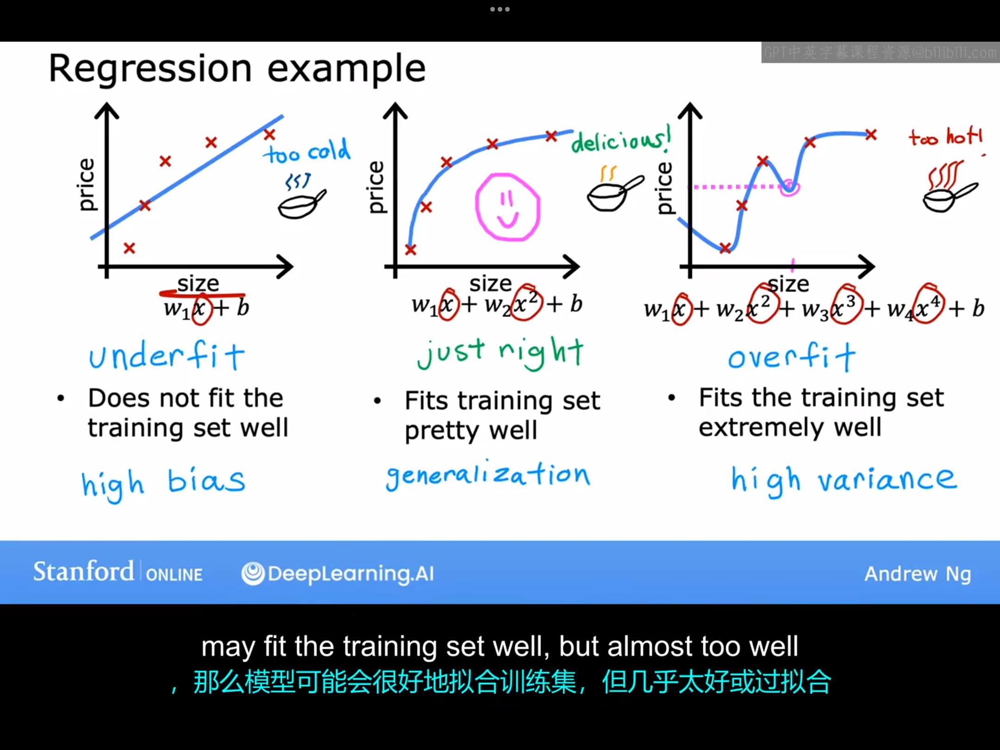
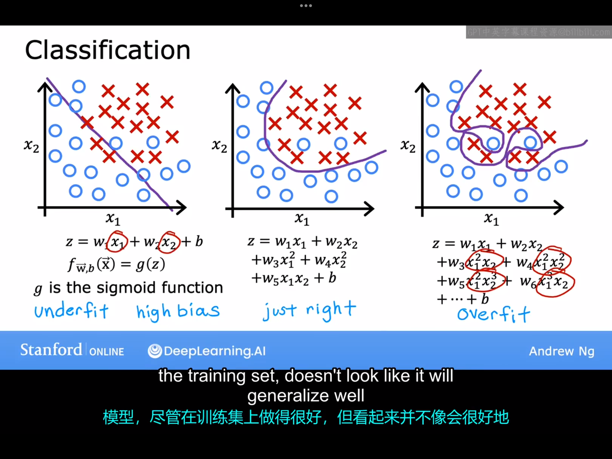
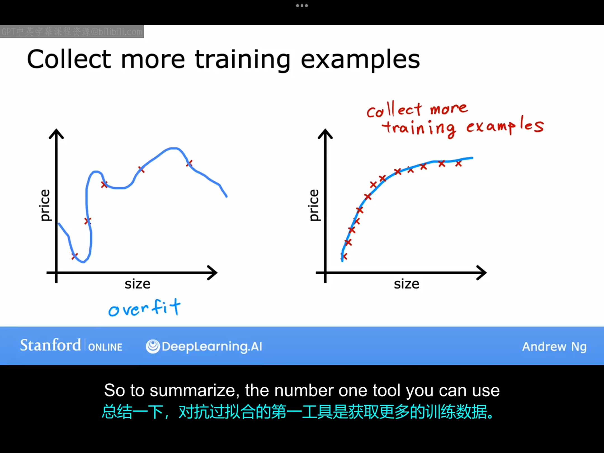
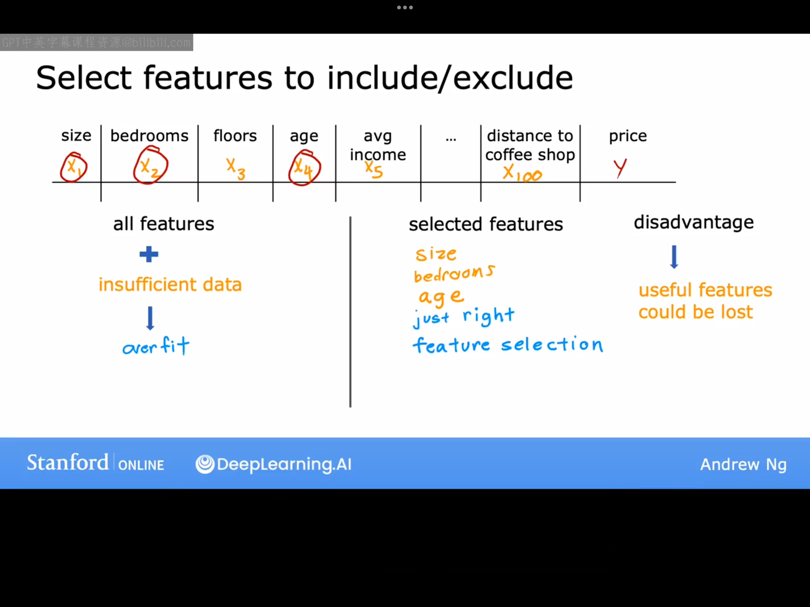
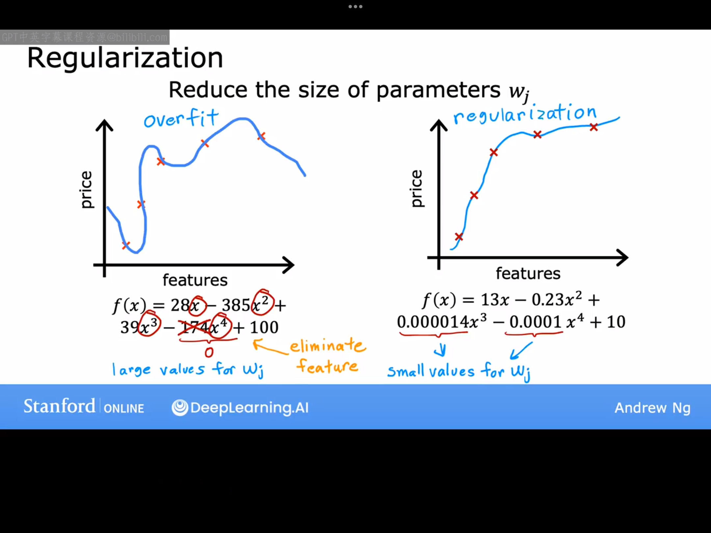
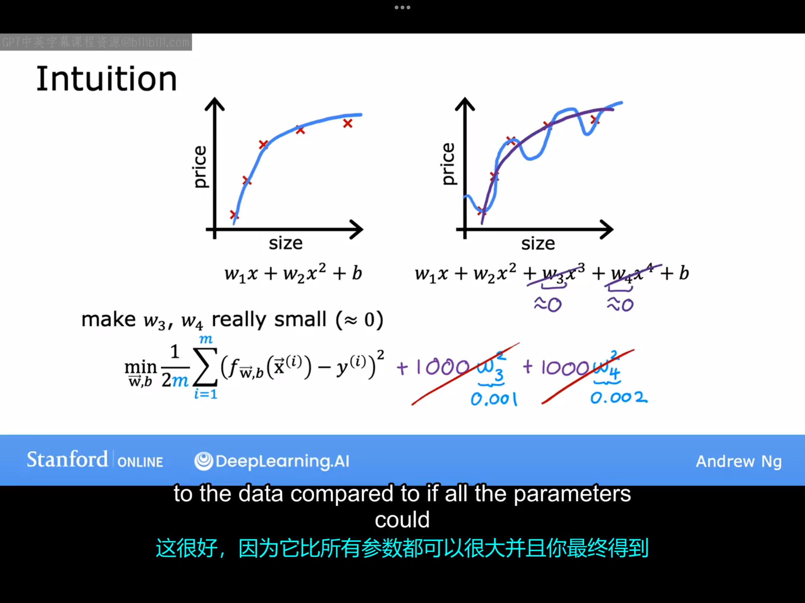
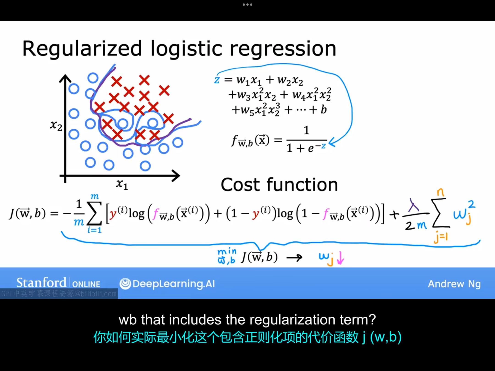
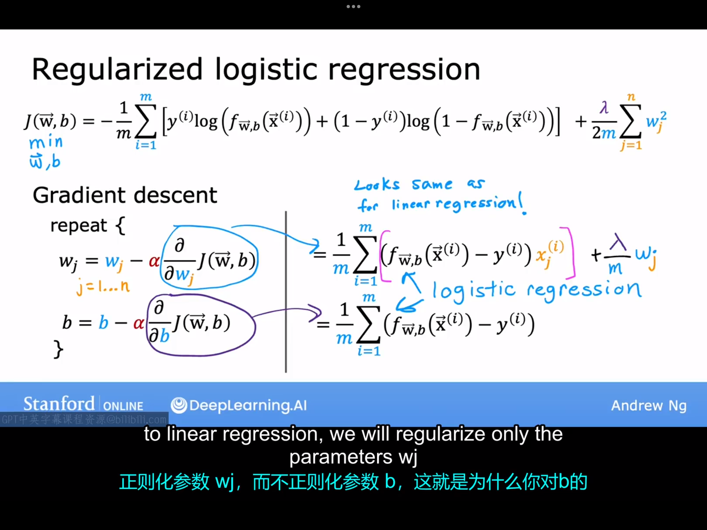

# 10.1 过拟合问题(the problem of overfitting)

前面我们学习了两种不同的学习算法——线性回归和逻辑回归。它们在许多任务中表现良好，但在某些应用中，算法可能会遇到一个称为过拟合的问题，这会导致其表现不佳。在这个视频中，我们将展示什么是过拟合，以及一个与之密切相关、几乎是相反的问题，称为欠拟合。之后我们会分享一些解决过拟合问题的方法。特别是，有一种方法叫做正则化，这是一个非常有用的技术。

现在我们来举一个具体的例子来帮助你理解什么是过拟合：

假设现在有一个如上图所示的数据集，上面三张小图就分别对应了欠拟合，刚好拟合，过拟合的情况。
1.左图：如果选取线性回归模型，显然这并不是一个很好的模型，因为该数据集有一个很明显的特征是随着特征x的不断增加，输出y会趋于饱和。这个问题的技术术语是模型欠拟合(underfit)训练数据，另一个术语是算法具有高偏差（high bias）。这里的偏差指的是：算法欠拟合数据，导致它无法很好地拟合训练集，训练数据中有一个明显的模式，但算法无法捕捉到。另一种思考这种偏差的方式是，如果学习算法有一个非常强烈的“先入之见”，或者说有一个强烈的偏见，这个偏见认为房价就是房屋大小的完全线性函数，这种先入之见导致它拟合了一条直线，但这条直线并没有很好地拟合数据，导致它欠拟合数据。
2.中图（这里的模型我认为图上是写错了，不应该包含二次项，而应该包含$\frac{1}{2}$次项）：中图选择的曲线图像可以较好地拟合数据，如果出现了一个不在数据集中的新房子，这个模型可能在预测新房子上表现得非常好。所以如果你希望你是一个房地产经纪人，你希望你的学习算法在训练集之外的例子上也能表现良好，这被称为“泛化”。从技术上来说，我们也希望你的学习算法能够很好地泛化，这意味着即使在它从未见过的新样本上也能做出良好的预测。
3.右图：这是一个相对于左图的另外一个极端。这是一个四次函数模型，有五个参数，而数据集中也有五个数据，所以你可以拟合一条数据完美地通过五个数据点，这也就意味着代价函数为0，这看起来似乎是一个不错的拟合。但是，这个模型如果现在有个新房子大小处在x轴上的粉红色标记处，用该模型预测的结果对应于粉红色圆圈对应的纵坐标，它低于第三个数据点对应的纵坐标，这意味着房屋面积变大了，房价却变低了，这显然不符合常识，所以我们不认为这是一个很好地房价预测模型。技术术语是这个模型过拟合了数据，或者说这个模型存在过拟合问题。另一个术语是算法具有高方差(high variance)。过拟合或者高方差的直觉是算法非常努力地拟合每一个训练样本。事实证明，如果你的训练数据稍微发生一点变化，比如对于同一个房子，它的房价稍微高一点或者低一点，那么算法拟合的函数可能会完全不同。
在上面三张图中，我们认为中间那张图是最合理的，这种情况并没有一个特定的名称，我们可以称之为：“刚刚好”，因为它既不过拟合，也不欠拟合。我们机器学习的任务就是希望找到一个既不过拟合也不欠拟合的模型。换句话说，希望找到一个既不高偏差也不高方差的模型。
到目前为止，我们已经看到了线性回归中的过拟合。同样地，过拟合也适用于分类。下图给出了一个具体的示例：

# 10.2 解决过拟合问题
在本专业课程后期，我们将讨论调试和诊断学习算法可能出现的问题，你还将学习到识别何时可能发生过拟合和欠拟合的具体工具。但现在，当你认为发生了过拟合时，让我们讨论一下你可以采取的措施。
法一：收集更多的数据，扩大训练集。

局限性：你可能没有办法获取更多数据（比如某个地区只有这么多房屋被出售）。
法二：使用更少的特征。
在之前的视频中，我们的模型特征包括$x,x^2,x^3,x^4$等等，这些都是多项式特征，减少多项式特征的数量可以减少过拟合。现在我们来看一个不同的例子。现在假设你有不同的房屋特征来尝试预测其价格，如下图所示：

事实证明，如果你有很多这样的特征，但没有足够的训练，那么你的机器学习算法有可能对训练数据过拟合。但是如果你从这些特征中只挑选处几个你认为重要的特征并训练模型，你可能会发现你的模型不再那么严重地过拟合。选择最合适的特征集有时也被称为特征选择。特征选择的一个缺点就是，训练时仅使用了全部特征的子集，算法可能会丢弃一些关于房屋的信息。在课程2的后期你还会看到一些自动选择最合适的特征集的算法。
法三:正则化（regularization）

上图中左图是一个过拟合的模型，这是一个多项式模型，你会发现各参数的值往往比较大。现在，你要消除其中的一些特征，比如说，你要消除特征$x^4$，那就相当于将$x^4$前面的参数设置为0。事实上，正则化是一种更温和地减小某项特征的影响的方法，它不像直接消除那样严厉。正则化鼓励学习算法缩小参数的值，而不一定非要求精确地设置为0。这样一来，即使你拟合了一个高阶多项式，只要你能让算法使用较小的参数值，你最终会得到一条更好的拟合训练数据的曲线。所以正则化的作用是让你保留所有的特征，同时避免某些特征产生过大的影响。顺便说一下，我们正则化一般只减小$w_1,w_2,...,w_n$的值，是否也正则化参数b并没有很太大的区别（一般不鼓励正则化b）。
总结一下解决过拟合问题的方法：
1.收集更多训练数据
2.特征选择
3.正则化方法（减小参数的值），该方法通常最常用。

# 10.3 带正则化的代价函数
上节课中我们看到，正则化方法试图使参数值$w_1,w_2,...,w_n$取比较小的数值，以减小过拟合。本节课我们将基于此种直觉，在原来的代价函数的基础上做点修改，以此实现正则化。

我们继续看上节课那个例子，我们知道对于图中的数据集来说二次函数模型是一个好的模型（虽然笔者认为这里应该更应该引入的是1/2次项，二次项应该也使用正则化消除其影响，但这里不再纠结这个问题，就按照ppt来），所以应该让3次方，4次方项前面的参数变小以减小这两项的影响。为了实现这一目的，我们在原来的代价函数的基础上再加上$1000w_3^2$,$1000w_4^2$这两项（这里选择1000是因为它是一个比较大的数，也可以选择其他比较大的数）。这样一来，如果$w_3,w_4$很大，由于$1000w_3^2$和$1000w_4^2$这两项的存在，有很大可能导致代价函数也会很大，所以在最小化代价函数时，梯度下降算法不得不选择更小的$w_3,w_4$。如果$w_3,w_4$很小，那么代价函数中的$1000w_3^2,1000w_4^2$也会很小，趋向于零，对原代价函数的影响并不会很大。
正则化背后的思想：如果参数的值比较小，那么这有点像有一个更简单的模型，可能具有更少的特征，因此不太容易过拟合。上图中我们只对$w_3,w_4$进行了正则化，但实际应用中，我们很可能不知道哪些是最重要的特征，因此，正则化通常的实现方式是正则化所有特征前面的参数。并且可以证明，这通常会导致拟合一个更平滑、更简单、不太容易过拟合的函数。
假设我们现在有n个特征，我们并不知道哪些特征是重要的，我们需要对所有参数正则化处理。修改后的代价函数可以写为：
$$
J(\vec{w},b)=\frac{1}{2m} \sum_{i=1}^{m} (f_{\vec{w},b}(\vec{x}^{(i)})-y^{(i)})+\frac{\lambda}{2m} \sum_{j=1}^{n}w_j^2
$$
式中的$\lambda$也被称为正则化参数($\lambda>0$),类似于学习率$\alpha$,我们现在也必须为$\lambda$选择一个合适的数值。值得一提的是，我们这里并不使用$\lambda$直接乘以$w_j^2$，而是加了一个$\frac{1}{2m}$因子，这是为了与第一项保持一致，事实证明，这样做之后，即使训练集的大小增加，之前选择的$\lambda$值与更可能继续有效。一般来说，是否对b正则化是无所谓的，故代价函数中包不包括$\frac{\lambda}{2m}$都可以。
总结一下，在上式那个修改后的代价函数中，包括了原始代价函数以及正则化项。在最小化代价函数时，实际上是在最小化这两项之间做了权衡。最小化第一项是鼓励算法通过最小化预测值与实际值之间的平方差来很好地拟合训练数据。而试图最小化第二项，算法试图保持参数$w_j$较小，这将倾向于减少过拟合。你选择的$\lambda$值指定了这两个目标之间的相对重要性或者相对权衡。让我们看看不同的$\lambda$值会对你的学习算法产生何种影响：
1.如果$\lambda=0$,则相当于未引入正则化项，你的模型很可能过拟合。
2.如果$\lambda$超级大，例如取值为$10^{10}$，这时所有的参数都会趋于零，这时$f(x) \approx b$，你的模型会欠拟合。
所以你必须得选择一个既不太大也不太小的值！！！后面我们会介绍选择合适的$\lambda$的值的方法。

# 10.4 正则化线性回归
修改后的代价函数：
$$
J(\vec{w},b)=\frac{1}{2m} \sum_{i=1}^{m}(f_{\vec{w},b}(\vec{x}^{(i)})-y^{(i)})^2+\frac{\lambda}{2m} \sum_{j=1}^n w_j^2
$$
该修改后的代价函数对应的参数更新规则：
$$
w_j=w_j-\alpha \frac{\partial J}{\partial w_j}=w_j-\alpha [\frac{1}{m}\sum_{i=1}^{m} (f_{\vec{w},b}(\vec{x}^{(i)})-y^{(i)})x_j^{(i)}+ \frac{\lambda}{m}w_j]\\
b=b-\alpha \frac{\partial J}{\partial b}=b- \alpha \frac{1}{m}\sum_{i=1}^{m}(f_{\vec{w},b}(\vec{x}^{(i)})-y^{(i)})
$$

# 10.5 正则化逻辑回归
逻辑回归的梯度更新与线性回归的梯度更新相比，二者非常相似。同样的，正则化逻辑回归的梯度下降更新也将与正则化线性回归的梯度下降更新非常相似。我们先复习巩固一下正则化逻辑回归的应用场景。假设现有一个二分类任务的数据集如下图所示：

假设我们将z选择为一个高阶多项式，且未进行正则化，那么由此模型得到的决策边界很可能是一条非常复杂的曲线，更一般地，当你使用大量特征（无论是多项式特征还是其他特征）训练逻辑回归时，可能会增加过拟合的风险。但如果你使用了正则化方法，就可以有效地避免过拟合。
修改后的逻辑回归的代价函数：
$$
J(\vec{w},b)=-\frac{1}{m} \sum_{i=1}^{m} [y^{(i)}log(f_{\vec{w},b}(\vec{x}^{(i)}))+(1-y^{(i)})log(1-f_{\vec{w},b}(\vec{x}^{(i)}))]+\\
\frac{\lambda}{2m} \sum_{i=1}^{n}w_j^2
$$
正则化逻辑回归后，梯度下降的参数更新规则如下图所示：