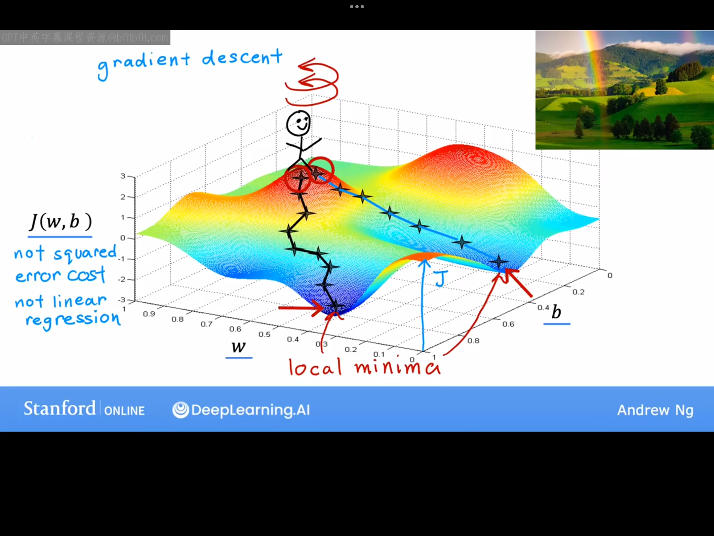
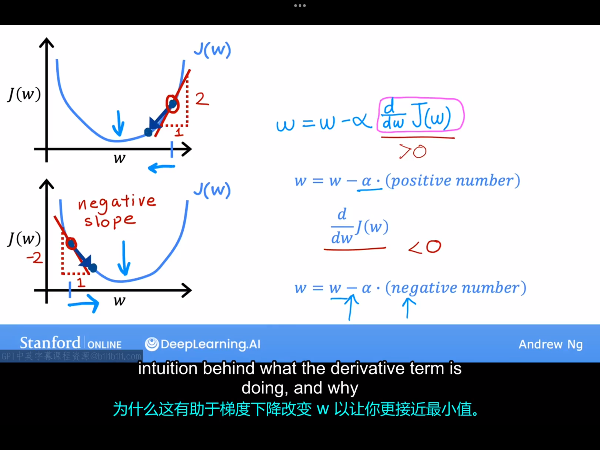
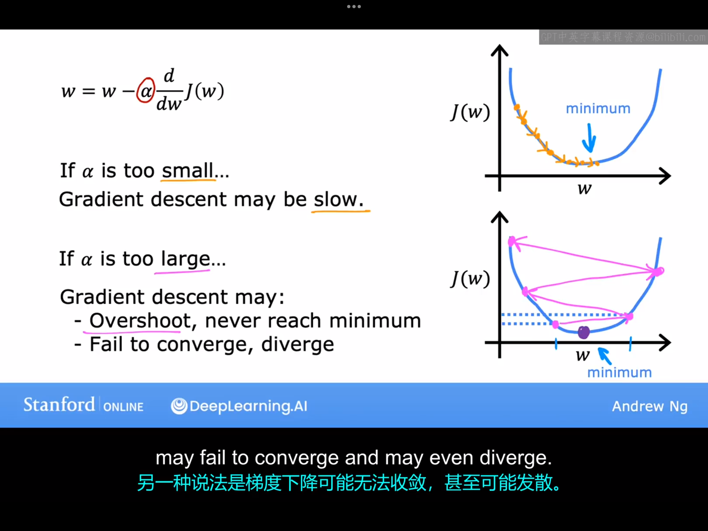
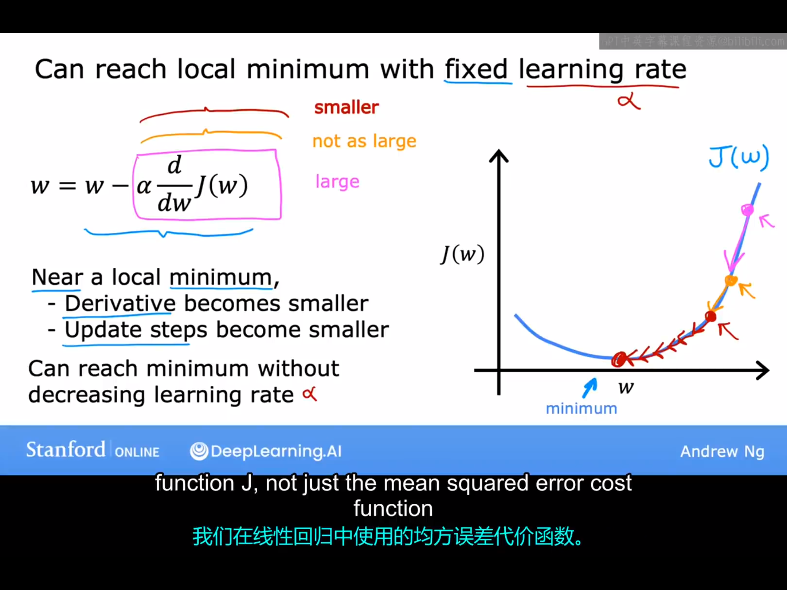
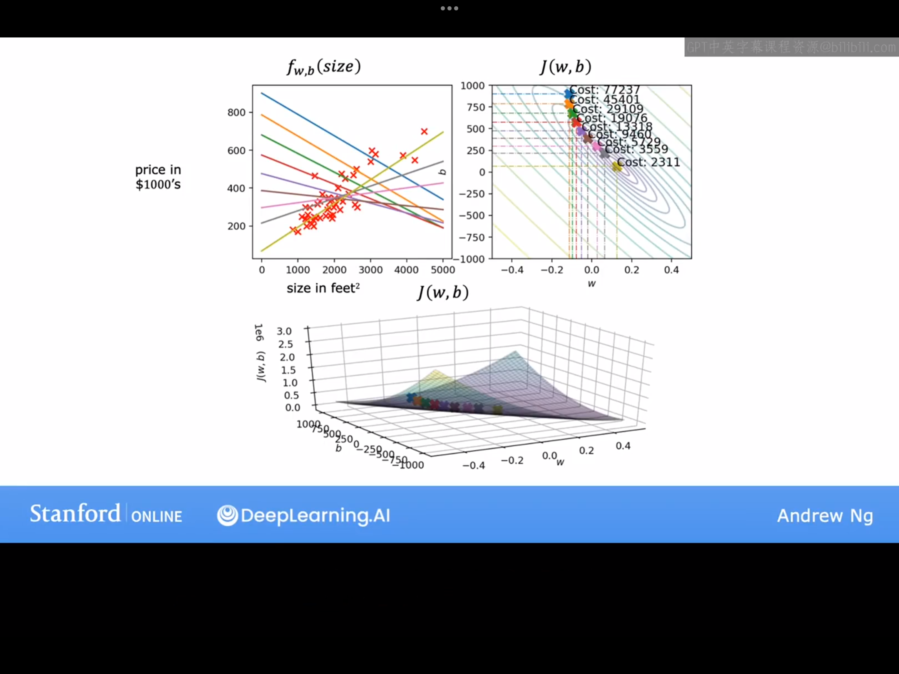

# 4.1 梯度下降（Gradient Descent）法
本节课开始，我们将学习梯度下降法。值得一提的是，梯度下降法求最小值并不只适用于线性回归模型中的代价函数，它其实适用于所有函数。梯度下降在机器学习中经常用到，不仅用于线性回归，也可用于神经网络的训练等。

再次梳理下我们的任务：我们现在有代价函数J(w,b),我们想要通过梯度下降法找到最小的J(w,b)以及它对应的(w,b)。(注：实际上梯度下降也不只适用于双变量函数，它适用于任意n变量函数)。

梯度下降法的具体步骤：
1.选定起始点$（w_0,b_0）$。
2.不断改变$w,b$以减小$J(w,b)$。
3.直到算法找到了$J$的最小值处或者距离最小值足够近的地方，在这之后算法停止迭代。

值得注意的是，实际上我们遇到的代价函数并不都是线性回归模型中的那种碗形或者吊床形函数。有的代价函数的三维曲面图像很复杂，这时我们使用梯度下降法找到的最小值可能不止一个（可能找到多个局部最小值），例如，假设下图是某代价函数的三维曲面图像。梯度下降法对应的示意图已经在图上标出。每次迭代时，小人都会站在当前点位上，$360\degree$地环顾一周，然后找到下降最快的方向并沿着该方向移动移动某一步长。但是选择不同的起点，小人最后停止的位置也可能不一样。

# 4.2 实现梯度下降
下面我们介绍梯度下降算法具体是如何实现的。实际上，梯度下降算法的核心就在于参数的的迭代，该降法中参数的具体迭代更新方式如下：
$$
w=w-\alpha\frac{\partial}{\partial w}J(w,b)\\
b=b-\alpha\frac{\partial}{\partial b}J(w,b)
$$

式中的$\alpha$代表学习率,它通常是一个处在0~1范围内的数，它改变的是迭代过程每一步的步长大小，后面我们会学习如何选择合适的学习率$\alpha$。

但是在参数的更新过程中需要注意一点：我们需要同步更新W和b。同步更新的正确做法如下所示：
    temp_w=$w-\alpha\frac{\partial}{\partial w}J(w,b)$
    temp_b=$b-\alpha\frac{\partial}{\partial b}J(w,b)$
    w=temp_w
    b=temp_b
但下面这种更新方法是错误的：
    temp_w=$w-\alpha\frac{\partial}{\partial w}J(w,b)$
    w=temp_w
    temp_b=$b-\alpha\frac{\partial}{\partial b}J(w,b)$
    b=temp_b

尝试讨论一下为什么需要同步更新参数（这部分内容完全是笔者的自我发挥，无法保证完全正确）：
首次正式接触梯度，应该是在学电磁学的时候（力学课上讲到保守力时老师提过一嘴，学高等数学时老师则直接跳过了这部分内容）。我们知道，对于一个用标量函数$f(x,y,z)$描述的标量场，点$（x_0,y_0,z_0）$处的梯度$\nabla f$指向标量场增加最快的方向，这点也是很容易证明的。在梯度下降法中，每次迭代时，我们需要找$J$减小最快的方向，即$\nabla J$所指方向的反方向。所以梯度下降法中要寻找的下降最快的方向的单位向量为：
$$
\vec{I}=-\frac{1}{|\nabla J|}\nabla J=-\frac{1}{|\nabla J(w,b)|}(\frac{\partial J}{\partial w}\hat{w}+\frac{\partial J}{\partial b}\hat{b})
$$
假设每次迭代走的步长为a,所以沿着$\hat{I}$方向走步长a时，w轴、b轴坐标的变化量为：
$$
dw=a*I_w=-a\frac{1}{|\nabla J(w,b)|}\frac{\partial J}{\partial w} \\
db=a*I_b=-a\frac{1}{|\nabla J(w,b)|}\frac{\partial J}{\partial b} 
$$
所以经历一次迭代以后，新的（w，b）的值为
$$
w=w+dw=......\\
b=b+db=......
$$
通过以上讨论可以清楚地看到，同步迭代的本质是当小人站在$(w_0,b_0)$点处利用迭代公式计算下一步该走到那里时，迭代公式涉及的是$(w_0,b_o)$处的梯度，而不是求$(w_0,b_0+db)$或$（w_0+dw,b_0）$处的梯度。

# 4.3 梯度下降的直观理解

这节内容很简单，用如下一张图即可概括（图中的例子是针对b=0的特例）。

# 4.4 学习率
在这节课我们将会看到，学习率$\alpha$的选择会对于梯度下降实现的效率产生巨大的影响，如果$\alpha$选择不当，梯度下降可能根本无法工作。如果$\alpha$过大或者过小可能会产生如下影响：

此外，梯度下降法还有一个特点：越靠近最小值点时，参数每次更新的幅度的绝对值会越小（因为学习率不变，但偏导数的绝对值会变小），若某次迭代后，J(w)恰好处于最低点，则此后算法将停止迭代。对应的示意图如下所示：

# 4.5线性回归的梯度下降法
本节课我们将梯度学习算法具体应用到线性回归模型中。具体的：
线性回归模型：
$$
f_{w,b}(x)=wx+b \tag{4.5.1}
$$
代价函数(该模型使用的均方误差函数)：
$$
J(w,b)=\frac{1}{2m}\sum_{i=1}^{m}(f(x^{(i)})-y^{(i)})^2 \tag{4.5.2}
$$
参数迭代公式：
$$
\begin{align}
w&=w-\alpha\frac{\partial}{\partial w}J(w,b) \tag{4.5.3}\\
b&=b-\alpha\frac{\partial}{\partial b}J(w,b) \tag{4.5.4}  
\end{align}
$$
将(4.5.1)、(4.5.2)代入(4.5.3)、(4.5.4)得：
$$
\begin{align}
w&=w-\alpha\frac{1}{m}\sum_{i=1}^{m}(f(x^{(i)})-y^{(i)})x^{(i)} 
\\
b&=b-\alpha\frac{1}{m}\sum_{i=1}^{m}(f(x^{(i)})-y^{(i)}) 
\end{align}
$$

我们在前面的课程中提到过，梯度下降法求函数最小值可以用于求任何函数的最小值。但是有时候梯度下降法给出的最小值并不是全局最小值，而是局部最小值。但是在用梯度下降法求线性回归模型中代价函数的最小值时不存在这个问题，因为这时的J(w,b)是“凸函数（convex function）”,在全空间只有唯一的一个最小值。

# 4.6 运行梯度下降法

梯度下降法的运行示意图：

更准确的说，目前为止我们介绍的梯度下降算法都属于“批量梯度下降（Batch Gradient descent）法”。这里批量的意思是：Each step of gradient descent uses all the training examples,而不是训练集的一个子集。实际上也有其它版本的梯度下降，它们不查看整个训练集，而是在每次更新时只查看训练集的某个子集，但我们只使用批量梯度下降来处理线性回归问题。
以上就是线性回归的全部内容了，恭喜你学完了你的第一个机器学习模型。