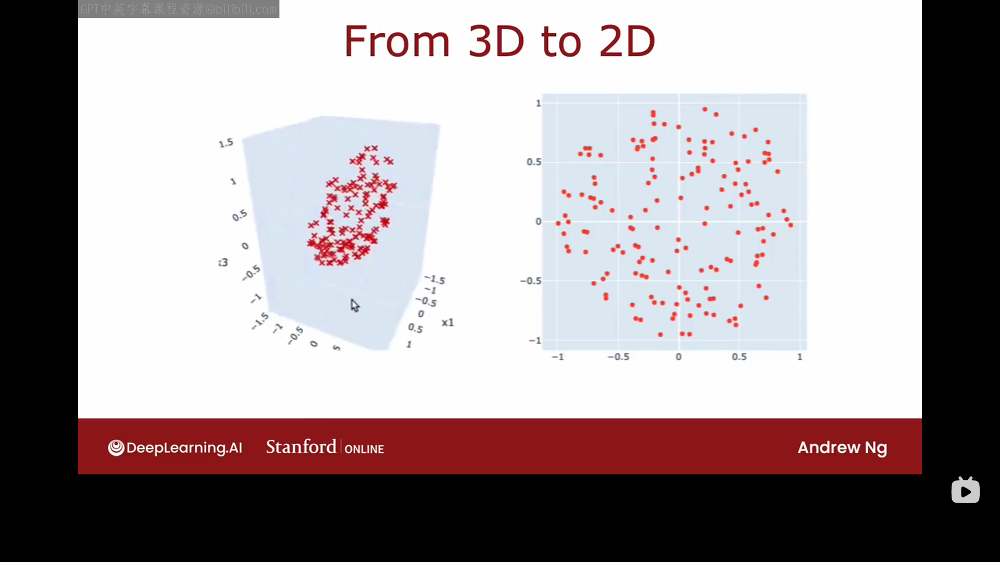

# 可选1 减少特征数量（可选）
在结束推荐系统这部分内容之前，我们再给大家介绍一个无监督算法——主成分分析，这是一个常用于可视化的算法。如果你有一个包含很多特征的数据集，那你无法绘制出这么多维特征表示的数据。主成分分析(PCA)是一种算法，它允许你将数据的大量特征的减少到两三个，以便于你可以绘制并可视化它们然后分析可能发生的情况。
为了介绍PCA算法，我将举一个家用车的例子。家用车可能有许多特征，例如长、宽、高、车轮的直径等你如何使用PCA来减少特征数量呢？
假设你有一个包含两个特征的数据集：汽车的长($x_1$)与宽($x_2$)。但实际上，为了符合道路宽度，不同汽车的宽度一般不会有太大差异。，所以你可能获得一个如下图所示的数据集：

其中,不同汽车的$x_1$差异很大，但$x_2$的差异却很小。所以如果你想减小特征数量，你可以只选$x_1$。事实证明，当PCA算法应用于这个数据集时，它会或多或少地决定只取特征$x_1$。如果你取$x_1$=车身长度，$x_2$=车轮直径，这种情况与上一种情况类似。如果我们取$x_1$=车身长度，$x_2$=车身高度，不同车的$x_1、x_2$都可能会有很大差距。你可能会获得如下图所示数据集：

这时如果让你选择减少特征数量，你很难决定是选择$x_1$还是选择$x_2$，因为它们都包含了很多信息。这时我们如果另外选择一条新的轴，记为z轴，它是根据数据集中的数据分布选出来的。那我们有了z轴之后，如何用它对应于车辆大小信息呢？现在我们要用z轴这一个特征来捕捉车辆的信息，z轴的坐标会告诉我们车辆的大小信息。PCA算法的思想就是找到一个或少数几个新轴，这样你在新轴上测量数据坐标时仍然可以获取获取关于物体的一些信息。在目前的例子中，我们只是将数据特征数量从二减少到了一。但在实际应用中，PCA算法往往应用于将大量特征（可能是几十，几百，上千个）减少至两个或三个特征，然后在二维、三维坐标系中绘制出它们以用于可视化。
例如，如下左图有一组三维数据，尽管它们是三维的，但它们好像全部位于同一个薄薄的平面上，所以我们可以利用PCA算法将其可视化到一二维平面上（如下右图所示）：

这里还有一个例子，如果你有一份用于评估很多国家发展程度的数据如下图所示：

假设这份数据中包含50个特征，你如何可视化这些数据？PCA允许你做的是将这50个特征压缩到两个特征，这里我们记为$z_1,z_2$，然后你可以绘制出这些有关于$z_1,z_2$的图：


$z_1$轴可能代表了国家的总gdp，$z_2$轴可能代表了人均gdp。
每当你拿到一份数据时，你都可以先尝试一下将数据可视化，因为这更有利于我们了解数据全貌，很多时候我们还可以从可视化的数据中发现一些新的东西。因此,PCA算法是一个很有用的算法。
# 可选2 PCA算法（可选）
本节课我们将学习PCA算法具体是如何工作的。
假设我们有一个如下图所示的包含五个数据的数据集：

这是一个无监督数据集，只有$x_1,x_2$，没有标签y。所以如果我们不想用$x_1,x_2$轴来表示数据，我们应如何选择一个新轴来表示数据？在应用PCA的下一步之前，特征应首先归一化为0均值（zero mean，即从每个特征中减去均值），如果$x_1,x_2$的取值范围十分不同，在进行PCA的下一步之前，你应该首先进行特征缩放。

为了决定选择哪条新轴，我们将原来的$x_1,x_2$轴去掉，但保留原点，假设我们选择了如下图所示的蓝轴作为新轴：

在此情况下，我们将只捕捉每个样本在z轴上的投影点对应的z轴坐标。这个选择并不太差，因为原来的数据点在这个新轴上分布地很开，你捕捉到了原始数据集中的很多变化与方差，捕捉到了很多有用的信息。

我们再来看z轴的另一种选择方法：

这种选择方法就不太好，因为这里的五个投影点很紧密地挨在了一起，通过该z轴的选择，你从数据集中获取的信息要少很多。

让我们看一下最后一种选择：

这种选择比之前两种都要好，因为这个轴上的投影点分得更开，保留了原始数据集的更多信息。在PCA算法中，这个轴被称为主成分（principal component），它是当你将数据投影到它上面时，所得的投影点坐标的方差最大的一条轴。

下面让我们更深入了解一下它是如何工作的：

假设我们已经选择了图中那条蓝线作为z轴，现在有一个样本（2,3）。在z轴上取一单位向量（图中紫色所示）为$[0.707,0.707]^T$，我们现在如何将图中的样本投影到z轴上？答案是使用点乘，即$[2,3] \cdot [0.707,0.707]^T = 3.55$。即该样本在z轴上投影点对应的坐标是3.55，我们就可以用这一个数字来代替这个样本。本例中我们只选择了$z_1$这一个轴，它也可以被称为第一主成分。
如果我们选择了$z_1$，$z_2$,$z_3$轴，他们必须互相垂直，并且可以依次被称为第一、第二、第三主成分。
注意PCA算法与线性回归是有很大的不同的：


最后，我们介绍一下PCA算法中的重构这一步，回忆之前的那个例子：

我们如何通过z=3.55这一数据找出原始样本在$x_1,x_2$坐标轴中的坐标？一种近似估算方法是：$3.55 \times [0.707,0.707]^T =[2.52,2.52]^T$，这就是主成分分析的重构步骤。

下个视频中，我们将学习如何在Scikit-learn库中实现PCA算法。
# 可选3 PCA算法的代码实现

若想实现PCA算法，你得先进行一些预处理步，例如，如果原始数据的各个特征的取值范围差异很大，可以先进行特征缩放。之后的正式步骤：
- 运行PCA算法以获得两个或者三个轴$z_1，z_2,...$。在Scilearn中，你将使用fit函数/方法来完成这一步，PCA中的fit函数自动包含了均值归一化，因此，你无需单独进行均值归一化。
- 查看每个主成分的解释的方差比例。这是通过"explained_variance_ratio"方法完成的。
  注：解释的方差比例 (Explained Variance Ratio)：在找到所有主成分后，我们可以计算每个主成分所捕获的方差占原始数据总方差的百分比。这就是 explained_variance_ratio_。
- 将每个原始数据投影到主成分上。
  
下面我们写一段代码来处理下面这个包含六个样本的数据集：


```python
#X是一个二维数组
X=np.array([],[],[],
            [],[],[])
#将数据降维至一个主成分
pca_1=PCA(n_components=1)
#用数据拟合PCA模型，计算主成分的方向（特征向量）和方差（特征值）
pca_1.fit(X)
#返回一个数组，显示每个主成分解释的方差比例（例如，如果返回[0.85]，
#表明第一个主成分保留了85%的原始数据方差）
pca_1.explained_variance_ratio_
#将原始数据 X 投影到主成分上，得到降维后的数据 X_trans_1
X_trans_1=pca_1.transform(X)
#将降维后的数据 X_trans_1 ​反向转换回原始特征空间，得到重构数据 X_reduced_1（形状与 X 相同）
#由于降维损失信息，X_reduced_1 是原始数据的近似（非精确还原）。
X_reduced_1=pca_1.inverse_transform(X_trans_1)
```

PCA算法的一些其他用途：
- 用于数据压缩。（很多年前经常用，现在由于内存已经足够大，故这种应用越来越少）。
- 加速监督学习算法的应用（这也是很多年前经常用，现在也几乎不用了）。
