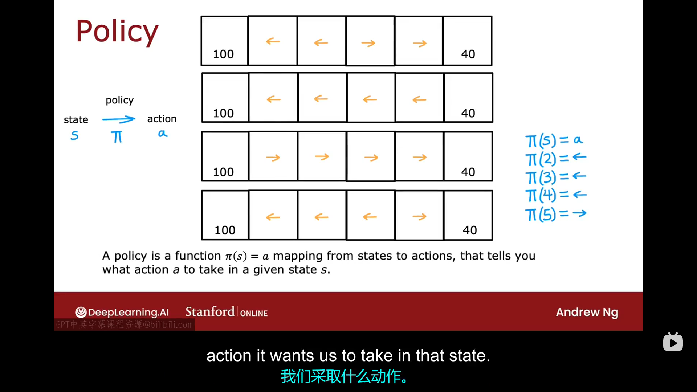

# 7.1 什么是强化学习
让我们先从一个例子开始介绍机器学习：
下图是一个直升机模型：
以往我们控制直升机模型都是使用无线电遥控器。但现在如果我要求你写一段代码来让模型实现自主飞行，你应该如何做到这一点呢？答案是，现在你可以通过强化学习来让直升机自主飞行。

在过去，我们通过观察直升机的位置，然后控制遥感以操控飞机，与之对应的一个简化模型就是：我们根据直升机目前的状态（在强化学习中，我们称直升机的位置、方向、速度等为直升机的状态）来决定当下直升机需要做什么动作（你也可以将其看成一种映射关系）。有人可能会尝试通过监督学习来解决这个问题，他可能将直升机当前状态设定为输入x，然后请教一个专业的直升机飞行员直升机当下状态x对应的最合理的操作是什么，并把它记为y，然后训练一个神经网络模型，直接从状态S学习到动作A。但事实证明，它不是一个好的方法。因为你很难准确获取直升机当前状态（而且状态是可以连续变化的），并且很难判断出下一步最合适的操作，故你很难获取数据集(x,y)。因此，在机器人的控制领域，监督学习效果不佳，人们转而使用强化学习。此外，强化学习还有一个额外输入：奖励函数。它会告诉直升机什么动作做的好，什么动作做的不好，以此来鼓励直升机做出更多的“好动作”。思考强化学习为何如此强大的一个方法是，你必须告诉它做什么，而不是如何做，这种通过制定奖励函数而不是最优动作的方法，为你设计系统提供了更大的灵活性。具体地说，举个例子，如果直升机飞得好，你可以每秒钟给它一个正奖励，例如+1。如果它做的不好，甚至坠毁了，你可以给它一个很大的惩罚，比如-1000。
当下强化学习的一些应用领域：

强化学习的关键思想是：你不必告诉算法每个输入的正确输出Y是什么，你只需要指定一个奖励函数，告诉它什么时候做得好，什么时候做的不好，算法的工作是自动选择好的动作。
# 7.2 火星探测器示例
本节课我们将使用一个受火星探测车启发的简化例子来开发强化学习。
在这个应用中，我们将使用如下图所示的六个方格来表示来表示火星车可能所在的六个位置。漫游车的位置在强化学习中被称为状态，这里将六个位置分别记为状态一、状态二、...状态六，假设漫游车起始时位于状态四。

假设现在漫游车正在执行火星考察任务，现在位置1是一个科学家比较感兴趣的、有趣的地方，位置6也是一个有趣的地方，但它不如位置1那么有趣，我们可以用奖励函数来表示这一点。例如，我们可以规定状态1的奖励是100，状态6的奖励是40，其他所有中间状态的奖励都是0。在每一步，漫游车都可以选择向左走或者向右走，那么现在漫游车应该如何做以获得最大收益？在强化学习中，我们十分关注奖励函数,因为它会告诉漫游车它做的动作做的是好还是坏。如果漫游车往左走，它会依次获得0（当前状态）、0、0、0、100的奖励，假设当机器人达到状态1或者状态6时，它一天的任务就结束了，它不再会发生任何移动。在强化学习中，状态1和状态6这种状态被称为终止状态。总结一下，在每个时间步，机器人会处于某种状态s，它可以选择某种动作a，它还会霍德尔某种奖励R(s)，由于它做了动作a，它会到达状态$s^{\prime}$，你可以用$(s,a,R(s).s^{\prime})$来表示这四要素。这四要素是强化学习在决定如何采取下一步动作时的核心要素。
# 7.3 强化学习中的回报
你在上节课中看到了什么是强化学习中所谓的"状态"，以及根据算法采取的动作，漫步车回经历不同的状态并获得不同的奖励。但你如何知道一组特定的奖励是好于还是坏于另外一组特定的奖励呢？本节课中，我们将介绍什么是强化学习中的“回报”，它将会帮助我们判断这一点。
将回报之前，我们先用一个例子类比一下。如果现在你的脚下有一张五美元钞票，而在城市的另一边有十五美元，你会选择去捡哪一个呢？虽然十五美元比五美元多，但你如果想得到它你将获得更大的代价。因此，更快获得的少量奖励可能比花费大量时间才能获得的大量奖励更有吸引力。
让我们回顾一下之前的火星漫游车的例子：

我们现在规定，漫游车选择每种方案时对应的回报为：
$$
return=R_1+rR_2+r^2R_3+\dots
$$
其中，r为折扣因子，其取值为$(0,1)$
例如，如果漫游车从状态4一路向左出发达到状态1，该方案下漫游车获得的回报是：
$$
return=0+r*0+r^2*0+r^3*100
$$
在许多强化学习算法中，折扣因子的常见选择是一个非常接近1的数字，例如0.9,0.99,0.999等。在金融应用中，折扣因子也有一个非常自然的解释，即利率，或货币的时间价值。例如，如果你今天有1美元，可能比你未来有1美元更有价值，因为你可以将其放入银行，获取一些利息。因此，在金融领域，折扣因子常被用来未来1美元相对于今天的1美元价值降低了多少。
下图列出了更多的具体计算回报的例子：
。
总结一下，强化学习中的回报是系统获得奖励的叠加，但这些奖励是按照加权因子叠加的。距离当下越远的奖励在叠加时会乘上一个更高次数的加权因子。但如果你的系统中存在负奖励，那就会出现一个有趣的现象：如果系统包含负奖励，那算法会倾向于将负奖励推到更远的未来。例如，如果你必须支付10美元给某人，那么你推迟几年支付将比你立刻支付更划算。
# 7.4 强化学习中的决策
在强化学习中，我们的目标是设计一个称为策略$\pi$的函数，它的任务是接受任何状态s作为输入，然后映射到我们希望其采取的某个动作a上。例如，对于下图中的策略4而言，$\pi$函数的映射关系如下图右下角部分所示：

因此，强化学习的目标就是找到一个策略$\pi$函数，它会告诉你在每个状态下如何采取最合适的行动以最大化回报。
目前为止，我们已经接触了强化学习中耳朵很多术语：状态、奖励、动作、回报、策略。下个视频中，我们将开始开发寻找良好策略的算法。
# 7.5 关键概念回顾
下表列举了几种情况下，强化学习中的状态、动作、折扣因子、奖励、回报、策略$\pi$具体代表了什么：

之前我们介绍的种种强化学习的形式化方法实际上有一个名字，它被称为马尔科夫决策过程（Markov Decision Process,简称mdp）。马尔科夫过程中的术语“markov”指的是未来状态只取决于当前的状态，而与你之前是如何达到当前状态的无关。