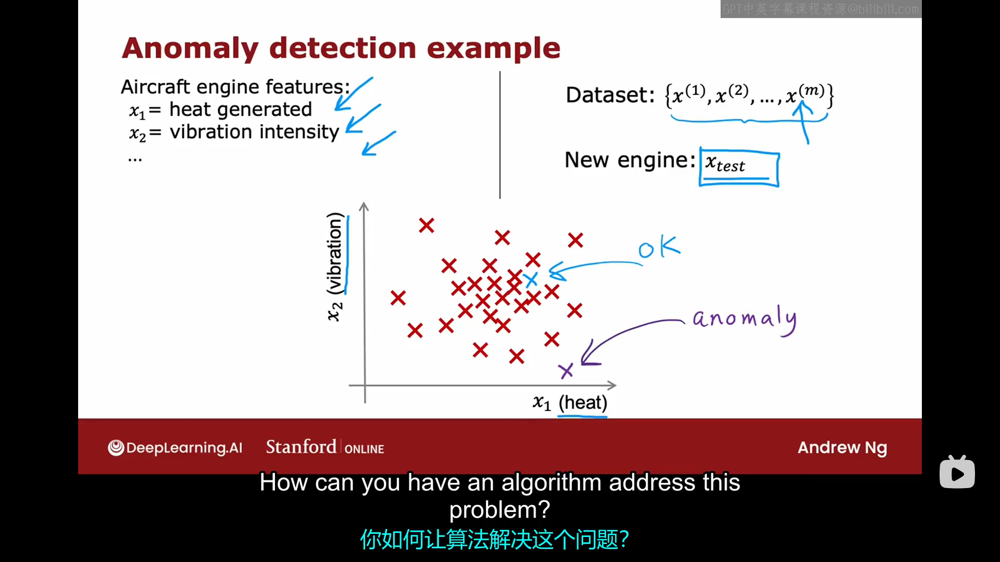
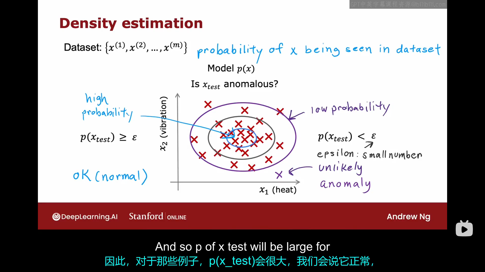
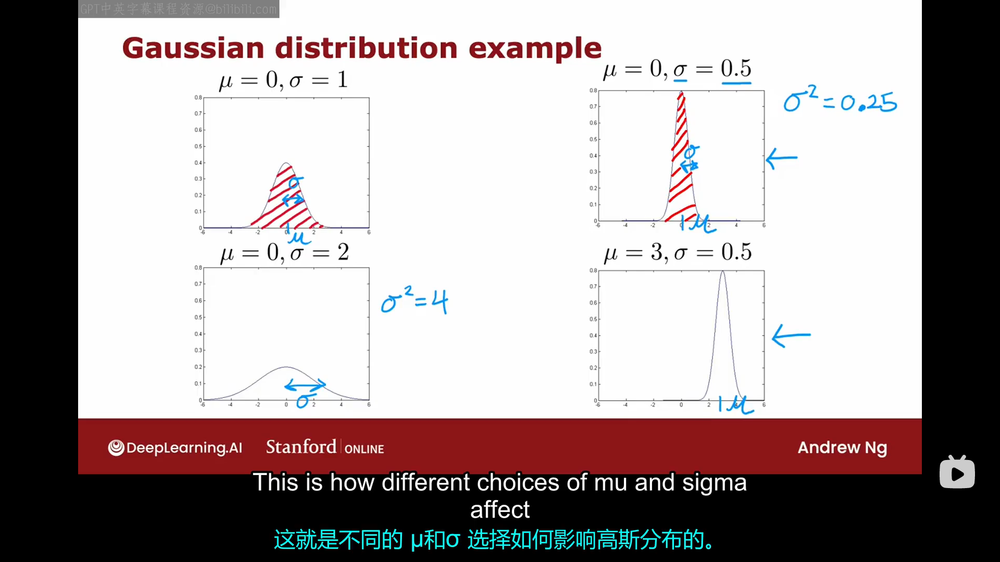
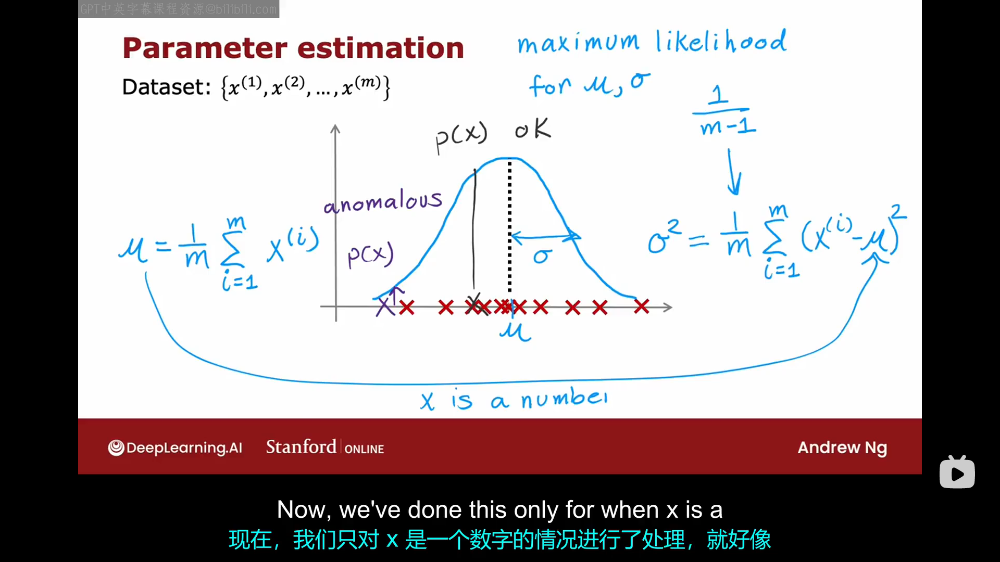
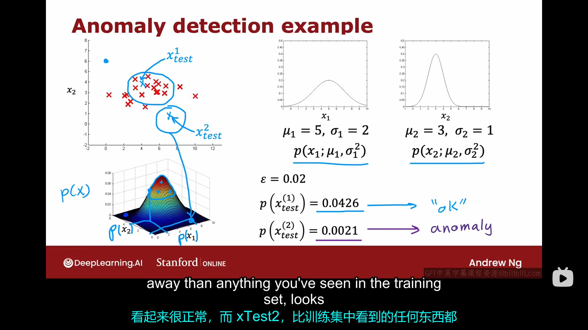
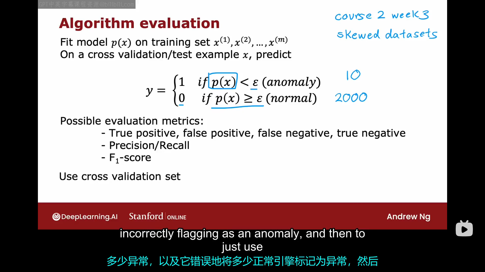
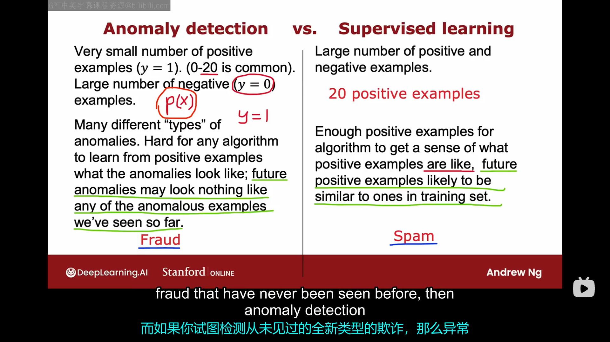
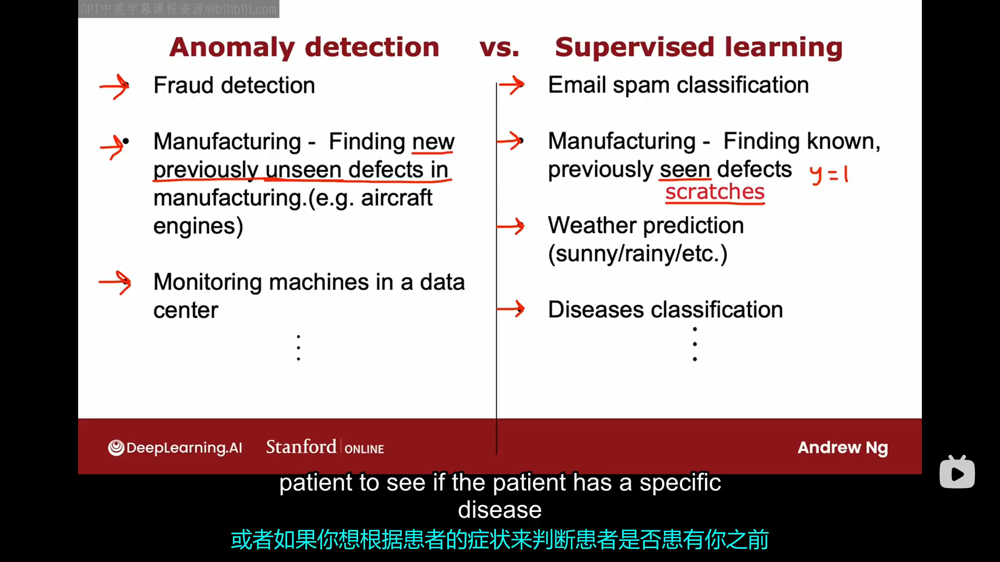
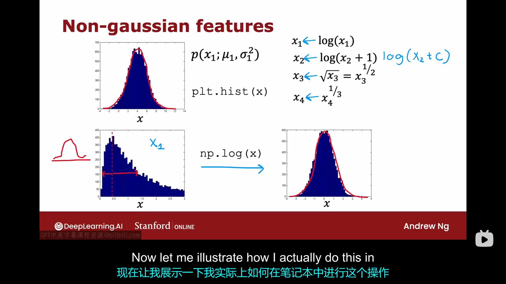
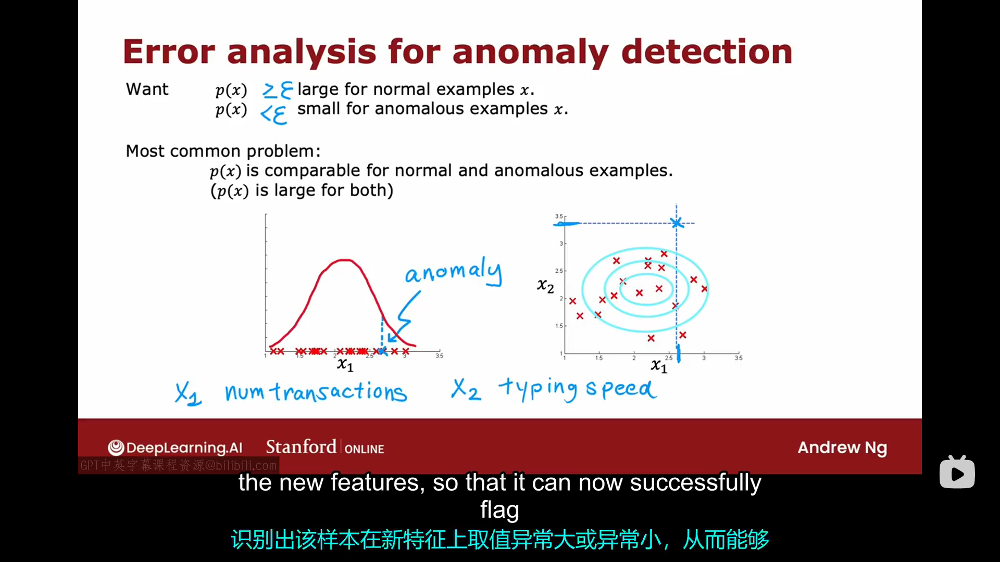

# 3.1 发现异常事件
异常检测算法会查看一个未标记的正常事件的数据集，并从中学习如何检测或标记异常事件。这里我们举一个检测制造的飞机发动机是否异常的问题。当飞机发动机下线后，你可以计算发动机的各种特征。例如，特征$x_1$检测发动机产生的热量；特征$x_2$检测发动机振动的强度。为了简化问题，这里只考虑这两个特征。事实证明，发动机制造商制造出有问题的发动机的概率是很小的。假设现在有已经制造好的m个发动机的数据作为数据集:{$x^{(1)},x^{(2)},\dots x^{(m)}$}。异常检测的任务是:如果现在有一个刚下生产线的新的发动机的数据是$x_{test}$，我们需要判断这个新生产的发动机是否有什么奇怪的地方。
假设我们根据m个样本的特征数据绘制出下图（图中每个红叉代表一个数据点）：

假设我们需要测试的样本处于图中蓝叉的位置我们大概率可以认为这个发动机没什么异常，但是如果待测试样本的特征位于图中紫叉的地方，我们就需要警惕这个发动机可能有问题，我们最好对其进行更深入的检查。那么，我们如何通过算法实现上述功能呢？
进行异常检测的最常见方法是使用一种密度估计的技术。这意味着当你得到这包含m个；样本的数据集时，你首先要做的是建立一个关于x的概率模型。也就是说，你得先弄清楚在特征$x_1,x_2$中哪些数值是高概率出现的，哪些数值是低概率出现的。比如在上个数据集中，我们可以认为在下图中的蓝色椭圆包围的区域内的数值是高概率出现的，在蓝色与黑色椭圆之间的区域的数值是中等概率出现的，在黑紫椭圆之间的区域的数值是低概率出现的，在紫色椭圆外部区域的数值是更低概率出现的：

至于你如何能从训练集中确定哪些取值是高概率出现的，哪些取值是低概率出现的，我们将在后续的视频中加以说明。当你学习了一个预测概率的$p(x)$模型后,如果现在有一个新样本$x_{test}$,且$p(x_{test})<\epsilon$时（$\epsilon$是人为设置的一个较小的参数），我们会发出警报，说这个可能是一个异常。
异常检测在今天许多应用中使用，它经常用于欺诈检测。例如，如果你正在运行一个具有许多不同特征的网站。将$x^{(i)}$记为第i个用户的特征，它可能包括用户的登录频率、交易频率、打字速度等。如果异常检测算法检测到了账户异常，我们通常不会直接封禁账户，但可能会对该账户加强安全审查，以确保其不会进行其他欺诈活动。此外，异常检测也经常用于制造业，比如用于我们之前局的例子——检测生产零件是否合格。

# 3.2 高斯分布
为了实现异常检测算法，我们得使用高斯分布（也叫正态分布或者钟形分布）。首先让我们来看看什么是高斯分布。
如果x是一个随机变量，且取值x的概率有下式给出：
$$
p(x)=\frac{1}{\sqrt{2 \pi \sigma}} e^{\frac{-(x-\mu)^2}{2 \sigma ^2}}
$$
那么我们就说随机变量x满足正态分布。其中$\mu$是随机变量x的期望值，对应于图像对称轴的横坐标。$\sigma^2$是随机变量的方差，决定了图像的胖瘦。这两个参数对于图像的影响如下：

 假设我们现在有一组数据集：{$x^{(1)},x^{(2)},\dots x^{(m)}$}，我们可以先通过下图中的公式计算出参数$\mu，\sigma^2$：
 
 你可以利用这两个参数得到一条高斯分布曲线去拟合数据集中的数据（原数据并不一定满足高斯分布，这条高斯曲线只是对原始数据的拟合）。如果你上过高级统计课程，你可能会知道这里的计算$\mu，\sigma^2$的公式叫做参数$\mu，\sigma^2$的极大似然估计。很多统计学家在计算$\sigma^2$时，前面的系数通常会使用$\frac{1}{m-1}$而不是$\frac{1}{m}$，但在实际应用中，使用这两个几乎没有太大差别。
 以上讨论仅限于特征x是一个标量而不是一个矢量。但实际的异常检测应用中，大多需要同时考虑多个特征，这一点我们将在下个视频中讨论。
# 3.3 异常检测算法
上节课我们学习了高斯分布如何应用于单个特征，本节课我们将考虑异常检测算法的具体实现。
如果我们现在有一个包含m个样本的数据集：{$\vec{x}^{(1)},\vec{x}^{(2)},\dots,\vec{x}^{(m)}$}，每个$\vec{x}^{(i)}$包含了n个特征，那么有：
$$
p(\vec{x})=p(x_1;\mu_1,\sigma^2_1)*p(x_2;\mu_2,\sigma^2_2)*...*p(x_n;\mu_n,\sigma^2_n)
$$
严格来说，上式要求各变量之间是独立的。但在实际操作中，即使变量之间不完全独立，上式的实际使用效果依然挺好的。
综上，构建一个异常检测算法需要下面几步：
- 选择合适的特征$x_1,x_2,...,x_n$
- 针对数据集拟合出参数$\mu_1,\sigma^2_1;\mu_2,\sigma^2_2;...;\mu_n,\sigma^2_n$
- 给出新样本的$\vec{x}$，计算$p(\vec{x})$，并比较$p(\vec{x})$和$\epsilon$的大小，其中：
  $$
  p(\vec{x})=\prod_{j=1}^{n}p(x_j;\mu_j,\sigma^2_j)=\prod_{j=1}^{n}\frac{1}{\sqrt{2 \pi \sigma_j}}e^{\frac{-(x_j-\mu_j)^2}{2 \sigma_j^2}}
  $$
下图给出了一个两个特征对应的具体事例：

所以你已经看到了异常检测系统的建立过程，但是你应该如何选择参数$\epsilon$呢？下节课我们将更深入探讨开发和评估异常检测系统性能的过程。
# 3.4 开发和评估异常检测系统
本节课我们将分享一些开发异常检测系统的实用技巧。其中的一个关键思想是，如果你有一种方法可以在系统开发过程中进行评估，你就能更快地做出决策、改进系统。

当您在开发机器学习算法时，在选择不同的特征或者尝试不同的参数值如$\epsilon$时，如果你有一种好的方法来评估学习算法，那么你将更容易做出决策，这有时被称为实数评估（real number evaluation）。具体地说，当你每次想以某种方式更改算法时，例如更改特征或者更改参数，如果你可以计算出一个数字来告诉你更改后的算法是变好还是变坏，那么你决定如何更改算法将会变得容易。这种方法在异常检测中很常见，尽管我们主要讨论的是未标注数据，但现在我想稍微修改一下假设，假设我们现在有一些标注数据（通常包括少量我们之前观察到的异常，例如，很可能你在制造飞机几年后，你只遇到过几个异常的发动机）。对于异常的例子，我们用y=1去标注它，对于正常的例子，我们用y=0去标注它。现在我们进行异常检测算法的训练集仍然是那个未标注的训练集，并且我们假设这个训练集中的发动机都是正常的。实际上，即使有几个异常的发动机混入了训练集，你的算法通常也会表现良好，下面我们来介绍如何实现实数评估。

如果你有一些异常例子，创建一个交叉验证集是很有用的。我们用{$(x_{cv}^{(1)},y_{cv}^{(1)}),(x_{cv}^{(2)},y_{cv}^{(2)}),\dots,(x_{cv}^{(m_{cv})},y_{cv}^{(m_{cv})})$}来表示交叉验证集，用{$(x_{test}^{(1)},y_{test}^{(1)}),(x_{test}^{(2)},y_{test}^{(2)}),\dots,(x_{test}^{(m_{test})},y_{test}^{(m_{test})})$}。我们希望在交叉验证集和测试集中包含少数异常（即y=1）的例子。让我们仍然发动机制造为例，假设你现有10000个发动机，其中包含了20个异常发动机。我们可以在训练集中放入6000个正常发动机，在交叉验证集中放入1990个正常发动机和10个异常发动机，在测试集中放入也1990个正常发动机和10个异常发动机。这样我们可以在训练集上训练模型，然后通过交叉验证集来更改$\epsilon$的值或增加、删除、修改特征。

但是，在实际应用中，由于异常出现的概率很小。所以更常见的一种做法是，取消测试集。也就是说训练集放入6000个正常发动机，交叉验证集放入4000个发动机，其中20个是异常发动机。这种方法适用于异常出现的概率特别低的时候，比如假设这1000个发动机中只包含两个异常，那此时把这两个异常都放入交叉验证集更好。这种方法的缺点是，你无法知道算法在未知的样本上表现如何，它存在着在交叉验证集上过拟合的可能，总之它更加适用于没有多余的异常来创建测试集的情况。
下图总结了开发和评估异常检测系统的过程：

值得一提的是，图中提到了对于异常检测算法的，我们可以用之前课上讲到的用于评估倾斜数据集（正例和负例数量相差很大的数据集）的一些指标来评估你的异常检测算法。但还有一个问题值得考虑，那就是：如果我们已经知道了哪些发动机是好的，哪些发动机是异常的，我们为什么不使用监督学习算法而是使用无监督学习算法呢？下节课我们将比较一下监督学习和异常检测，并讨论它们各自在什么情况下表现更好。
# 3.5 异常检测 vs 监督学习
当你有大量负样本(y=0)和少量正样本(y=1)，你应该在什么时候使用异常检测，什么时候使用监督学习？下图给出了二者对比：

总结一下，以下情况更建议使用异常检测：
- 只有数量非常少的正例和数量非常多的负例。
- 有多种类型的异常；或者算法很难从少量的正例中学习到异常是什么样的；或者未来可能出现我们之前从未见过的异常。

以下情况更建议使用监督学习：
- 有大量的正例和负例。
- 有大量的正例供算法学习使得算法能够大概学习到异常长什么样子；或者未来出现的正例都和训练集中的比较类似。

给出以上建议的原因是：异常检测与监督学习对于数据集的关注点有很大的不同，异常检测算法更多关注的是负例(y=0)，它有大量的负例可以学习，故它很容易学习到负类的特征，所以它一旦遇到了疑似正例的样本，它可以更好地识别出来。但是监督学习算法则是更多地直接关注正例，从大量的正例中学习正例的特征。

举个具体的例子，对于金融诈骗的检测，显然更适合使用异常检测算法。对于辨别垃圾邮件这一任务，则可能更适用于使用监督学习算法。因为个金融诈骗的形式更加多种多样。

下图列出了一些异常检测与监督学习分别适用的领域：

# 3.6 选择使用哪些特征
在构建异常检测算法时，选择好的特征是十分重要的。在监督学习中，如果你的特征不太正确，或者有一些与问题无关的额外特征，通常这也没关系，因为算法有监督信号（即足够数量的标签），算法可以自行决定忽略哪些特征，或者如何重新缩放特征，从而充分利用你提供的特征。但是对于异常检测，它仅从无标签数据中运行或者学习。算法更难自行决定忽略哪些特征。因此，选择合适的特征对于异常检测比对于监督学习更加重要。本视频中我们将介绍一些关于异常检测中如何选取合适的特征的实用技巧。
对异常检测算法来说，有个很重要的一点是尽量使你提供的特征的分布接近高斯分布。

如果你的某个特征$x_1$的分布如上图中第一行小图所示，这说明$x_1$的分布较为接近高斯分布，故你可以选择不对其进行处理。如果你的某个特征分布如上图第二行第一个图所示，那么你可以对特征x进行一些变换，让其变成第二行第二个图所示的那样。一些常见的变换方式如上图中右上角所示。特别地，在使用$log(x+c)，x^c$等变换时，我们可以尝试不同的c值以使特征x的分布更接近高斯分布。值得提醒的是，如果你对训练集做了某种变换，那么别忘了对交叉验证集与测试集也做同样的变换。

除了确保你的数据接近高斯分布以外，在训练完异常检测算法后，如果你的算法在交叉验证集上表现不佳，你也可以进行异常检测的错误分析过程。换句话说，你可以重点查看算法在哪些地方会表现不佳，在哪些地方会出错，然后利用这些信息来提供改进。
在理想情况下，我们希望$p(\vec{x})<\epsilon$对应于异常，$p(\vec{x})>\epsilon$对应于正常。但实际操作中，我们更常遇到的一种情况是：对于某一个样本，算法给出的结果是$p(x_1)>\epsilon$，但是实际上该样本是一个异常样本。在这种情况下，我们一般会重点关注这个样本，并试图弄清楚为什么这个样本的特征$x_1$与其它样本类似但该样本仍然属于异常样本？如果我们能识别出一个新的特征$x_2$，它有助于区分这个样本与正常样本，那么添加这个新的特征很可能有助于提升算法性能。具体示意图如下图所示：

再举一个例子，假设你正在构建一个异常检测系统来监控数据中心的计算机，试图弄清楚计算机可能存在的一些行为异常，所以你希望选择一些在异常情况下可能取值异常大或者异常小的特征。你可能选择一些如下的特征：
- $x_1$=内存使用量
- $x_2$=每秒磁盘访问数
- $x_3$=cpu负载
- $x_4$=网络流量
  
如果你用上面特征训练了一个算法，你可能会发现算法能够检测出一些异常，但也可能未能检测一些异常。在这种情况下，通过组合旧特征来创建一些新特征并不罕见。例如，如果你发现一台计算机的行为异常，但它以上四个特征的取值并无异常，真正异常的是它在低网络流量下的cpu负载很高。如果你运营一个流媒体视频的数据中心，那么计算机的cpu负载和网络流量可能都很高或者cpu负载很低但是网络流量很高。在这种情况下，我们可以考虑新建立一个特征$x_5=\frac{cpu \space load}{network \space traffic}$或$x_5=\frac{(cpu \space load)^2}{network \space traffic}$。