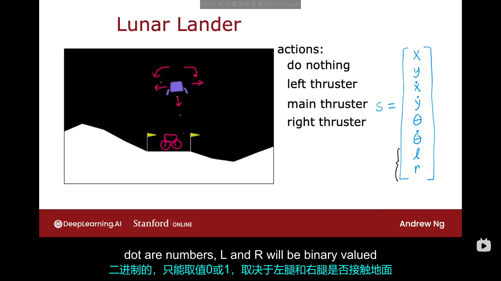
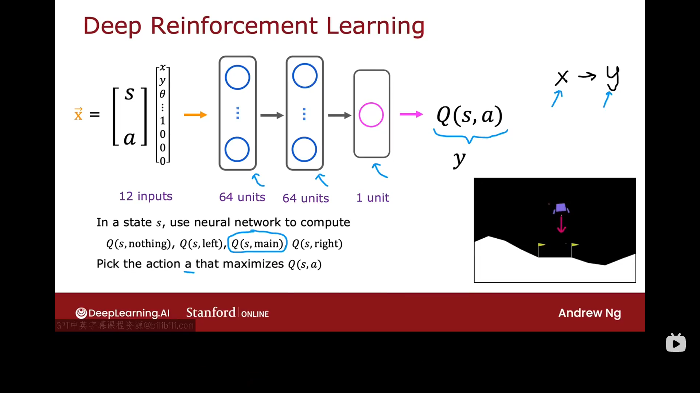
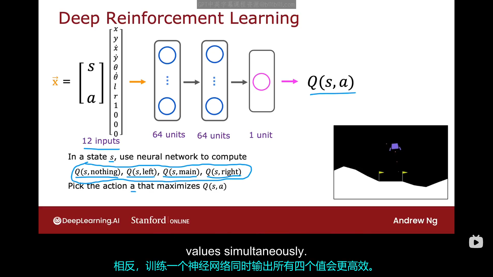
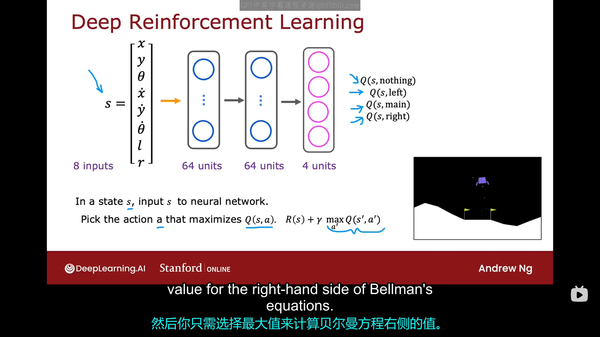
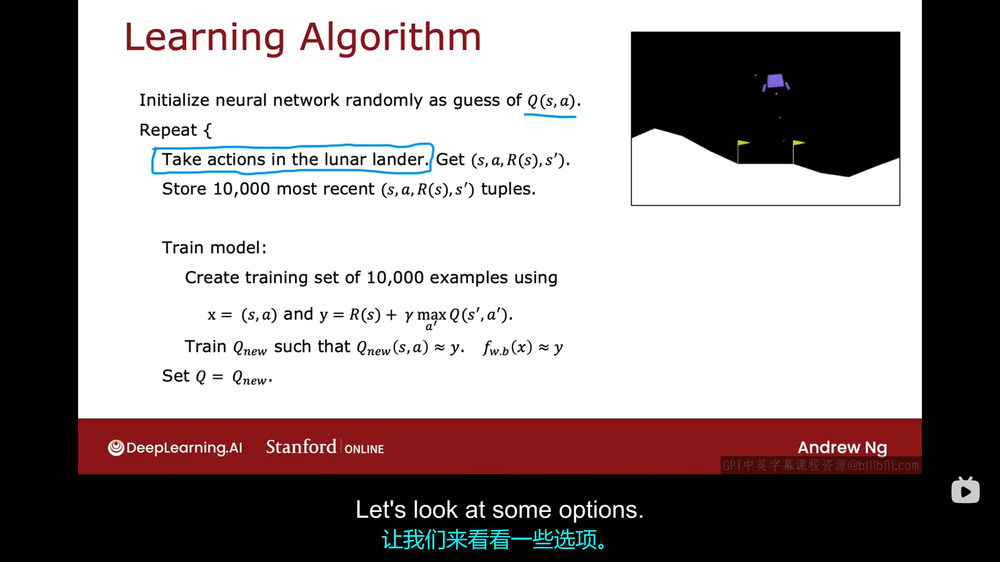
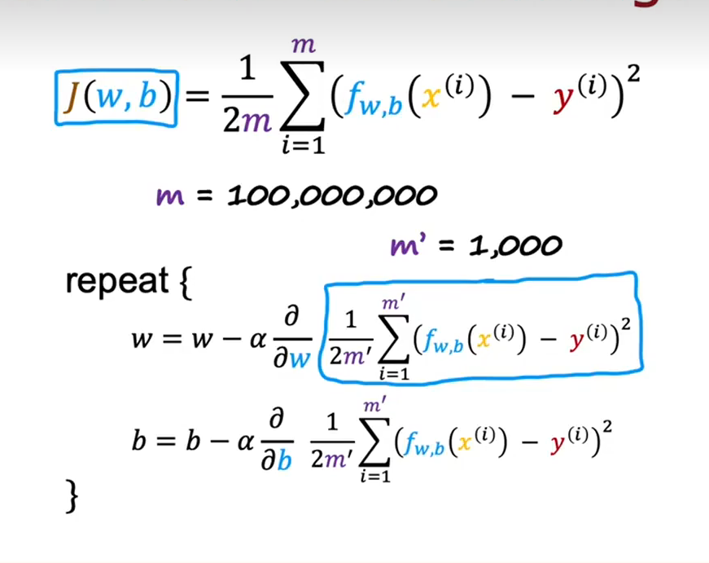
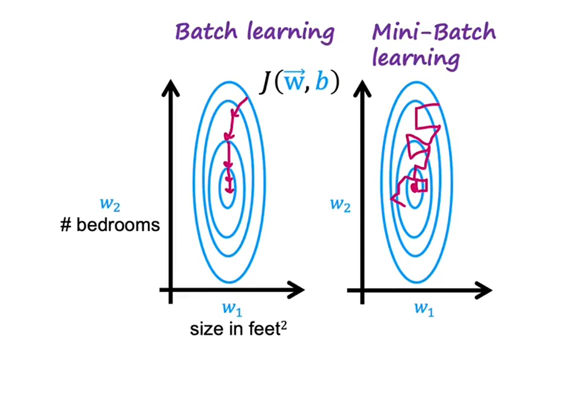
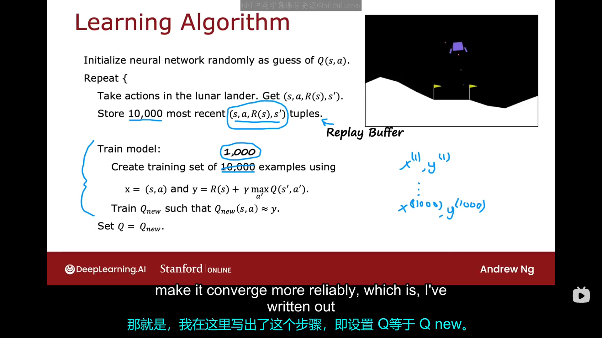

# 9.1 月球着陆器
月球着陆器是让你让你在月球上降落一个模拟的飞行器。在这个应用中，你指挥一个快速接近月球表面的月球着陆器，你的任务是在适当的时候点燃推进器，使其安全降落在着陆平台上。下图是一个示意图：

在这个任务中，着陆器有四个可能的动作可以做：
- 什么都不做
- 点燃左推进器（它会将着陆器推向右边）
- 点燃主推进器
- 点燃右推进器

其状态向量可以被表示为：
$$
s=[x,y,、theta,\dot{x},\dot{y},\dot{\theta},R,L]
$$

其中：x用于描述其水平位置，y用于描述其竖直方向的位置，$\theta$用于描述其中轴线与竖直方向的夹角，R用来描述其右支架是否接触地面，L用于描述其左支架是否接触地面。此例中我们设置的奖励函数如下：
- 如果其成功降落至降落平台中心，则给予100-140的奖励，具体的奖励取决于它的飞行情况以及到达着陆平台中心的程度
- 如果其朝向平台移动，其将获得正奖励。如果其背离平台移动，其将获得负奖励。
- 如果其坠毁，则给-100的奖励
- 如果其成功软着陆，则给+100的奖励
- 对于每条腿，如果它左腿着地，则给其+10的奖励
- 为了鼓励其节省燃料，它每次启动主引擎会获得-0.3的奖励
- 为了鼓励其节省燃料，它每次启动左/右引擎会获得-0.03的奖励

当你构建自己的强化学习系统时，通常需要认真思考你想要哪些动作，你不想要哪些动作，并将其编码进你的奖励函数中。
所以让我们再次明确一下这个任务：我们需要找到一个$\pi$函数，要求其给出在状态s下回报最高的动作a。在月球着陆器中，我们通常选择折扣因子是一个比较大的数，本例中我们可以选择r=0.985。
这是一个令人兴奋的应用，我们终于做好了开发一个算法的准备，该算法将使用神经网络上的深度学习来制定一个策略，以使月球着陆器着陆，下节课我们将开始学习深度强化学习。
# 9.2 学习状态值函数
本节课我们将具体学习如何构建使月球着陆器自主着陆的算法，其关键思想是使用神经网络来计算或近似状态-动作值函数$Q(s,a)$，这将使我们能选择好动作。

算法的核心是，我们以当前的状态与动作作为输入，然后计算或者近似得到$Q(s,a)$。在本例中，我们将s与a合成一个向量作为神经网络的输入，我们将状态s的八个分量放在动作a的四个分量的上面，并且使用独热编码表示动作a。将由s,a合成的向量x输入神经网络中，然后神经网络将输出一个值作为$Q(s,a)$的值，由于我们使用神经网络训练算法，我还将把这个值$Q(s,a)$记为目标Y。注意，我们之前说过。强化学习与监督学习不同，我们不是输入一个状态，然后让它输入一个动作。我们是将状态与动作组合起来作为神经网络的输入，并让它尝试输出$Q(s,a)$。所以如果你能训练一个神经网络，在隐藏层和输出层选择合适的参数，给出$Q(s,a)$的良好估计。训练好神经网络后，当着陆器处于某个状态s时，你就可以计算在状态s下，四个动作分别对应的$Q(s,a)$，然后选择最大的那个$Q(s,a)$对应的a即可。

所以现在的问题变成了如何训练一个神经网络来输出$Q(s,a)$。事实证明，一个不错的方法是使用贝尔曼方程来创创建一个包含大量示例X,Y的训练集，然后我们将使用监督学习来训练神经网络。

现在的问题又变成了我们怎样才能获得一个包含X,Y值的训练集，以便我们可以用它来训练神经网络。我们这里采用的方法是：我们使用月球着陆器着陆，并尝试在其中采取不同的动作，如果我们还没有           一个好的策略，我们将随机采取动作，通过在月球着陆模拟器中尝试不同的操作，我们将观察到许多的例子：当我们位于状态s时，我们会获得状态s对应的奖励$R(s)$，并随机做出某动作a，然后进入下一状态$s'$，在经历数次上述循环后，我们会得到数个包含四个数据的元组：$(s^{(1)},a^{(1)},R(s^{(1)}),s'^{(1)}),(s^{(2)},a^{(2)},R(s^{(2)}),s'^{(2)}),s^{(3)},a^{(3)},R(s^{(3)}),s'^{(3)},\dots ,s^{(n)},a^{(n)},R(s^{(n)}),s'^{(n)}$。事实证明，每一个元组都足以创建一个单独的训练样本$x^{(i)},y^{(i)}$。其中$x^{i}=(s^{i},a^{i})，y^{(i)}=R(s^{(i)})+r \max_{a'} Q(s',a') $，但现在又出现了一个问题：我们如何知道表达式中的$Q(s',a')$是多少呢？实际上，你一开始确实不知道$Q$函数是多少，但事实证明，当你不知道$Q$函数是什么时，你可以从一个完全随机的猜测开始。但在开始时,$Q$函数只是一个猜测，随着时间的推移，$Q$函数会变得越来越好，并且最终会变成那个真正的$Q$函数。通过上面n个数组，我们最终会得到包含n个$(x，y)$的数据集，之后我们会使用此数据集来训练我们的神经网络。

现在让我们来看一下学习$Q$函数的完整算法是什么样的：
- 首先，我们先构建一个神经网络框架并随机初始化所有参数。起初，我们完全不知道$Q$函数是什么，所以我们先完全随机的选择参数的值，然后我们会假装这个神经网络输出的值是对我们$Q$函数的初始随机猜测。这就像你之前训练线性回归时，你首先随机化各参数，然后使用梯度下降算法，所以初始时随机选择参数是可以的，只要算法后面可以不断地向着正确的方向更新参数即可。
- 然后你将重复一下动作：在月球着陆器中模拟器中反复采样，对于每个状态$s^{i}$，随机采取动作$a^{i}$，获得奖励$R(s^{(i)})$,到达下一个状态$s'$。反复如此，直到你获得n组以下格式的元组：$(s^{(i)},a^{(i)},R(s^{(i)}),s'^{(i)})$，为了确保我们不会使用过多的计算机内存，常见的做法是只取我们在MDP过程中看到的10000个最近的这种元组，这种只取最近的例子的技术在强化学习中有时被我们称为回放缓冲区（Replay Buffer）。所以在这一步，我们只是随机地飞行月球着陆器，它有时安全着陆，有时坠毁，在此过程中，我们获取并记录大量数据
- 然后，我们可以开始训练神经网络。上面的每个元组都对应了一个样本$x^{(i)},y^{(i)}$，将这上万个样本组成的数据集用来训练神经网络，然后你会得到一个更加接近真实值的Q函数。然后我们用这个新获得的$Q$函数再去将每个$(s^{(i)},a^{(i)},R(s^{(i)}),s'^{(i)})$转化成新的$x^{(i)},y^{(i)}$，然后再用这组新的数据集去训练新的神经网络，得到一个更接近真实值的$Q$函数。足够多次之后，神经网络预测的$Q$函数就已经足够接近真实Q函数了。

你刚刚看到的算法有时被称为DQN算法，即深度Q神经网络，因为你使用深度学习来训练Q函数，事实证明，对该算法做一些改进后，它可以工作的更好，我们将在下面的几节课中看到这一点。

# 9.3 算法改进：改进的神经网络架构
上节课中，我们看到了这样一种神经网络结构：输入状态+动作，输出$Q(s,a)$的预测值。事实证明，有一种更使得该算法更加高效的神经网络架构。现在大多数DQN的实现实际上使用的是我们在本视频中提到的神经网络架构。
下图是我们之前介绍的神经网络架构：
当我们处在状态s时，我们必须进行四次计算来找出使的$Q(s,a)$取最大值的a，这并不高效。相反，训练一个神经网络同时输出四个值会更加高效。下图就是我们改进后的神经网络算法示意图：
该神经网络的输入是状态向量s，然后其输出层有四个神经元，分别对应于$Q(s,nothing),Q(s,left),Q(s,main),Q(s,right)$,这种改动可以经过一次然后输出所有可能的$Q(s,a)$，毫无疑问更加高效。
# 9.4 算法改进：贪婪策略
在我们构建的这一算法中，当我们在学习如何近似Q函数的时候，我们就已经需要在月球着陆器中采取一些行动了。那么，当我们还在学习的过程中，应如何选择这些行动呢？最常见的方法是使用一种被称为$\epsilon-$贪心策略的方法，下面让我们具体来看一下。

上图是我们之前构建算法的步骤，算法中的一个步骤要求你是在月球着陆器中采取行动，当在学习算法还在运行的过程中，我们并不知道每个状态下的最佳行动是啥。那当在这种我们还不知道Q函数的情况下，我们应该如何尽力做出更好的动作呢？以下有几个选项：
- 选项1：选择使得$Q(s,a)$取最大值的动作a，这意味着即使我们还无法准确预测$Q(s,a)$，但我们任然尽力得努力使用我们当前对Q函数的预测。事实证明，这工作得还可以，但不是最好的选择。
- 选项2：在大多数情况下（比如95%的情况下），选择使得Q(s,a)取最大值的动作a；在少数情况下（比如95%的情况下），随机选择一个动作。为什么要这样做呢？原因如下：举个例子，假设某次我们在初始化神经网络参数的时候，与计算$Q(s,main)$有关的参数被设置的很奇怪，这导致每次神经网络预测的$Q(s,main)$都很小，也就是说，算法始终认为开启主推进器是一种不好的选择，它将永远不会选择发射主推进器，这样它就无法学习到在有些情况下开启主助推器是一个很好的选择。所以在选项2下，在每一步，我们都有一些小的概率尝试不同的行动，以便神经网络可能可以克服其先入之见。这种随机选择行动的方法有时被称为探索步骤。95%的几率选择使得Q(s,a)取最大值的动作a，这一步被我们称为贪婪（greedy）动作，因为我们试图通过这个行动来最大化我们的回报，或者在某些强化学习中，有时这被称为利用（exploitation）步骤。

上面的选项二通常被我们称为$\epsilon-$贪婪策略，这里的$\epsilon=0.05$，是随机选择动作的概率。这是让你的强化学习算法进行一些探索的最常见方式。最后，强化学习中的一个非常有用的技巧是从一个比较大的$\epsilon$z值开始，这就意味着，算法在刚开始时的大多数时间都在随机采取行动，然后逐渐减少它，这样随着时间的推移，你采取随机行动的几率越来越少，更有可能使用你不断改进的Q函数来选择好的行动。

与监督学习相比，强化学习对超参数更加敏感，这句话的意思是：如果你再监督学习中选择了一个过小的学习率，那么你可能得花正常时间的三倍来训练一个神经网络；但如果你在强化学习中，没有很好地设置$\epsilon$的值，那你可能需要花费比正常情况下十倍、甚至百倍的时间来训练它。由于强化学习算法没有监督学习那么成熟，所以其对小参数的选择更加敏感。

下一个视频中，我将对算法做进一步的改进，包括小批量处理和软更新，它们会使你的算法运行更快。
# 9.5 算法改进：小批量和软更新（可选）
在本节课中，我们将继续讨论强化学习的两个改进方法。第一个想法是使用小批量（mini-batch）,这个方法不仅可以加速你的强化学习算法，也可以帮你加速监督学习算法。第二个想法是使用软更新(soft up dates)，这个方法将有助于你的强化学习算法收敛到一个更好的解决方案。

为了理解小批量，我们先从监督学习开始，当我们开始讨论线性回归等监督学习时，训练集的大小m非常小。但假设你有一个非常大的训练集，比如$m=1$亿，那你的梯度学习算法每次进行参数更新时，都需要计算着1亿个样本的均方误差平均值，这会导致算法非常慢。小批量梯度下降的想法是：不是在每次迭代中都使用这1亿个样本，相反，我们可能会选择一个比较小的数量，比如，我们令$m'=1000$，在每次迭代中，我们值使用所有m个总样品中的$m'$个子样本。相应的参数更新规则变为：。
小批量梯度下降的作用是在算法的某一次迭代中，它只查看数据的某个子集，在下一次迭代中，它只查看数据的另一个子集，如此反复。由于每次迭代都只涉及一个小子集，故算法运行速度回快很多。

批量梯度下降与小批量梯度下降的对比：

上图表明小批量梯度下降时，每次算法可能选择方向的并不是下降最快的方向，但由于每次运行的成本会大幅降低，故其总体速度更快。故实际上，当有一个巨大的训练集时，小批量学习比批量学习更常用。现在让我们回到强化学习，之前我们提到，我们使用缓冲区最近存储的一万个元组对应的样本点来训练神经网络，但小批量算法发告诉我们，我们每次训练时可以只使用大训练集的某个子集来训练神经网络，虽然这会使每次模型训练的迭代有些嘈杂，但速度更快。

最后，还有一个改进算法的方法，可以使算法更可靠地收敛。

上图给出我们之前的学习算法，其中有一步是令$Q=Q_{new}$，事实证明，这可能使Q做出非常突然的改变，如果你训练了一个新的神经网络，但碰巧它不是一个很好的神经网络，甚至可能比之前的还要差，故你可能是用了一个更差的、带有噪声的神经网络覆盖了你的Q函数，而下面要介绍的软更新方法有助于防止Q函数因为一次不幸的更新而变得更差。

软更新：假设旧的神经网络中的一系列参数记为$W_{old},B_{old}$，新的神经网络中的一系列参数记为$W_{new},B_{new}$，软更新中的参数更新规则不再是以前那样：令$W=W_{new},B+B_{new}$，而是使用以下新规则：
$$
W=\alpha W_{new}+(1-\alpha)W_{old}
\\
B=\beta B_{new}+(1-\beta)B_{old}
$$
其中,$\alpha,\beta$是我们可以设置的参数，一般非常小，比如可以取0.1。故软更新允许你对神经网络中的参数进行缓慢的更新，事实证明，它会使你的强化学习算法更可靠的收敛而不会出现一些震荡、发散或者其它一些不好的行为。
# 9.6 强化学习现状
略
# 9.7 总结与感谢
恭喜你，本课程完美撒花。