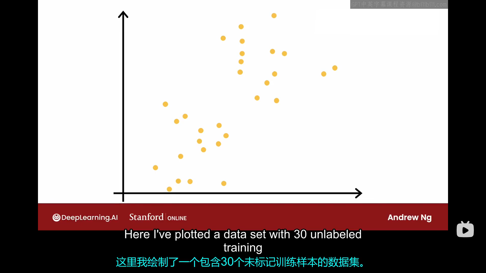
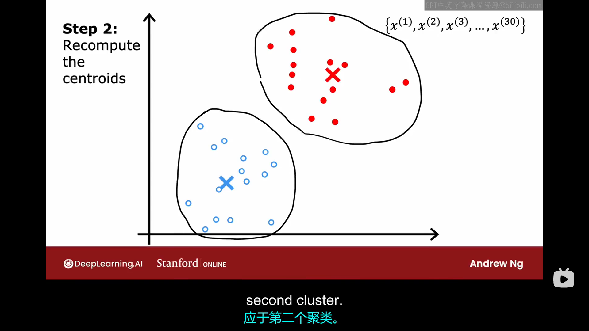
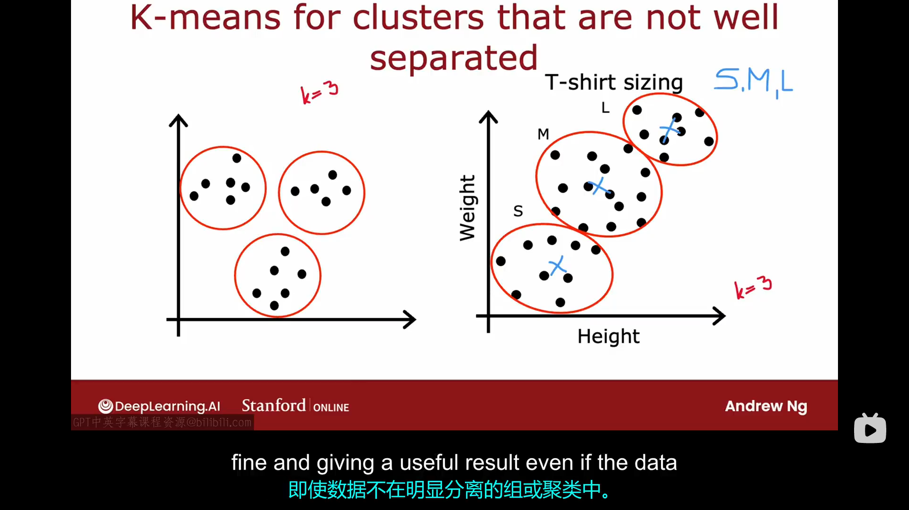
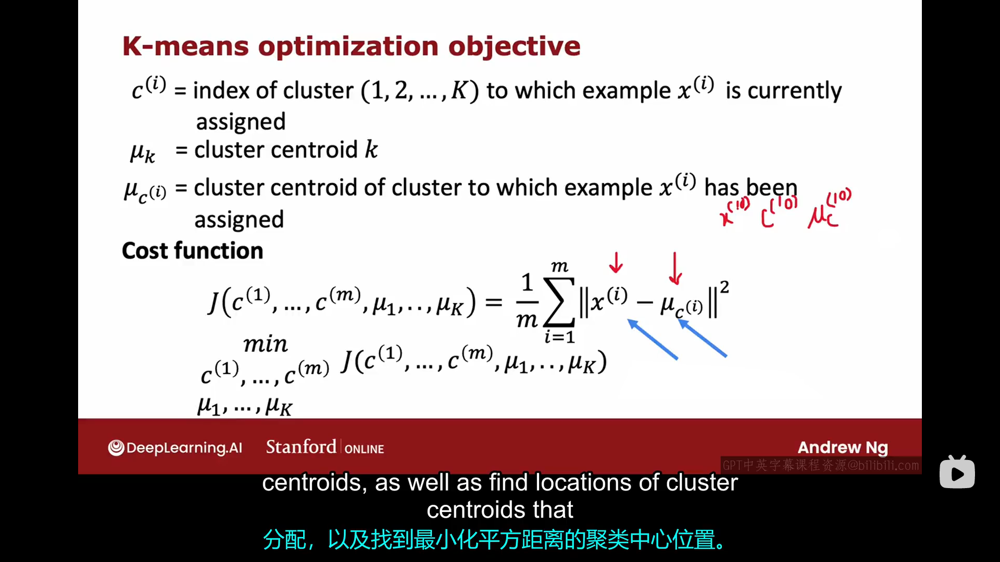
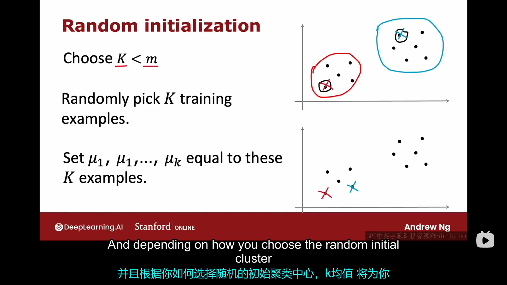
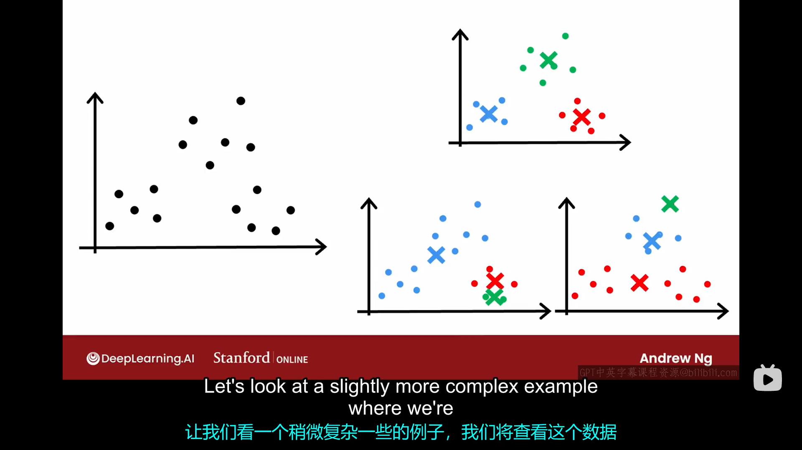
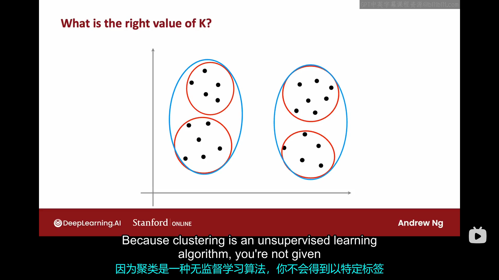
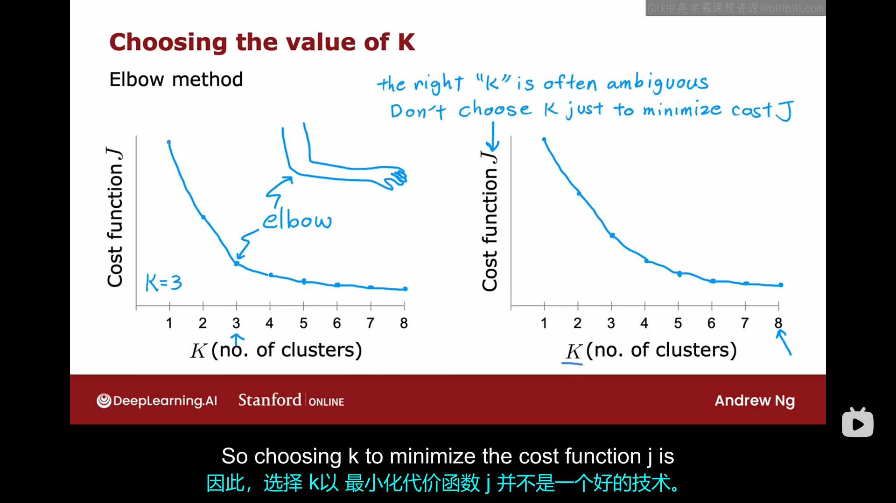

# 2.1 什么是聚类 
什么是聚类？聚类算法会查看一组数据点，并自动找出相互关联或者相似的数据点。注意，聚类算法不同于你之前在监督学习中看到的二分类算法。随意列举几个聚类算法的应用：
- 分类相似主题的新闻
- 分析dna数据，找出dna相似的人
- 天文学家有时会使用聚类进行天文数据分析，将太空中天梯分组以便于科学研究
# 2.2 K-means的直观理解
假设我们有一个待分类数据集如下图所示：

这个数据集中包含了30个样本，我们现在希望在此数据集上运行K均值算法。k均值算法的第一步是他会随机猜测你要求它找到的两个聚类中心的位置（在这个例子中，假设我们只要求它找到两个聚类中心，本周晚些时候我们会介绍如何寻找多个聚类中心）。k均值算法始终在重复做做两件事：第一件事是将点分配给聚类中心。第二件事是移动聚类中心的位置。具体地说：
- 第一步：计算每个样本点到两个聚类中心的距离，并得出它们距离哪个聚类中心更近。
- 第二步：将所有距离同一个聚类中心更近的点看成一组，计算这一组样本点的平均值，并将这一组对应的聚类中心移动到样本平均值所在的位置

重复以上两步足够多次，你会慢慢发现聚类中心的位置可能几乎不再变化，这就意味着k均值算法已经收敛。最终的运行结果可能如下图所示：

# 2.3 K-means算法
本节课我们来详细介绍一下k均值算法，以便你可以自己实现它。假设我们现在有一个包含m个数据点的数据集。
算法的第一步是随机选择k个聚类中心，让我们用$\mu_1,\mu_2,...,\mu_k$来表示它们，并且将每个数据点分配给一个聚类中心。假设$c^{(i)}$=第i个数据点对应的最近的聚类中心的索引（这里的距离指的是数学上的平方距离，也叫L2范数）第二步是更新聚类中心的位置，将聚类中心的位置更新为分配给该聚类中心的所有样本点的平均位置。顺便值得一提的是，如果有一个聚类中心没有分到任何样本点，那么你可以将此聚类中心移除，与此同时聚类中心的数量也会由k个变为k-1个。

k均值算法不仅适用于那些分类良好的聚类（如下左图所示），也适用于不那么明显分类的数据集（如下右图所示）。

下右图对应的情况可能是：如果你是一个衬衫设计师，你想要知道把衬衫的s,m,l尺寸具体设置成多少大小合适，如果你收集人们的身高体重表，你很可能发现他们的身高体重在光谱上是连续变化的，并没有明显的聚类。为了完成这个任务，你可以开始随机选择三个聚类中心，然后不断地更新聚类中心的位置知道收敛，此时聚类中心的位置即可当作s,m,l对应的尺码大小。
# 2.4 优化目标
在本课程的前两部分，我们学习了很多监督学习算法，这些算法都是通过使用训练集、设定代价函数函数、使用梯度下降算法或者其他算法来优化该代价函数。事实上，你在前几节视频中看到的K均值算法也是在优化一个特定的代价函数。但这里的优化算法不是梯度下降法，而是您在上一个视频中看到的算法。
k均值算法中，代价函数的具体形式如下图所示：

从图中我们可以看出，k均值算法中代价函数代表了每个样本点距离它最近的聚类中心的平均距离，优化目标就是通过调整每个样本点的分配方法以及移动每个聚类中心的位置使得代价函数最小化。顺便说一下，这个代价函数有一个专门的名字，叫做失真函数（distortion function）。直观上理解这个代价函数也是挺重要的，由于理解起来比较简单（只要分别理解第一步第二步即可），我这里就不再赘述，视频中有讲。通过对k均值算法的代价函数优化过程的直观理解，可以很容易知道对该算法的优化一定会收敛。如果你的算法无法收敛，或者某次更新后代价函数反而变大了，那一定是你的代码出了问题。一旦某次迭代后，代价函数的值保持不变，这通常意味着已经收敛，你此时应该停止算法。或者如果运行一段时间后，代价函数的减小速度已经非常慢，那么这说明算法已经接近收敛，此时你也可以选择1停止算法。
# 2.5 初始化K-means
聚类算法的第一步是随机选择K个点作为初始的聚类中心，但在实际中，具体应该如何随机选择呢？以及我们应该如何进行多次初始猜测，以便得到更好的聚类集。
首先，我们一般会选择聚类中心的数量小于样本的数量，即$k<m$，其次，我们一般会将初始聚类中心选在合适的样本点上，具体如下图所示：

并且根据你选择的不同初始聚类中心，k均值算法将为你的数据集选择不同的聚类方法。例如，如果你打算将如下左图所示的数据集分为三类，不同的初始聚类中心选择可能导致如下右图所示的三种结果：

显然，上图中右边最上面的那个结果是一个比较好的分类。而上图中右边最下面的两个结果可能很不幸地达到了代价函数的局部最小值。所以如果你想要找到最佳的聚类方法，你可以选择不同的初始聚类中心并多次运行k均值算法，然后计算出每次运行所对应的代价函数的值，并选择代价函数最小的那一个方案,现实训练中总是建议你这样做。
# 2.6 选择聚类的个数
在k均值算法中，我们需要决定到底选择几个聚类，也就是参数k到底应该取多少。实际上，对于许多聚类问题，k的准确值都是模糊的。如果现在有一个数据集如下图所示，然后你随机问一个人该数据集包含多少聚类，不同的人可能给出不同的答案，有人可能认为有两个聚类（图中蓝色圆圈标注的），而有人可能认为有四个聚类（图中红色圆圈标注的）。
因为聚类是一种无监督学习算法，你不会得到以特定标签形式给出的正确答案。因此，在许多应用中，数据本身并没有提供清晰的指示来表明其中有多少聚类。

如果你查看一些有关于k均值算法的学术文献，有一些技术可以尝试自动选择适用于特定应用的聚类数量。我在这里简要说明一种你可能经常见到的方法（视频里老师说了他本人并不使用这种方法），这种自动选择k值的方法叫elbow方法。

elbow方法就是作出代价函数对于k的函数图像，然后寻找一个拐点，在拐点左侧，代价函数随着k的增加而快速减小；在拐点右侧，代价函数随着k的增加而缓慢减小。但实际上，在实际情况中，该拐点都不会很明显，所以老师一般不会使用这种方法。顺便说一下，仅仅通过寻找合适的k以最小化代价函数的方法是不起任何作用的，因为代价函数总是随着k的增大而减小！（$k\leq m$时）

那么，在实践中，你具体应该如何选择k的值呢？通常，你运行k均值算法是为了获取聚类以用于后续的某些目的。也就是说，你将使用聚类来做一些事情。所以我建议你对于k值的选择要根据你后续的要求来选择。例如之前的设计衬衫的例子，如果你需要的是s,m,l尺码对应的具体大小，你就设置k=3。如果你需要的是xs,s,m,l,xl,那么你应该设置k=5。

以上所有就是k均值算法的全部内容，恭喜你完成了第一个无监督学习算法，下面我们来学习第二个无监督学习算法——异常检测算法。