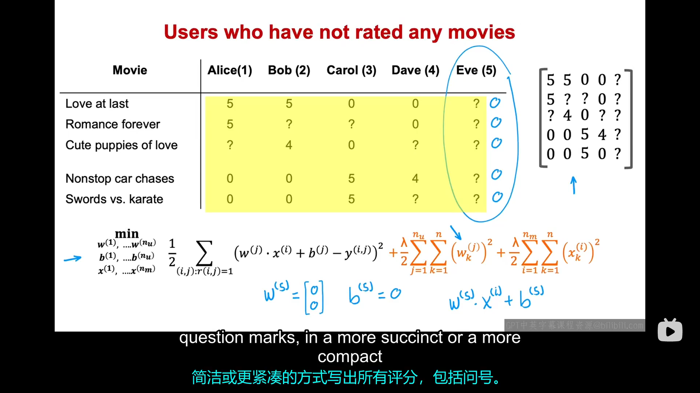
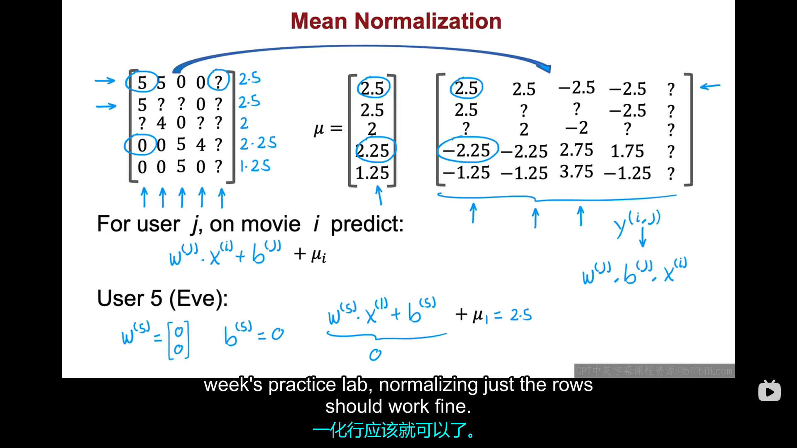

# 5.1 均值归一化
在第一门课程中，你已经了解到对于线性回归，，特征归一化可以帮助算法运行的更快。在构建推荐系统时，如果你首先运行均值归一化（也就是说，你将电影评分归一化，使其具有相同的均值），您的算法将运行更快，并且性能也有所提升。

上图是我们一直在使用的数据集，为了介绍均值归一化，我们添加了第五个用户——Eve，她还没有对任何电影进行评分。您很快就会看到，均值归一化会帮助用户Eve做更好的预测。事实上，如果您想在该数据集上训练一个协同过滤算法，由于正则化项的存在总是会使$w^{(j)}$取较小的值，所以你可能会得到第五个用户对应的参数$w^{(5)}=[0,0]^T$，$b^{5}$很可能也为0（我们并没有正则化$b^{(5)}$,但我们为了讨论方便假设所有的$b^{(j)}=0$）。所以该算法会预测每一个未给所有电影评分的用户给所有电影的评分都是0，这对我们并不是很有帮助。在本视频中我们将使用均值归一化方法来给这些还未给电影评过分的用户做出更好的预测。为了描述均值归一化，我们将表中所有的数据放入一个二位矩阵，当然，这只是为了更简洁地记录数据。

为了进行均值归一化，我们取每部电影的所有评分计算出每部电影的平均评分，然后再用，每部电影的每个评分减去这个电影的平均评分，得到一个新的评分矩阵。现在我们预测第j位用户对第i个电影的评分是：
$$
w^{(j)} \cdot x^{(i)} +b^{j} + \mu_{i}
$$
其中，每部电影评分加上$\mu_i$这一项只是为了保证每部电影的评分不为负。在这种预测标准下，用户5对第i个电影的预测就是：
$$
w^{(5)} \cdot x^{(i)} +b^{5} + \mu_{i} = \mu_{i}
$$
在这种评价体系下，用户五对电影的评分就等于其他所有人对该电影评分的平均值，这也是比较符合常识的。实际上，通过均值归一化，我们也会使我们的均值归一化算法运行的更快。在本实验中，我们
使用的是对每一行进行均值归一化，在某些运用场景下我们还可以对列进行均值归一化。
以上就是本节课均值归一化的内容，它不仅可以使你的算法运行更快，更重要的是它可以帮那些未给（或者几乎未给）电影评过分的用户对一部电影给出更合理的预测。下节课我们将介绍如何在tensorflow实现这个算法。
# 5.2 协同过滤算法的tensorflow实现
在此之前，你可能认为tensorflow只适用于神经网络的实现。但实际上，tnsorflow也同样适用于很多其他学习算法的实现，例如这里的协同过滤算法。我们平时喜欢使用tensorflow进行此类任务的原因之一就是，对于许多应用来说，为了实现梯度下降，你需要处理的一件事就是计算成本函数的导数，而tensorflow正好可以为你找到成本函数的导数。你只需要写出成本函数，不需要任何微积分知识，只需要几行代码，tensorflow就可以帮助你计算出成本函数的导数，然后用于优化成本函数。
例如，假设我们现在有代价函数$J=(wx-1)^2$（假设我们此例中固定b=0，不对参数b进行更新），下面这段代码可以帮助你实现梯度下降算法：
``` python
w=tf.Variable(3.0) #tf.Varible表明这个参数是梯度下降过程中需要更新的参数
x=1.0
y=1.0 #target value
alpha=0.01

iteration=30
for iter in range(iteration):
    #使用tensflow中的梯度带（gradient tape）来记录更新过程，这是tensorflow中自动计算梯度的机制
    with tf.GradientTape() as tape:
        fwb=w*x
        costJ=(fwb-y)**2
    [dJdw]=tape.gradient(costJ,[w]) 
    #tape.gradient(costJ, [w]) 返回一个列表，包含 costJ 对 w 的梯度
    #[dJdw] 使用列表解包获取梯度值
    w.assign_add(-alpha*dJdw) #assign_add（）是TensorFlow变量的原地加法操作。
```
上述代码体现了tf中的一个非常强大的功能：自动微分（Auto Diff，有时被称为Auto Grad）。其他机器学习库里也有自动微分功能，比如pytorch。
> 补充： 列表解包（来源于deepseek）:列表解包是Python中将列表中的元素分配给多个变量的简洁方式。
> 基本例子：
> 
> * 普通方式
my_list = [5]
dJdw = my_list[0]  # 获取第一个元素
>* 列表解包方式
>[dJdw] = [5]  # 直接将列表中的5赋值给dJdw
>
>在梯度计算中的例子：
>* 例子1：单个参数的情况：
>```python
>import tensorflow as tf
>
>w = tf.Variable(3.0)
>x = 1.0
>y = 1.0
>
>with tf.GradientTape() as tape:
>    prediction = w * x
>    loss = (prediction - y) ** 2
>
># 方式1：普通获取梯度
>gradients = tape.gradient(loss, [w])  # 返回：[<tf.Tensor: shape=(), dtype=float32, >numpy=4.0>]
>dJdw_normal = gradients[0]  # 获取第一个梯度值
>
># 方式2：列表解包（更简洁）
>[dJdw_unpack] = tape.gradient(loss, [w])  # 直接解包到dJdw_unpack
>
>print("普通方式获取的梯度:", dJdw_normal.numpy())  # 输出: 4.0
>print("列表解包获取的梯度:", dJdw_unpack.numpy())   # 输出: 4.0
>```
>*例子2：多个参数的情况：
>import tensorflow as tf
>
>w = tf.Variable(3.0)
>b = tf.Variable(1.0)  # 偏置项
>x = 1.0
>y = 1.0
>
>with tf.GradientTape() as tape:
>    prediction = w * x + b
>    loss = (prediction - y) ** 2
>
>#计算对w和b两个参数的梯度
>[dJdw, dJdb] = tape.gradient(loss, [w, b])
>
>print("dJ/dw:", dJdw.numpy())  # 输出: 4.0
>print("dJ/db:", dJdb.numpy())  # 输出: 2.0

事实上，一旦实现自动微分后，你可以不再拘泥于使用梯度下降优化算法，你可以使用更高级的优化算法，例如Adam算法。为了在tensorflow中实现协同过滤算法，你可以使用以下代码：
```python
#选择优化器为Adam
optimizer=keras.optimizer.Adam(learning_rate=1e-1)

iterations=200

for iter in range(iterations):
    with tf.Gradient.Tape as tape:
        cost_value=cofiCostFuncV(X,W,b,Ynorm,R,
        num_users, num_movies,lambda) 
    #codiCostFuncV=Collaborative Filtering Cost Function Vectorized
    #Ynorm:归一化的评分矩阵
    grads=tape.gradient(cost_value,[X,W,b])
    optimizer.apply_gradients(zip(grads,[X,W,b]))
```
>补充(来源ds):
># `with ... as ...` 和 `zip()` 用法详解
>
>## 1. `with ... as ...` 用法
>
>### **作用**：
>上下文管理器，用于安全地管理资源（如文件、锁、梯度带等）
>
>### **在你的代码中**：
>```python
>with tf.GradientTape() as tape:
>    cost_value = cofiCostFuncV(...)
>```
>
>- **`tf.GradientTape()`**: 创建一个梯度记录器
>- **`as tape`**: 将梯度记录器赋值给变量 `tape`
>- **自动管理**: 退出 `with` 块时自动释放资源
>
>### **等价于**：
>```python
>tape = tf.GradientTape()
>try:
>    cost_value = cofiCostFuncV(...)
>finally:
>    # 自动清理资源
>    del tape
>```
>
>### **其他常见用途**：
>```python
># 文件操作
>with open('file.txt', 'r') as f:
>    content = f.read()
># 文件会自动关闭
>
># 数据库连接
>with db.connection() as conn:
>    conn.execute(query)
># 连接会自动关闭
>```
>
>## 2. `zip()` 用法
>
>### **作用**：
>将多个可迭代对象"压缩"成一个元组的迭代器
>
>### **在你的代码中**：
>```python
>optimizer.apply_gradients(zip(grads, [X, W, b]))
>```
>
>### **具体过程**：
>假设：
>- `grads = [grad_X, grad_W, grad_b]`（梯度列表）
>- `[X, W, b]`（参数列表）
>
>`zip(grads, [X, W, b])` 会产生：
>```python
>[
>    (grad_X, X),    # 第一个梯度对应第一个参数
>    (grad_W, W),    # 第二个梯度对应第二个参数  
>    (grad_b, b)     # 第三个梯度对应第三个参数
>]
>```
>
>### **简单示例**：
>```python
>names = ['Alice', 'Bob', 'Charlie']
>scores = [85, 92, 78]
>
>zipped = list(zip(names, scores))
>print(zipped)
># 输出: [('Alice', 85), ('Bob', 92), ('Charlie', 78)]
>```
>
>### **为什么这里需要zip？**
>因为 `optimizer.apply_gradients()` 需要接收这样的格式：
>```python
>[(gradient1, variable1), (gradient2, variable2), ...]
>```
>
>## 3. 两者结合的工作原理
>
>```python
># 1. 记录梯度计算
>with tf.GradientTape() as tape:  # 开始记录
>    cost_value = cofiCostFuncV(...)  # 计算损失
>
># 2. 提取梯度
>grads = tape.gradient(cost_value, [X, W, b])  
># grads = [∂cost/∂X, ∂cost/∂W, ∂cost/∂b]
>
># 3. 配对梯度和参数
>grad_var_pairs = zip(grads, [X, W, b])
># 得到: [(∂cost/∂X, X), (∂cost/∂W, W), (∂cost/∂b, b)]
>
># 4. 应用梯度更新
>optimizer.apply_gradients(grad_var_pairs)
>```
>
>## 4. 关键优势
>
>### **`with as` 的优势**：
>- ✅ **自动资源管理**：避免内存泄漏
>- ✅ **异常安全**：即使出现错误也能正确清理
>- ✅ **代码清晰**：明确资源的作用范围
>
>### **`zip` 的优势**：
>- ✅ **精确配对**：确保每个梯度应用到正确的参数
>- ✅ **灵活性**：可以处理任意数量的参数
>- ✅ **可读性**：清晰表达"梯度-参数"的对应关系
这两个构造在深度学习中非常常见，是实现自动微分和参数更新的基础。

以上就是如何在tensorflow中实现协同过滤算法，有人可能会问我们为什么不使用密集层来进行模型编译和模型拟合，那是因为协同过滤算法和成本函数它们不能很好地适应TensorFlow的密集层和其他类型的标准神经网络层。这就是我们为什么必须以另外一种方式实现它，即我们自己先写出成本函数，然后使用TensorFlow的自动微分工具，然后使用Adam算法来优化成本函数。如果你的模型是一系列密集神经网络层或者其他受TensoFlow支持的神经网络层，俺么旧的模型编译，模型拟合方法依旧有效。但即使不是这样，TensorFlow中的这些工具也为你提供了一些有效的方式来帮助你实现其他学习算法。
# 5.3 发现相关项目
现实生活中，当你在网上查看某件物品时，网站很可能会向你推荐其他与此物品类似的其他物品，网站是如何做到这一点呢？事实证明，我们一直在讨论的协同过滤算法提供了一种很好的方式来帮你找到相关物品。
作为我们讨论过的协同过滤的一部分，我们会对电影$i$，学习它的特征$\vec{x}^{(i)}$，但在实际中我们发现，对于学习到的特征$\vec{x}^{(i)}$,我们很难解释每个特征$x_1,x_2,...,x_n$具体代表着什么，即我们很难一眼看到说，$x_1$代表浪漫程度,$x_2$代表动作程度....但尽管如此，所有的特征$x_1、x_2、...、x_n$共同传达了关于这部电影的一些信息。对于电影i，如果你想找到与其相似的电影k，你可以找到特征$\vec{x}^{(k)}$与特征$\vec{x}^{(i)}$相似的电影。一个用于衡量向量$\vec{x}^{(k)}$与向量$\vec{x}^{(i)}$相似程度的量如下所示：
$$
\sum_{j=1}^{n}(\vec{x}^{(k)}_j-\vec{x}^{(i)}_j)^2
$$
这也是向量$\vec{x}^{(k)}$与向量$\vec{x}^{(i)}$之间的距离的数学表达式，在数学上也被记为：$||\vec{x}^{(k)}-\vec{x}^{(i)}||$。
在结束本节课之前，我们想谈谈协同过滤算法的局限性，在协同过滤中，你有一组用户和一组物品，用户对物品的某些子集进行评分。协同过滤的一个缺点是它不善于处理冷启动问题，例如，如果你的目录中有一个新物品，比如有人刚刚发不了一部新电影，几乎还没有人对其进行过评分，那你应该如何预测对该电影的评分呢？同样，对于只对少数电影做出过评分的新用户，我们应该如何向他们推荐他们可能感兴趣的内容呢？
我们在之前的课程中看到，均值归一化会对此类问题产生一定的帮助，但可能还有更好的方法来向那些新用户展示他们可能感兴趣的内容。协同过滤算法的第二个局限是它没有提供一种自然的方式来使用辅助信息或关于项目或用户的额外信息。例如，对于某一部电影，你可能知道它的类型，导演，产地。预算等，对于一个用户，你也可能知道一些关于他的人口统计学信息，例如年龄、性别、籍贯等。
因此，虽然协同过滤算法是一种很强大的算法，但是其仍有许多局限性。下节课我们将介绍基于内容的过滤算法，该算法可以有效解决协同过滤算法的一些局限性。
