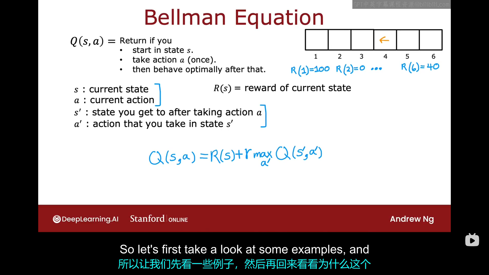

# 8.1 状态——动作值函数的定义
当我们本周晚些时候开始开发强化学习算法时，你会发现有一个关键的量是强化学习算法试图的算的，那就是状态——动作值函数。
状态——动作值函数通常用大写字母Q表示。它是你当下所处状态以及基于当下状态你未来可能做出的动作的函数，即$Q=Q(s,a)$，$Q(s,a)$会返回一个数值，该数值等于：如果你从状态S开始，采取动作a一次，之后总是采取最优行为所能得到的总回报（即考虑了当前状态对应的奖励）。让我们来看一个例子：

在之前的例子中我们可以看到，如果折扣因子选择为0.5，那么图中上面的表中选择的策略就是最优策略。现在我们计算得到了几个不同状态下的$Q(s,a)$,并将它们列在了上图中（注意：在终止状态，$Q(s,a)$总是对等于终止状态对应的奖励）。由于状态——动作函数总是用大写字母$Q$表示，所以状态——动作函数也被称为$Q$函数。
下图中给出了漫步车例子中不同状态下的最优策略及回报，以及每个状态的$Q$函数：
观察此表我们不难发现一些有趣的现象：
- 从任何状态s开始，能获得的最大回报为：$\underset{\text{\scriptsize a}}{\text{max}} \space Q(s,a)$
- 在状态s下的最优动作是使得$Q=max \space Q(s,a)$时的a的取值。

以上内容可能给你一个启发：为什么构建$Q(s,a)$是实现强化学习算法中的中重要一步。也就是说，如果你有一种办法为每个动作和每个状态计算$Q(s,a)$，那么当你处于状态s时，你所需要做的就是找出当前状态s下使得$Q(s,a)$取最大值的动作a。在有些文献中，$Q$函数也被称为$Q^*$函数或者“optimal Q function”
# 8.2 状态——动作函数的示例
本节只是看了一下不同的折扣因子对于$Q(s,a)$的影响，内容基础，所以略。
# 8.3 贝尔曼方程
前面我们说过，如果你可以获得各种状态以及各种动作下的$Q(s,a)$，那么它就给你提供了一种在在每种状态下选择好动作的方法。在强化学习中，有一个关键方程叫做贝尔曼方程，它将帮助我们计算$Q$函数下面我们一起来看一下这个方程是什么样的。为了描述贝尔曼方程，我将使用以下记号：

贝尔曼方程的具体形式如下：
$$
Q(s,a) = R(s) + r \max_{a'} Q(s', a')
$$
公式的简单推到如下图所示：

# 8.4 随机环境（可选）
在某些应用中，当你采取行动时，结果并不总是完全可靠的。在实践中，由于受环境影响，许多机器人并不总能精确按照你的指令行事。因此，我们讨论过的强化学习框架有一个拓展，它模拟了随机或者不确定的环境。继续以我们的火星漫步车为例，假设其在每次移动时，都有90%的概率会朝着正确方向移动一格，有10%的概率会滑倒并导致其会往相反方向移动一格。在这种带有随机性的强化学习的问题中，同一行动策略对应的奖励序列也不一定相同，毕竟你也无法预料机器人在哪一步会执行错误指令。所以在强化学习问题中，我们感兴趣的不是最大回报，因为那是一个随机数，我们感兴趣的是使回报的期望值最大化。即：
$$
 Expected ruturn=average(R_1+rR_2+r^2R_3+\dots+)=E(R_1+rR_2+r^2R_3+\dots+)
$$
因此，强化学习的任务是选择一个策略$pi$来使回报的期望值最大化。总结一下，当你有一个随机的强化学习问题或随机的马尔科夫过程时，你的目标是选择一个策略，告诉在状态s下取什么动作a,以最大化回报的期望。随机器强化学习过程中的贝尔曼方程：
$$
Q(s,a)=R(s)+rE(Q(s',a'))
$$
在目前为止我们的讨论中，我们一直使用的是火星车这个例子，它只有六个状态。对于许多实际的应用，状态的数量将大得多。下个视频中，我们将讨论我们迄今为止讨论的强化学习或者马尔科夫决策过程框架，并将其推广到更丰富，更有趣的问题集，这些问题具有更大，特别是连续的状态空间。

# 连续状态空间的应用示例
许多的机器人控制应用，都具有连续的状态空间。那现在我们应该看看如何将我们讨论过的概念应用于连续状态空间。之前我们的例子中，火星车只能取六个离散的位置，如果假设火星车可以位于一条线段上的任意位置，它的位置可以由区间（0,6）中的任意一个数字表示，那这就是一个连续状态空间的例子。下面我们将使用一个控制卡车行驶的例子来介绍连续空间的应用示例。对于在公路上行驶的卡车而言，其状态无法仅用一个数字来描述，而是通常用一个包含六个分量的向量来描述，可以记为：$s=[x,y,\theta,\dot{x},\dot{y},\dot{\theta}]^T$，而对于一架在空中飞行的直升机，其状态可以使用一个包含十二个分量的向量来描述：$s=[x,y,z,\theta,\omega,\phi,\dot{x},\dot{y},\dot{z},\dot{\theta},\dot{\omega},\dot{\phi}]^T$。