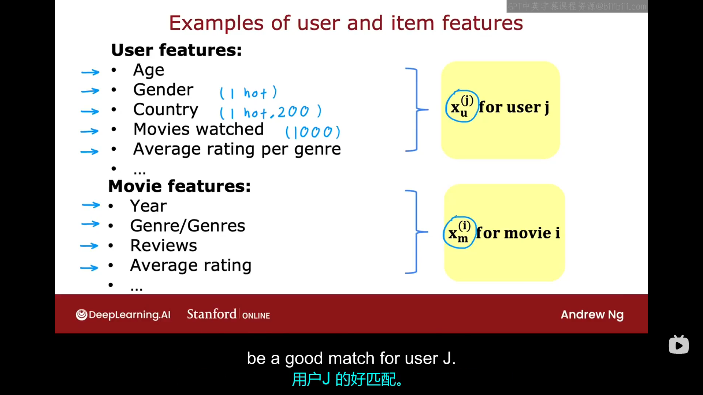
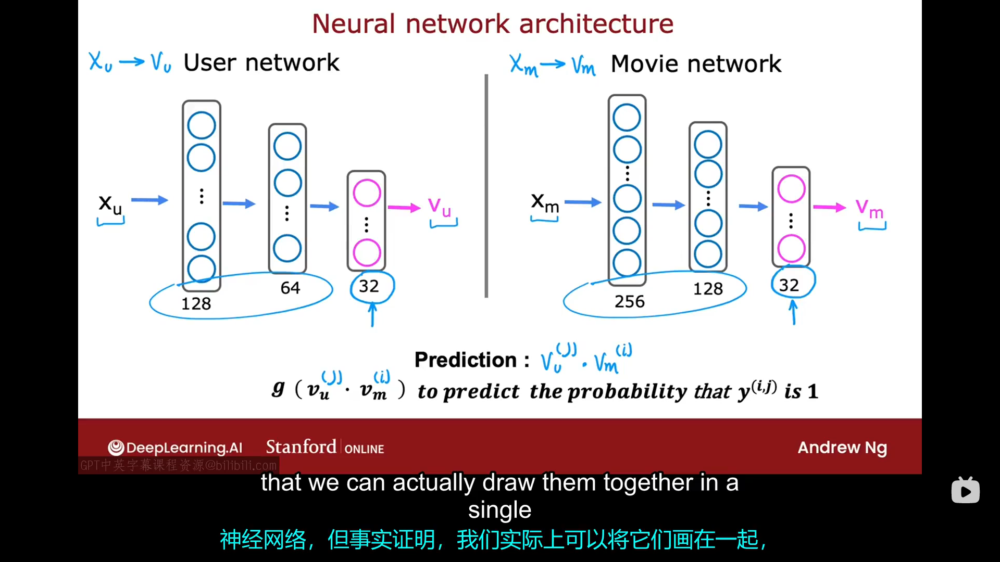
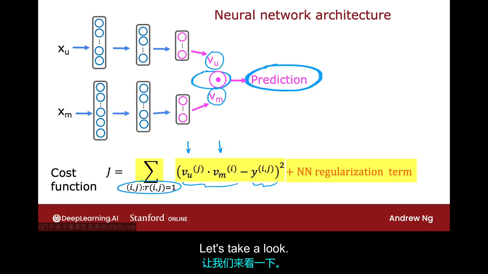

# 6.1 协同过滤与基于内容的过滤
在这个视频中，我们将开始开发第二件推荐系统，称为基于内容的过滤算法。首先让我们将此算法与之前的算法做一个对比。
一般来说，协同过滤算法是根据与你给出评分类似的用户评分向你推荐物品。所以我们会有一组用户对物品的评分，算法将依据此评分来向你推荐物品。
相比之下，基于内容的过滤采用了一种不同的方法来决定向你推荐什么。基于内容的过滤将依据用户与物品的特征来推荐物品，以便获得一个很好的匹配（也就是说，基于内容的过滤需要获取每个用户与每个物品的一些特征）。在基于内容的过滤算法中，你仍然有用户对于各物品评分的数据。
你可以按照如下图所示的方式来构建用户与物品的特征向量：

其中，对于用户的"gender"、"country"等特征可以使用独热编码来表示。请注意，用户特征与电影特征的大小可能非常不同，用户特征可能多达上千个，电影特征可能只有几十个。

之前我们预测评分使用的模型是：$w^{(i)} \cdot x^{(i)} + b^{(j)}$,这里为了使讨论更简单，我们设定$b^{(j)}$始终为0，并且用$v_u^{(j)}$来代替$w^{(j)}$，用$v_m^{(i)}$来代替$x^{(i)}$。即现在的评分预测模型变为：$v_u^{(j)} \cdot v_m^{(i)}$。其中：
- $v_u^{(j)}$代表第j个用户的特征向量，它是一组从用户j的特征中训练出来的数字。
- $v_m^{(i)}$代表第i个电影的特征向量，它是一组从电影i的特征中训练出来的数字。
现在的问题是，我们应该如何从$x_u^{(j)}$中提取出$v_u^{(j)}$，如何从$x_m^{(i)}$中提取出$v_m^{(i)}$。虽然$x_m$和$x_u$的维度可以不同，但提炼出的$v_m$、$v_u$的维度必须相同。在下节课中我们将看到如何计算$v_m^{i}$与$v_u^{j}$。


# 6.2 基于内容的过滤的深度学习
构建基于内容的过滤算法的一种好的方法就是使用深度学习。其大致框架如下图所示：

为了提炼出$v_u$和$v_m$，我们需要训练出如上图所示的两个神经网络。首先让我们来看一下用户神经网络，与之前我们训练出的神经网络不同，该神经网络的输出层不只有一个神经元，而是包含了32个神经元。其次让我们来看一下电影神经网络，注意：电影神经网络与用户神经网络理论上可以有不同数量的隐藏层，每个隐藏层内的神经元数目也不一定要求一致，只要输出层的神经元数量相同即可。如果你有二进制标签，用y=1或0表示用户是否收藏了某电影，那你可以使用$g(\vec{v}_u^{(j)} \cdot \vec{v}_m^{(i)})$来预测$y^{(i,j)}$的概率。以上我们是将两个神经网路分开来画了，但事实证明也可以将两个神经网路放在一起，如下图所示：
对于这种把两个神经网络组合在一起使用的情况，该大神经网络的训练的过程中不涉及到对两个小神经网络的训练，训练过程中涉及的代价函数也如上图中所示，此外，如果我们想找到与电影i相似的电影，我们可以找使得$||\vec{v}_m^{(i)}-\vec{v}_m^{(k)}||^2$的值很小的$\vec{v}_m^{(k)}$对应的电影k，这就类似于我们在上节课找的使得$|| \vec{x}_m^{(i)}-\vec{x}_m^{(k)}||^2$值很小的$\vec{x}_m^{(k)}$对应的电影K。
你可能还记得当我们讨论决策树和神经网络的区别时，我们说过：神经网络的优点之一就是，我们可以将多个神经网络组合成一个更大的神经网络来使用以实现更加强大的功能，以上就是一个例子。有一点值得一提的是，在现实生活中，当我们需要实现诸如此类的算法时，我们往往得花费大量时间来设计作为神经网络输入的特征。在类似应用中，我们描述此类算法的一个限制是：如果你有一个包含大量不同电影的目录，运行它可能非常昂贵，在下一个视频中，我们将看到一些实际问题，以及我们应该如何修改这个算法以使其可以拓展到处理非常大的项目。


# 6.3 从大型目录中推荐
今天的推荐系统有时要求我们从成千上万甚至数百万个项目中挑选几个进行推荐，对此种情况，你如何才能实现高效计算？当用户访问一个网站时，我们可以轻易获取他们的特征对应的$x_u^{j}$，但如果我们取库中包含的成千上万个项目一个一个在神经网络上计算以决定推荐哪些，这巨大的工作量显然是不现实的。

目前许多大规模推荐系统的实现分为两个步骤：检索与排序。其想法是：在检索步骤生成一个包含大量合理候选推荐项目的列表，试图涵盖你可能推荐给用户的许多可能东西。并且在检索步骤中包含用户可能不喜欢的东西也是可以的。然后在排序步骤中我们会进行微调并挑选出最佳项目推荐给用户。我们可以使用以下方法来选出一个包含大量合理候选推荐项目的列表（检索）：
- 比如对于用户最近观看的10部电影，找到与之最相似的10部电影。
- 从用户最喜欢看的三种类型的电影中，每个种类各挑选出十部电影。
- 找出该国家评分最高的20部电影。
- ......

把以上选出的电影放入一个列表中，并去重。
在排序过程中，您将用到上一步检索出来的列表，可能是数百部作品，然后使用训练出的模型对它们进行计算并排序。如果你提前计算了电影网络的部分，那么每个用户登陆时你只需要计算用户网络那部分然后做内积。
# 6.4 推荐系统的伦理使用
略
# 6.5 基于内容的过滤算法的tensorflow实现
在本周的实践实验室中，你将看到如何使用tensorflow实现基于内容的过滤算法。本视频中，我们将介绍一些关键代码：
```python
user_NN=tf.keras.models.Sequential(
    [tf.keras.layers.Dense(256,activation='relu'),
     tf.keras.layers.Dense(128,activation='relu'),
     tf.keras.layers.Dense(32)]
)
item_NN=tf.keras.models.Sequentail([
    tf.keras.layers.Dense(256,activation='relu'),
    tf.keras.layers.Dense(128,activation='relu'),
    tf.keras.layers.Dense(32)]
)
input_user=tf.keras.layers.Input(shape=(num_user_features))
vu=user_NN(input_user)
vu=tf.linalg.12_normalize(vu,axis=1)
#上面这行代码是归一化vu的代码（L2归一化），事实证明，加上这行代码以后算法效果更好
input_item=tf.keras.layers.Input(shape=(num_item_features))
vu=item_NN(input_item)
vm=tf.linalg.12_normalize(vm,axis=1)

output=tf.keras.layers.Dot(axes=1)([vu,vm])

model=Model([input_user,input_item],output)
#制定模型的输入为[input_user,input_item]，输出为“output”
cost_fn=tf.keras.losses.MeanSquaredError()
```
