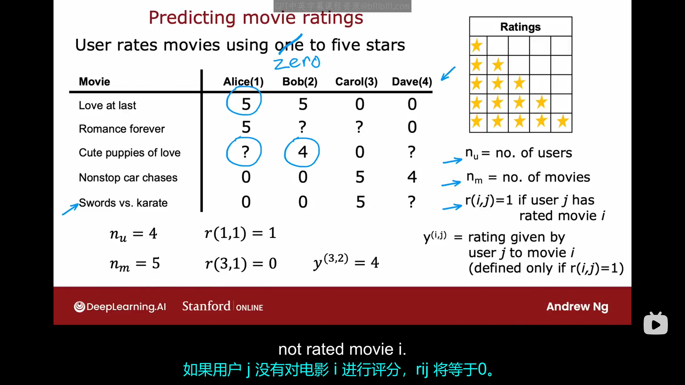
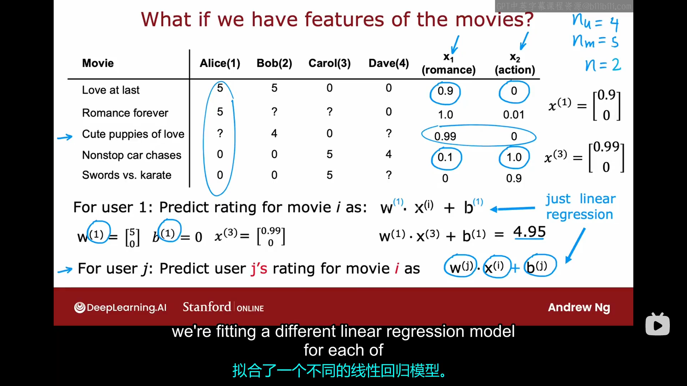
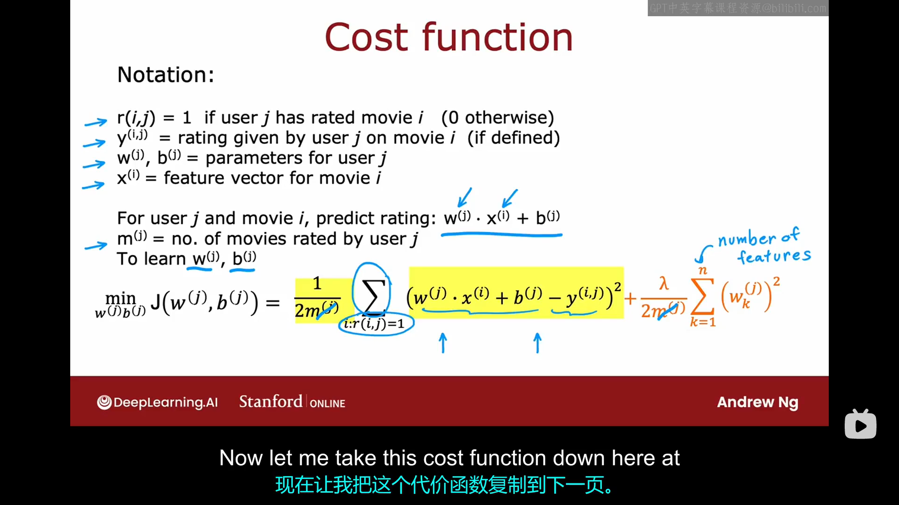
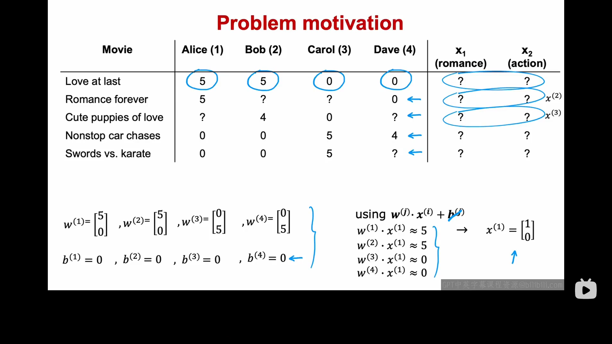
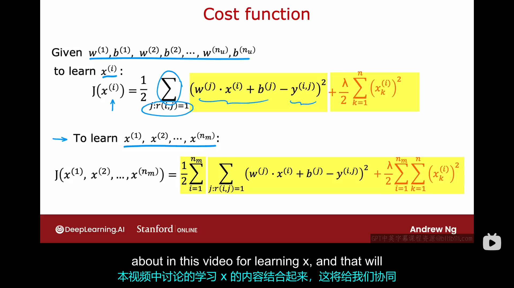
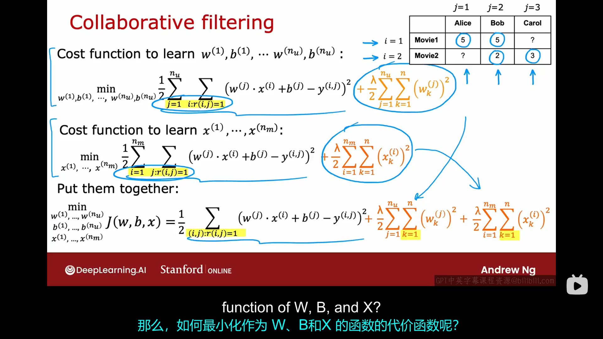
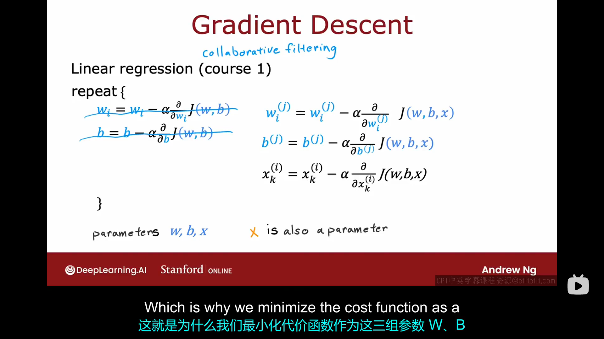
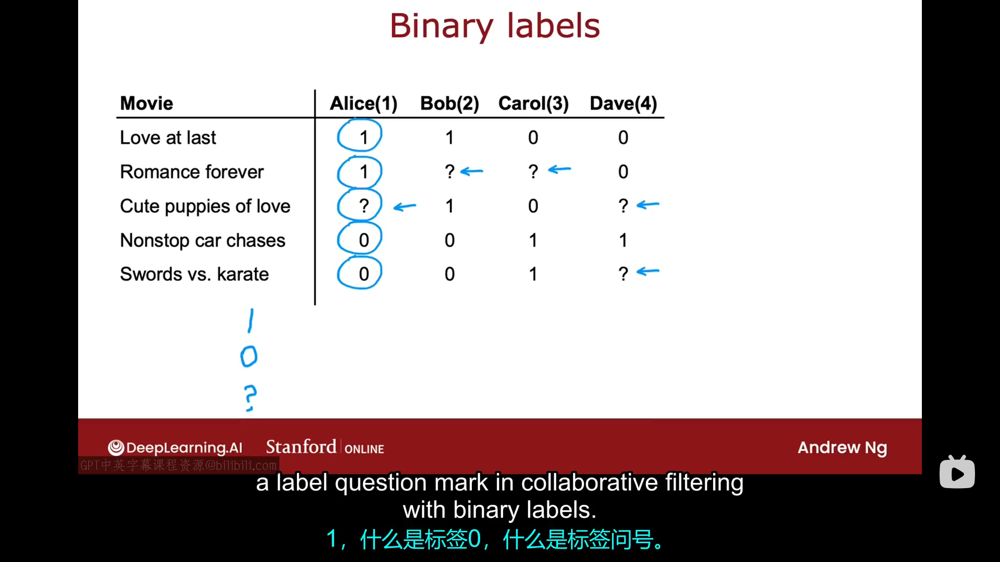
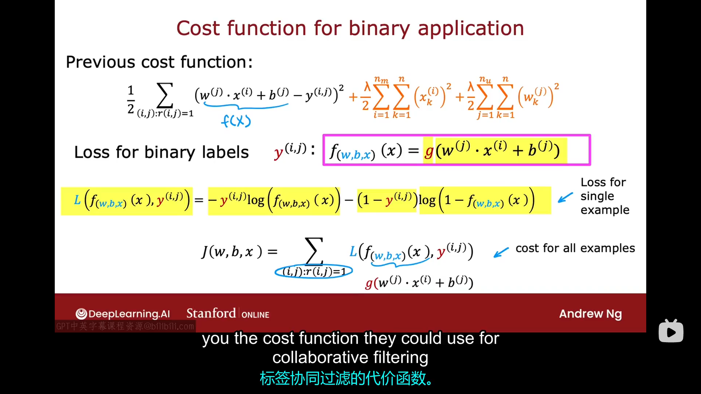

# 4.1 推荐系统(marking)
本周我们将介绍推荐系统，我认为，推荐系统在工业界的应用范围可能比学术界要广的多。
假如你正在运营一个大型电影流媒体网站，你的用户会使用1-5颗星为电影评分，该例子中会涉及到的一些记号如下图所示：

在这个推荐系统的框架下，解决问题的一种可能方法就是查看用户未评分的电影，并预测用户对这些电影的评分，根据预测的评分向他们推荐他们可能会喜爱的电影。在下一个电影中，我们会尝试构建一个推荐算法，但它会包含一个特殊的假设。即假设我们可以电影的一些特征或者其他信息，例如哪些电影是爱情电影，哪些电影是悬疑电影，并利用这些特征来开发算法。但本周晚些时候，我们将回过头来问，如果我们没有这些特征又该怎么办？
# 4.2 使用项目特征
所以让我们看看如果我们有每个项目的特征或每部电影的特征，我们如何开发一个推荐系统。假设我们的数据集如下图所示：

假设第j用户的评分预测模型我们选取为：
$$
w^{(j)} \cdot x^{(i)} +b^{(j)}
$$
现在让我们来看看如何为这个算法制定成本函数，首先再让我们复习一下该例子中各种记号的含义：

我们目标是根据现有的数据，即每个用户对一组电影的评分，来学习参数$w^{(j)},n^{(j)}$。我们的模型与线性回归非常类似，所以我们选择的误差函数也是一种均方误差函数，其具体形式如下图所示：
$$
\frac{1}{2} \sum_{i:r(i,j=1)} (w^{(j)} \cdot x^{(i)}+b^{(j)}-y^{(i,j)})^2 + \frac{\lambda}{2m^{(j)}} \sum_{k=1}^{n}(w_{k}^{(j)})^2
$$
其中，$i:r(i,j)=1$表示只对用户评过分的电影求和。注意之前线性回归那里第一个求和号前的系数是$\frac{1}{2m^{(j)}}$，现在推荐系统这里第一个求和号前的系数变成了$\frac{1}{2}$,去掉了$m^{(j)}$，当然了，这个改动整体上无伤大雅。
以上代价函数只是针对单个用户j的代价函数，但与其关注单个用户，我们不如尝试一次性学习所有用户的参数。容易理解，整体的代价函数就是就是对所用$n_u$个用户求和，即：
$$
\frac{1}{2} \sum_{j=1}^{n_u} \sum_{i:r(i,j=1)} (w^{(j)} \cdot x^{(i)}+b^{(j)}-y^{(i,j)})^2 + \frac{\lambda}{2m^{(j)}} \sum_{k=1}^{n}(w_{k}^{(j)})^2
$$
以上所有讨论都建立在一个基础上：每部电影的特征我们都可以获取，例如之前的特征$x_1,x_2$,它们使用具体的数值告诉你每部电影有多么浪漫以及某部电影有多少的动作。但这些特征从何而来，如果你没有访问这些特征的权限，你又该怎么办呢？在下一个视频中，我们将介绍这个算法的修改版本，它将允许你在即使没有权限访问那些详细特征的情况下做出预测。
# 4.3 协同过滤算法
在上一个视频中我们可以看到，如果我们有权限访问每个电影的特征，那你基本上可以使用线性回归预测用户对每部电影的评分。但是如果你没有这些特征$x_1，x_2$呢？让我们来看看如何从数据中获取这些特征。假设这种情况下的数据集如下图所示：

假设我们现在已经以某种方式学习了四个用户的参数，并且它们的具体取值上图中所示。至于我们是如何得到这些参数的，我们后面会介绍，但现在假设我们已经有了它们。要预测用户对每部电影的评分，我们这里还是使用线性回归模型:
$$
y^{(i,j)}=w^{(j)} \cdot x^{(i)} +b^{(j)}
$$
为了讨论简单，我们这里假设所有的$b^{(j)}=0$，考虑思维用户对第一部电影的评价，有：
$$
\vec{w}^{(1)} \cdot \vec{x}^{(1)} \approx 5
\\
\vec{w}^{(2)} \cdot \vec{x}^{(1)} \approx 5
\\
\vec{w}^{(3)} \cdot \vec{x}^{(1)} \approx 0
\\
\vec{w}^{(4)} \cdot \vec{x}^{(1)} \approx 0
$$
为了满足上面四个式子，我们可以给出对$\vec{x}^{(1)} $的一个合理预测是：
$$
x^{(1)}=\begin{pmatrix} 1 \\ 0 \end{pmatrix}
$$
显然，你可以用同样的方法来预测后面几部电影的特征的取值。在协同过滤算法中，正因为你有多个用户对同一项目的评分，这才使得你猜测每部电影的特征的合理取值成为可能。为了获取各个特征的合理值，我们可以尝试优化下图所示的代价函数：

因此，如果你有各个用户的参数:$\vec{w}^{(j)},\vec{b}^{(j)}$，你可以使用梯度下降法优化如上图中所示的代价函数以猜测各个电影相关特征的合理取值。对于大多数机器学习任务，特征必须由外部提供，但在这个算法中，我们实际上可以学习给定电影的特征。但在我们这里举的例子中，我们事先知道了各个参数$\vec{w},\vec{b}$的取值，我们又应该如何获取这些取值呢？

现在让我们将上节课的学习参数$\vec{w},\vec{b}$的内容和本节课学习特征$\vec{x}$的内容结合起来，一起来构建协同过滤算法。
我们将学习参数和学习特征的代价函数相加，得到如下图所示的结果：

我们可以使用梯度下降法优化此代价函数，具体的参数更新方式如下图所示：

以上算法就是协同过滤算法，对该名字的一个直观理解：这是用户之间的协作，以帮助你预测未来其他用户对电影的评分。在之前的例子中，数据集中的标签是电影评分，取值是$[0,5]$，推荐系统中的一个常见例子是你的数据集拥有二元标签，例如用户是否收藏、是否喜欢某个项目。在下个视频中，我们将介绍如何将你的算法推广到二元标签。
# 4.4 二进制标签
推荐系统或者协同过滤算法的一个重要应用就是用于二元标签，本节课我们将介绍如何将现有的算法推广到二元标签的应用，这个推广过程与我们之前从线性回归推广到逻辑回归的过程很类似。
假设现有一个二元标签数据集如下图所示：

图中的问号表示用户并未看过此电影。线性回归中，我们的模型为：
$$
y^{(i,j)}=\vec{w}^{(j)} \cdot \vec{x}^{(i)} +b^{(j)}
$$
在二元标签问题中，我们将模型改为：
$$
g(\vec{w}^{(j)} \cdot \vec{x}^{(i)} +b^{(j)})=\frac{1}{1+e^{-(\vec{w}^{(j)} \cdot \vec{x}^{(i)} +b^{(j)})}}
$$
它代表了$y^{(i,j)}=1$的概率。
为了构建这一算法，我们还需要对代价函数做出如下图所示的改进：

至此，尽管你已经看到了算法的关键结构和代价函数，但还有一些实现技巧可以使你的算法运行的更好，我们将在下个视频中看到这一点。

