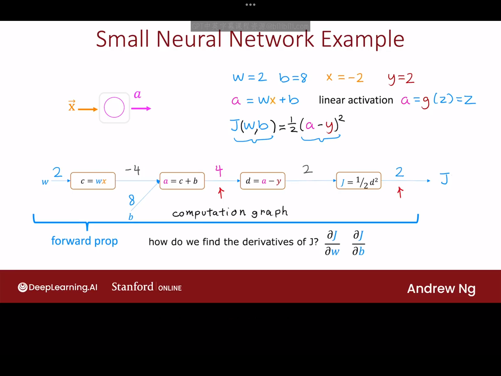
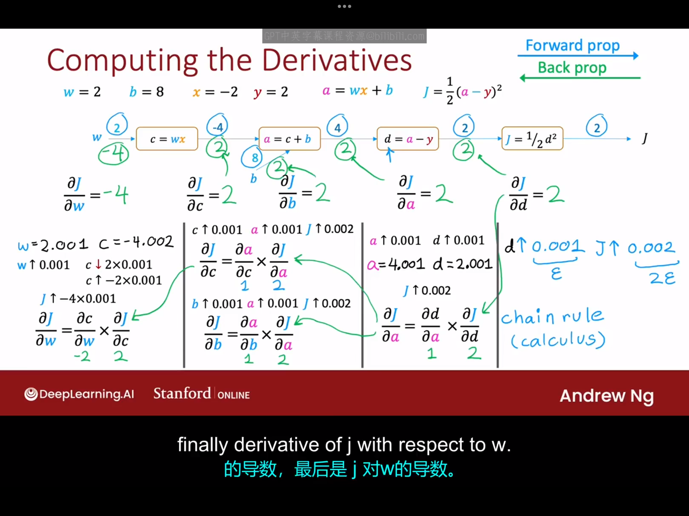
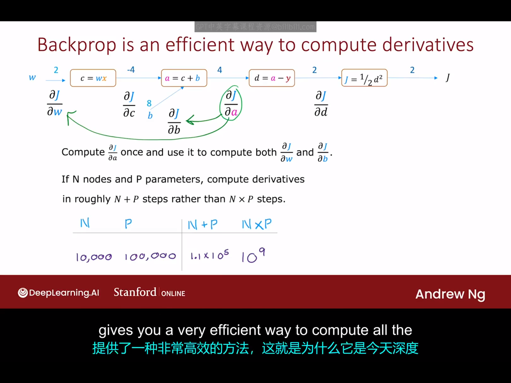

# Optional.1 什么是导数（这部分内容省略）
# Optional.2 计算图(Computational Graph)
计算图是像tensorflow这样的编程框架自动计算神经网络导数的方法,现在我们用下图中的例子来看看它的工作原理：

上图过程向我们展示了前向传播计算代价函数$J(w,b)$的过程，下面我们来看一下如何通过反向传播来计算$J(w,b)$对参数w和b的导数（核心是求导的链式法则）。

从上面的过程中你可以看到，反向传播高效的一个原因是：当我们进行从左到右的计算时我们只需要计算一次$\frac{\partial J}{\partial a}$的值，然后这个量用于计算$\frac{\partial J}{\partial w}$和$\frac{\partial J}{\partial b}$。事实证明，如果一个计算图有n个节点（即图有n个框）和p个参数，那么反向传播过程允许我们在大约n+p步（而不是n*p步）完成J对所有参数的偏导数的计算。

# Optional.3 更大的神经网络示例
本节课让我们来看看计算图如何在一个更大的神经网络中工作。

在神经网络发展的早期，神经网络科学家经常在纸上进行各种各样的导数计算，但感谢计算图与反向传播算法，今天的科学家们可以借助自动微分(auto-diff)这一方法来快速计算神经网络中的导数运算，这极大地促进了深度学习的发展。
