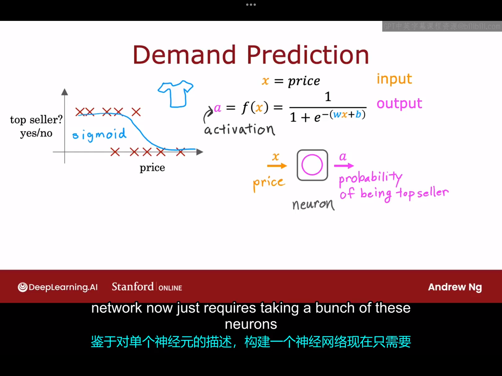

# 1.0 欢迎

在本课程的第二部分，你将学习神经网络（也称为深度学习算法），以及决策树，这些是最强大且广泛使用的机器学习算法中的一部分。在本课程中，您还将看到一些关于如何构建机器学习系统的实用建议。当您构建一个实际的机器学习系统时，您需要做出许多决策，例如，您应该花更多时间收集数据，还是应该购买更大的gpu来构建更大的神经网络。

我们将花费四周的时间来学习第二部分的内容：第一周，我们将学习神经网络以及它如何进行推理或者预测。如果您在互联网上下载其他人训练的神经网络的参数，并使用该神经网络进行预测，这被称为推理。第二周，我们将学习如何训练自己的神经网络。特别是，如果您有一个带有标签的训练集X和Y，您如何为自己的神经网络找到合适的参数？第三周，我们将深入探讨构建机器学习系统的实用建议，这将帮助您高效快速地构建系统。课程的最后一周，我们将学习决策树。虽然与神经网络相比，决策树在媒体上没有得到太多关注，但它也是广泛使用且强大的学习算法之一。如果您最终构建一个应用，您很有可能会使用它们。

# 1.1 神经元与大脑
几十年前，神经网络首次被发明时，最初的动机是编写能够模仿人类大脑或者生物大脑学习和思考方式的软件。但如今，神经网络（有时也被称为人工神经网络）的工作方式已经变得与我们所认为的大脑实际工作方式和学习方式大不相同。当然，不可否认的是，一些来自于生物学的启发仍然存在于我们今天对人工神经网络的思考方式中。因此，首先让我们来看看大脑是如何工作的，以及它与神经网络的关系。

人类大脑，或者更广泛地说，生物大脑，展示了一种比我们迄今为止所构建的任何其他事物都更高层次或更具能力智能。因此，神经网络的起源动机就是试图构建出能够模仿大脑的软件。

神经网络的发展史：
1.神经网络的工作始于20世纪50年代，但只过了一段时间便不再受欢迎。
2.20世纪80年代和90年代初，神经网络再次流行起来，并在一些应用中显示出巨大的牵引力，例如手写数字识别等
3.在随后的90年代，神经网络再次失宠。
4.2005年，神经网络重新兴起，并且被重新命名为深度学习。
5.从2005年起，神经网络彻底改变了一个又一个的应用领域：从语言识别到计算机视觉（例如2012年的ImageNet），再到文本或者自然语言处理(NLP),现在，深度学习更是被用于各个领域。尽管今天的神经网络几乎与大脑的学习方式无关，但早期试图模仿大脑的软件的动机依然存在。那么，大脑是如何工作的呢？请看下图：

这张图展示了大脑中的神经元是什么样子的，所有人类思维都来自于大脑和心灵中的这些神经元，它们发射电脉冲，有时与其它神经元形成新的连接。给定这样一个神经元，它有多个输入，即从其它神经元接收电脉冲。然后该神经元会进行一些计算，并通过电脉冲将其输出发送给其它神经元，即上层神经元的输出反过来成为下层神经元的输入，下层神经元再次从多个其他神经元聚合输入，然后可能将自己的输出再发送给其它神经元。

下图将向你展示神经元与人工神经元的对比：

图中左边是一个生物神经元，包含了细胞体、细胞核、轴突、树突。树突附则接受信号，轴突负责传递信号给下一个神经元。人工神经网络使用了一个非常简化的数学模型来模拟生物神经元的行为。右图中一个圆圈代表一个神经元，当你构建人工神经网络算法时，你通常希望同时模拟许多这样的神经元，而不是一次构建一个神经元，因此，在图的右边一共画了三个神经元，这些神经元共同的作用是接受一些输入的数字，并进行计算，然后输出一些其它数字。但实际上，现在人类对大脑真正的工作机制几乎是一无所知。因此，当我们研究人工神经网络时，尽管其起源于生物学启发，但请不要过分关注这种生物学启发。

神经网络概念已经存在了几十年，为什么只是在过去的几年里，神经网络才真正的起飞？下图会告诉你答案：

在过去的几十年里，随着互联网的兴起，手机的普及，在许多应用领域，数字数据量激增（比如可能很多过去被记录在纸上的信息都被数字化记录了）。我们通过上图可以看到，对于一个传统的机器学习算法（逻辑回归、线性回归），即使你给他一个很大的数据集，它的效果也只有很小的提升。因此，传统的机器学习算法性能似乎无法随着我们提供的数据量的增加而提升，它无法有效利用这些庞大的数据。但是，ai研究人员开始观察到，如果你在这个数据集上分别训练一个小型、中型、大型神经网络，算法的性能会随着数据量的变多而大幅度增加，这导致了深度学习的兴起（这也导致了更快的计算机处理硬件的兴起，例如gpu的兴起，这种硬件最初被设计用于生成漂亮的计算机图形，但也被证明对深度学习非常强大）。

# 1.2 需求预测

为了说明神经网络的工作原理，让我们从一个“需求预测”的例子开始讲起。何为需求预测？简单来说，就是预测一件商品是否会成为畅销商品。在这个例子中，你正在销售T恤，并且你想知道如果某件T恤卖某一价格是否会成为畅销品，你收集了来自附近门店的T恤销售数据（不同门店的价格不一样），数据包括了T恤的单价以及T恤的销售量（销售量达到一定数目我们就认为它是畅销品），假设数据集如下图所示：

在本例中，输入特征是T恤的价格，这就是学习算法输入。如果你选择拟合一个sigmod函数到数据上，它可能如图中蓝色曲线所示，那么你的预测输出就看起来如下所示：
$$
f(x)=\frac{1}{1+e^{-(\vec{w} \cdot \vec{x}+b)}}
$$
为了给下面构建一个神经网络做铺垫，这里用引入一个术语来表示这个逻辑回归算法的输出：“激活(activition)”，用字母a来表示，即$a=f(x)=\frac{1}{1+e^{-(\vec{w} \cdot \vec{x}+b)}}$。实际上，“激活”一词来源于神经科学，指的是一个神经元向下游其他神经元发送高输出的程度。这个逻辑回归单元，或者这个小的逻辑回归算法，其实已经可以被认为是一个非常简化的单个神经元模型。其中，该神经元所做的是将价格x作为输入，然后经过某种运算（本例中是将x代入$f(x)$），输出数字a（这里a代表了该T恤成为畅销品的概率）。举个形象的例子作为类比，你可以将神经元其看作一个微型计算机，它的任务是接受一个或几个数字作为输入，然后通过某种运算，输出一个或者几个数字（**但这里笔者有一个问题：一个神经元真的能同时输出几个数字吗？**）。这里得再次强调，人工神经元是对生物神经元做了极大的简化，生物神经元的工作机理到现在仍未弄清楚。基于对单个神经元的描述，构建一个神经网络现在只需要将一堆这样的神经元连接在一起或组合在一起。

下面看一个更复杂的需求预测的例子。在这个例子中我们有四个输入特征来预测一件T恤能否成为畅销品，它们分别是：价格(price)、运费(shipping cost)、营销(marketing)、材质(material)。现在，你认为可能影响销量的几个直接因素是：可负担性(affordability)、买家对这件T恤的认知程度(awareness)、感知质量(perceived quality)。可负担性主要取决于价格和运费，因为你需要支付的总金额是价格加上运费的总和。因此可以使用一个小神经元，接受价格与运费作为输入，并预测人们是否认为这是可负担的。类似地，认知度主要取决于T恤的营销，同样也可以构建一个神经元来预测人们是否对该产品有高认知度。最后，感知质量主要与价格和材料有关，我们可以再构建一个神经元预测人们是否认为这是高质量的。完成了对可负担性、认知度、和感知质量的估计后，我们将这三个神经元的输出连接到右侧的另外一个神经元，右边这个神经元也是一个逻辑回归单元，接受来自上层的三个数字作为输入然后经过计算输出该商品成为热销商品的概率。示意图如下图所示：

在神经网络中，我们通常把中间那三个神经元组合成一个“层(layer)”，层是一组神经元，它们以相同或者相似的特征作为输入，并依次输出一些数字。图中那个粉红色的单个神经元也是一个层，一层中可以有一个或者多个神经元。最右边的层也叫做输出层。在神经网络术语中，我们也将可负担性、认知度和感知质量称为激活值(activitions)（**笔者的疑问:这里的激活值与前文的激活是否是一个意思？**）。因此，可负担性、认知度、感知质量的这些数字是这一层的激活值。最终的输出概率是输出层的激活值。

上图中神经网络的工作流程：中间的那层（术语叫做隐藏层，名称来源：你在数据集中只能看到样本的输入、输出，却并看不到可负担性，认知程度，感知质量的相关信息）接受四个数字（这四个数字的列表也被称为输入层）作为输入，经过计算后输出三个数字，输出层再接受这三个数字作为输入，然后输出一个最终概率。

现在我们想对上图的神经网络稍作修改，前面我们的描述是：隐藏层的每个神经元都事先被我们决定好它将从上一层获取那些输入，比如可负担性对应的神经元需要获取的输入是价格与运费，认知程度对应的神经元需要获取的输入是营销......但如果我们需要训练一个大型的神经网路，我们一个个指定每个神经元所需要的输入是很麻烦的。因此，我们的改进做法是：每一层的每个神经元都可以获取前一层的所有输入特征，并通过设置参数来做到仅关注与该神经元最相关的所有特征的一个子集。

为了进一步简化神经网络的表示和描述，我们将这四个输入特征写成一个向量$\vec{x}$，这个特征向量被输入到隐藏层，得到三个激活值，这三个激活值又组成另一个向量并被输入到输出层，最终输出层会输出一个概率值。

这里分享另一种思考神经网络的方式：假如在上个例子中我们只考虑隐藏层与输出层，我们发现这就是一个逻辑回归算法，它以可负担性、认知度、感知质量作为输入，预测商品为畅销品概率。但有趣的是，这个逻辑回归并不是使用原始特征（价格、运费等）直接作为输入，而是使用一组新的，可能更好的特征作为输入。因此，一种思考这个神经网络的方式是，它知识逻辑回归，但它是一种可以学习自己特征的逻辑回归版本，这可能有更好的效果。神经网络的作用是，你不需要手动设计特征，它可以自己学习。

让我们来看看其他神经网络的例子，特别是具有多个隐藏层的例子，具体例子如下图所示：
实际上，当你构建自己的神经网络时，你需要决定的一件事是你想要多少个隐藏层，每个隐藏层有多少个神经元，这属于神经网络架构的问题，在本课程的后面会涉及。选择不同数理的隐藏层以及每个隐藏层选择不同数量的神经元会影响你算法的性能。这种具有多层隐藏层的神经网络也被称为多层感知器（multilayer perception）。

# 1.3 图像识别

本节课我们来看一下如何将神经网络应用于计算机视觉领域。
如果你正在构建一个用于人脸识别的神经网络，该神经网络的输入是一个如图所示的由$1000 \times 1000$个像素组成的图片，故该图片在计算机里就会被表示成一个$1000 \times 1000$的网格，也称为$1000 \times 1000$的像素强度值（这个好像就是灰度值）矩阵（如下图所示）。这个例子中，灰度值的取值范围是0~255。

你可以将所有的矩阵元素排列成一个包含一百万个像素强度值的列表或者向量。因此，你所搭建的神经网络需要完成的任务就是：以这一百万个灰度值组成的向量为输入，然后输出照片中的人物身份。

具体的流程大概如下图所示：

向量$\vec{x}$被输入到第一个隐藏层，然后提取一些特征。然后第一个隐藏层的输出被输入到第二个隐藏层，然后第二个隐藏层的输出被作为第三个隐藏层的输入，依此类推，直到输出层接收到来自上一层的输入然后输出某个数字（该数字代表了该图片对应于某个人的概率。）一个有趣的事实是，如果你查看一个在大量人脸图像上训练过的神经网络，并尝试可视化这些隐藏层正在计算什么，你可能会发现如上图中底部所示的内容：第一隐藏层的第一个神经元在寻找一条小的垂直线或者垂直边缘，第二个神经元正在寻找一条定向线或者定向边缘，第三个神经元正在寻找某一特定方向的线，依此类推......因此，在神经网络的最早层中，你可能会发现神经元正在寻找图像中非常短的线条或者或者非常短的边缘，如果你查看下一个隐藏层，你会发现这些神经元可能会学习将许多小线段组合在一起，以寻找面部的一部分，例如眼睛、鼻子或者耳朵的一部分......在下一个隐藏层中，神经网络可能正在聚合面部的不同部分，然后尝试检测更大的、更粗糙的面部特征是否存在。最终，检测输入图片中面部与不同面部形状的对应程度并依此创建一组丰富的特征，然后帮助输出层尝试确定图片中人物的身份。神经网络的一个显著特点是它可以通过训练在隐藏层自动学习特征表示，而无需人为选取特征。在这个例子中，没人告诉它在第一层寻找短小的边缘，在第二层找眼睛、鼻子等部分面部，在第三隐藏层找更完整的面部形状，但神经网络能够从数据中自行找出这些特征。

如果我们构建一个神经网络想用于识别不同汽车的侧面图，并尝试可视化不同隐藏层在做什么，我们可以得到如下结果：

第一个隐藏层仍然尝试寻找一些细小的边缘，第二隐藏层会寻找车的某些部位，第三隐藏层会尝试寻找更大的汽车特征。

