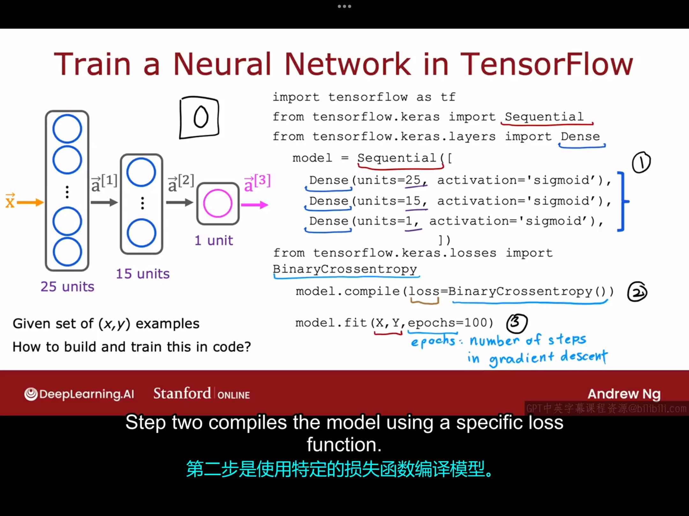
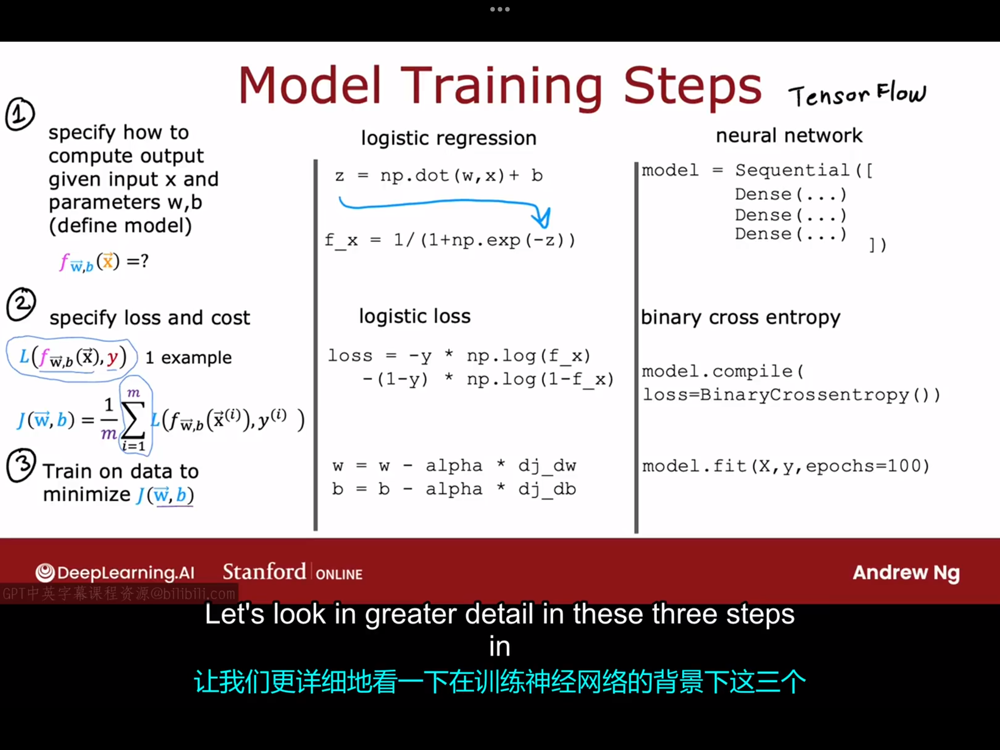

# 7.1 TensorFlow实现
上周，我们学习了如何在神经网络中进行推理。本周，我们将讨论神经网络的训练。
让我们继续以手写数字的识别为例，下图展示了该例中所用到的神经网络架构：
现在的问题是，如果我们有数据集(x,y)，如何在该数据集上训练我们的神经网络？具体代码如下所示：
```python
import tensorflow as tf
from tensorflow.keras import Sequential
from tensorflow.keras.layers import Dense
#第一步，指定模型
model=Sequential([
    Dense(units=25,activation='sigmoid'),
    Dense(units=15, activation='sigmoid'),
    Dense(units=1,activation='sigmoid')
])
#第二步，使用特定的损失函数编译模型
from tensorflow.keras.losses import BinaryCrossentropy
model.compile(loss=BinaryCrossentropy())
#第三步，在特定的数据集上训练模型
model.fit(X,Y,epochs=100)  #指定梯度下降运行一百步
```
# 7.2 训练细节

下图给出了训练一个逻辑回归模型和训练一个神经网络的步骤对比：

通过上图我们可以看到，二者的训练过程都可以总结为以下三步：
- 指定模型：指定输出与给定输入、参数之间的关系，即确定$f_{\vec{w},b}(\vec{x})=?$
- 指定代价函数
- 在数据集上最小化代价函数

下面我们将目光移至具体的代码细节：
```python
model.compile(loss=BinaryCrossentropy()) 
#选择二元交叉熵损失函数
model.compile(loss=MeanSquaredError())
#选择均方误差函数作为损失函数
```
二元交叉熵损失函数的具体形式：
$$
L(f(\vec{x}),y)=-ylogf(\vec{x})-(1-y)log(1-f(\vec{x}))
\\
J(W,B)=\frac{1}{m} \sum_{i=1}^{m}L(f(\vec{x}^{(i)}),y^{(i)})
$$
损失函数是神经网络中所有参数的函数，故大写的W实际上代表了$\vec{w}^{[1]},\vec{w}^{[2]},\vec{w}^{[3]}...$，大写的B代表了$\vec{b}^{[1]},\vec{b}^{[2]},\vec{b}^{[3]}...$

在最小化代价函数时，使用的是梯度下降法，而梯度下降法在更新参数时，最重要的一步就是计算代价函数对各参数的导数，而tensorflow所做的，实际上在神经网络训练中标准的是使用一种被称为反向传播的算法来计算这些偏导数项，tensorflow库在名为fit的函数中实现了反向传播,你要做的就是调用model.fit()并告诉它迭代多少个轮次。事实上，你稍后会看到一种比梯度下降运行更快的算法。


