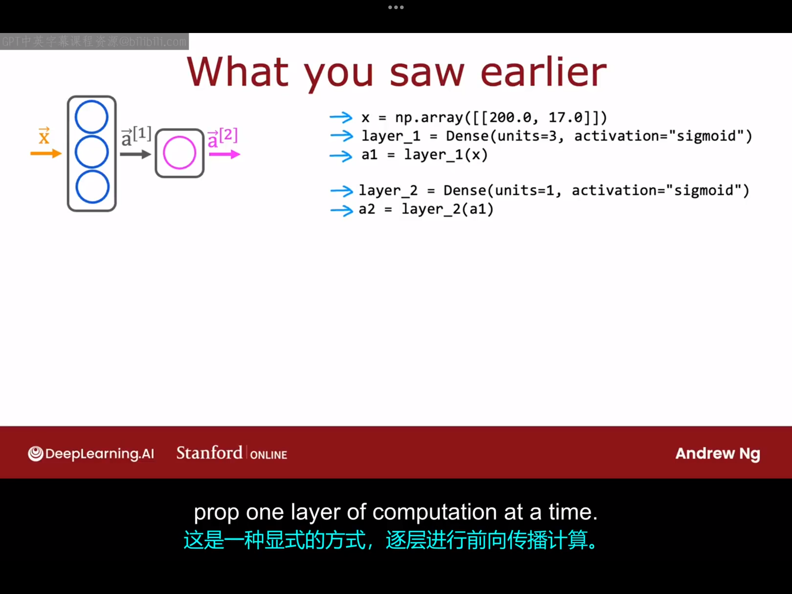

# 3.1 代码中的推理

TensorFlow是实现深度学习算法的主要框架之一,另一个流行的工具是pytorch，在这个专业化课程中，我们将专注于TensorFlow。
>补充（来自chatgpt）：
TensorFlow 是一个由 Google 开发的**开源机器学习框架**，广泛用于**深度学习模型的构建与训练**。它基于数据流图（DataFlow Graph）设计，允许开发者将计算任务表示为由“张量”在“节点”间流动的图结构。TensorFlow 提供了从低层运算（如张量计算、梯度求导）到高层 API（如 Keras）的一整套工具，使用户能够高效地构建、训练和部署神经网络模型，支持在 CPU、GPU、TPU 等多种硬件平台上运行，广泛应用于语音识别、图像处理、自然语言处理等领域。
>
>PyTorch 是一个由 Facebook（现为 Meta）开发的**开源深度学习框架**，以其**动态计算图机制**和**易用的 Python 风格编程接口**而深受研究者和开发者欢迎。与 TensorFlow 相比，PyTorch 更加灵活、调试方便，适合快速原型设计和科研探索。它提供了强大的张量运算功能和神经网络构建模块（如 `torch.nn`），支持自动求导（`autograd`）、GPU 加速训练，并通过 `torchvision`、`torchaudio` 等子库扩展到图像、音频等领域。PyTorch 既适用于学术研究，也广泛用于工业级部署，现已成为深度学习社区中最主流的框架之一。
>
>TensorFlow 和 PyTorch 都是 Python 库，在使用前需要先安装并加载。
>
>安装代码（可以指定安装版本，也可以不指定）：
```python
pip install tensorflow==2.15.0
pip install torch==2.1.0
```
>
>加载相应库的代码（每次使用前都需要加载）：
```python
import tensorflow as tf    # 加载 TensorFlow
import torch               # 加载 PyTorch
```
神经网络的一个显著特点是，相同的算法可以应用于很多不同的应用。下面我们随便举一个日常生活中的应用：我们希望使用神经网络来预测烘焙出来的咖啡是否好喝，假设这个例子中咖啡是否好喝只与烘焙咖啡的时长与烘焙咖啡的温度有关。假设收集的数据集如下图所示：

叉号代表咖啡好喝，圆圈代表咖啡不好喝。当下的任务是：给定一个包含烘焙温度和时间的特征向量$\vec{x}$（假设$\vec{x}=[200,17]$）,然后我们应用神经网络去预测，在这个条件下(温度为200，时间为17)烘焙得到的咖啡是不是好咖啡。

```python
x=np.array([[200.0,17.0]])
layer_1=Dense(units=3,activation='sigmoid')
a1=layer_1(x)
layer_2=Dense(units=1,activation='sigmoid')
a2=layer_2(a1)
if a2>0.5:
    yhat=1
else:
    yhat=0
```
>代码解读:
一、
np.array():np.array() 是 NumPy 提供的函数，用于将列表、元组或嵌套结构转换为 numpy.ndarray 数组对象。
np.array()的示例用法：
> ```python
>a = np.array([1, 2, 3, 4]) #创建一维数组
>print(a)          # [1 2 3 4]
>print(a.shape)    # (4,)
>
>a=np.array([[1,3],[2,4]]) #创建二维数组(矩阵)
>print(a)                  
>#[[1,3]
># [2,4]]  
>print(a.shape) # (2,2)
>
>（注：用numpy数组表示的矩阵行与行之间没有逗号，但是
>用python嵌套列表表示的矩阵行与行之间是有逗号的，但是使用嵌套
>列表表示的矩阵无法进行矩阵运算，而用Numpy数组表示的矩阵可以。
>故推荐使用numpy数组表示法。举一个将嵌套列表表示的矩阵转换成
>numpy数组表示并进行矩阵运算的例子：
>import numpy as np
>matrix = np.array([
>    [1, 2, 3],
>    [4, 5, 6],
>    [7, 8, 9]
>])
>print(matrix[1, 2])        # 输出 6
>print(matrix.T)            # 转置
>print(matrix @ matrix)     # 矩阵乘法）
> ```
>补充概念：
1.数组：
在编程中，数组（array）是一种可以存储一组相同类型数据的数据结构。
在 Python 的 numpy 库中，数组是使用 np.array 创建的对象，它具有：
(1)多维性（可以是 1D、2D、3D…）
(2)高效的数值运算能力（比 Python 原生列表快很多）
(3)广泛用于科学计算、机器学习、图像处理等领域
>
>2.数组的维数：
数组是由一组**类型相同的数据**按一定规则排列组成的数据结构，在 NumPy 中称为 `ndarray`（N 维数组），它支持高效的数值计算和多维数据操作。数组的**维度**是指索引数组中元素所需的**坐标轴（axis）数目**，也称为数组的“秩”（rank）。例如，一维数组是线性排列的数据（如向量），二维数组是有行列结构的矩阵，三维数组可以理解为多个矩阵堆叠而成的立体结构。NumPy 会根据嵌套列表的层数自动推断数组的维度，比如 `[1, 2, 3]` 是一维，`[[1, 2], [3, 4]]` 是二维，`[[[1, 2], [3, 4]]]` 是三维。维度的数量可通过 `.ndim` 属性查看。
>
>二、
Dense(units= ,activation='')中的Dense指的就就是我们目前为止所介绍的那种神经网络层，随着学习的深入，你还会见到其他类型的神经网络层。
>
>三、
上述代码中还有一些细节没有被提及，比如如何加载tensorflow库，参数w,b的取值如何确定，这些内容都在课后实验中有所涉及，所以请务必查看课后实验内容。

# 3.2 Tensorflow中的数据

本节课将介绍数据在numpy和tensorflow中的表现形式。很多年前，numpy首先被创建，并成为Python中线性代数中的标准库。很久之后，Google Brain团队创建了TensorFlow，故二者中的数据表现形式存在一些不一致性。

numpy 中的矩阵表示(这部分内容其实我在上节课的补充内容已经说过)：


介绍完numpy中的矩阵表示后，我们回到上一小节那个神经网络的例子：

> ```python
>a1=[[0.2,0.7,0.3]] 
>#这里假设a1结果在数学上的矩阵表示为[0.2 0.7 0.3],在numpy中与之对
>#应的表示为[[0.2,0.7,0.3]],但我们现在想知道经过神经网络的计算，a1
>#在TensorFlow中的的对应，故可以使用print函数来查看。
>print(a1)
>#输出:tf.Tensor([[0.2 0.7 0.3]],shape=(1,3)，dtype=float32)
>#(1,3)代表它是一个1*3的矩阵，float32代表它是一个可以用32位存储表示的
>#浮点数，Tensor在这里是一种数据类型，代表张量，TensorFlow团队创建它
>#是为了高效地存储和执行矩阵计算。从技术上讲，张量比矩阵更通用，但在本
>#课程范围内，可以将张量视为表示矩阵的一种方式，这也是TensorFlow
>#与numpy表示矩阵的区别所在.
>a1.numpy() #此代码可以将上面的a1(一个张量)转回numpy数组
>print(a1) #结果：array([[0.2,0.7,0.3]],dtype=float32)
> ```

我们通常习惯在numpy中加载和操作数据，但当你将Nmupy中的数组传递给TensorFlow时，TensorFlow喜欢将其转换为自己的内部格式——张量，然后进行高效地运算。读取数据时，你可以保持它为张量或者将其转换回Numpy数组。

>关于张量的一些补充知识（来源于deepseek）:
>### 张量维数的定义
>
>在张量代数中，**张量的维数**（Tensor Dimensionality）由两个相互独立的概念共同定义：
>
>1. **阶数（Order/ Rank）**  
>   描述张量的**索引维度数量**，即表示张量结构所需的索引个数：
>   - 标量：0阶（无索引，如常数 $c$）
>   - 向量：1阶（1个索引，如 $v_i$）
>   - 矩阵：2阶（2个索引，如 $M_{ij}$）
>   - 高阶张量：$n$阶（$n$个索引，如 $T_{i_1i_2\cdots i_n}$）
>
>2. **形状（Shape）**  
>   指定每个索引维度的**具体尺寸大小**，即每个索引的取值范围：
>   - 向量 $v \in \mathbb{R}^3$：形状为 `(3,)`（1个维度，尺寸为3）
>   - 矩阵 $M \in \mathbb{R}^{2\times 4}$：形状为 `(2,4)`（第1维尺寸=2，第2维尺寸=4）
>   - 三阶张量 $T \in \mathbb{R}^{5\times 3\times 6}$：形状为 `(5,3,6)`
>
>---
>
>### 关键说明：
>- **维数是阶数与形状的联合表述**：  
>  完整描述张量维数需同时说明其**阶数**和各维度的**尺寸**。例如：
>  > "一个形状为 `(4,3,2)` 的三阶张量"  
>  （阶数=3，第1维尺寸=4，第2维尺寸=3，第3维尺寸=2）
>
>- **阶数 ≠ 维度尺寸**：  
>  - 阶数 = 索引轴的数量（抽象层级）  
>  - 形状 = 每个轴的具体长度（具象数值）  
>  如三维空间中的位置张量（阶数=1，形状=`(3,)`）与RGB图像张量（阶数=3，形状=`(H,W,3)`）
>
>- **物理意义**：  
>  维数决定了张量的自由度数。例如：
>  - $\mathbb{R}^{3\times 3}$ 中的二阶张量有 $3^2=9$ 个独立分量  
>  - $\mathbb{R}^{2\times 2\times 2}$ 中的三阶张量有 $2^3=8$ 个独立分量
>
> **数学定义**：形式化地，张量可定义为多重线性映射  
> $$ T: V_1^* \times V_2^* \times \cdots \times V_n^* \rightarrow \mathbb{R} $$  
> 其中 $V_k$ 是维度为 $d_k$ 的向量空间，则其维数为阶数 $n$ 与形状 $(d_1,d_2,\cdots,d_n)$ 的乘积。

# 3.3 构建神经网络

本节课将介绍构建一个神经网络具体的代码实现。
前面学习的构建神经网络代码(一层一层显式计算):

本节课将学习的另外一种构建神经网络的方法：


```python
layer_1=Dense(units=3,activation='sigmoid')
layer_2=Dense(units=1,activation='sigmoid')
model=Sequential([layer_1,layer_2]) #按顺序串联两个神经网络层
x=np.array([200.0,17.0],
           [120.0,5.0],
           [425.0,20.0],        #x,y数组储存数据集中的数据
           [212.0,18.0])
y=np.array([1,0,0,1])           
model.compile(...)              #该函数下节课会讨论
model.fit(x,y)                  #告诉神经网络在数据x,y上训练
model.predict(x_new)            #用神经网络预测新数据x_new对应的结果
```
注，在TensorFlow中进行编码时，按照惯例，我们不会显式地将每个神经网络层都分配一个变量（例如上面代码的前两行那样），所以我们一般会将上面代码的前三行换一种写法：
```python
model=sequential([
    Dense(units=3,activation='sigmoid'),
    Dense(units=1,activation='sigmoid')])
```
以上基本就是你构建一个神经网络所需要的代码，下周我们将更多地讨论训练部分，即编译与拟合函数。下个视频中，我们将回到过去，从头开始实现前向传播，以便你可以理解搭建神经网络的整个过程。我们不希望你成为一个只会调用TensorFlow库的人，我们希望你了解构建神经网络的底层代码，了解你的代码到底在做什么，以便之后代码出问题是你可以更快地debug。


