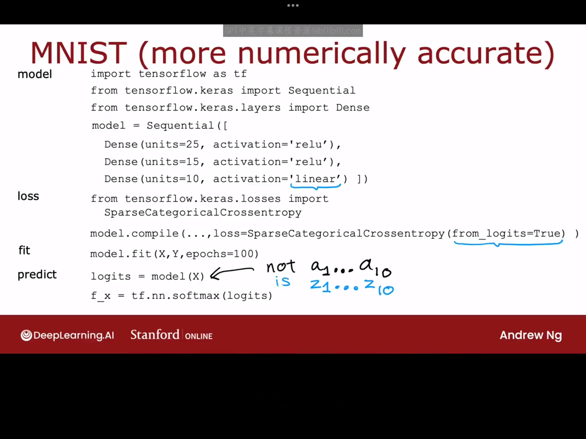

# 9.1 多类别(multiclass)
多类别分类指的是分类问题，其中你可以有超过两个可能的输出标签，而不止是0、1。例如，手写数字识别，之前举的例子只涉及到数字“0,1”的识别，但实际任务中可能涉及到对任意数字的识别。多类别问题仍然是一个分类问题，因为输出Y只能取一部分离散的类别，它不是任意数字。

二分类问题如下左图所示，多分类问题如下右图所示：


# 9.2 softmax
softmax回归算法是逻辑回归的泛化，适用于多分类场景。
逻辑回归与softmax回归算法的对比如下图所示：

下面看一下逻辑回归与softmax回归的逻辑函数的对比：

其中，softmax函数的损失函数又叫做交叉熵函数(Crossentropy loss)。下节课我们会将softmax用于神经网络，构建一个用于多分类任务的神经网络。

# 9.3 带有Softmax输出的神经网络
为了构建一个能处理多分类任务的神经网络，我们可以把softmax回归模型放入神经网络的输出层：

softmax激活函数的输出与其他激活函数(例如ReLU、sigmoid激活函数)的输出有个明显的不同：softmax函数的输出$a_j$是$z_1,z_2,...,z_n$的函数，而sigmoid、ReLU函数的输出$a_i$只是$z_i$的函数。
现在，让我们看一下如何在tensorflow中实现以上神经网络:
```python
import tensorflow as tf
from tensorflow.keras import Sequential
from tensorflow.keras import Dense
#注意：上面这两行代码不能写成：from tf.keras import...，因
#为from后面不能用别名。其实还有一种写法，那就是把第二行第三行
#删掉，后面需要用到Sequential,Dense函数时直接
#写tf.keras.Sequential和tf.keras.Dense。
model=Sequential([
    Dense(units=25,activation='relu'),
    Dense(units=15,activation='relu'),
    Dense(units=10,activation='softmax')
])

from tf.keras.loss import SparsecategoricalCrossentropy
model.compile(loss=SparseCategoricalCrossentropy())

model.fit(X,Y,epochs=100)

```
***但是实际应用中我们往往并不使用上面这段代码，后面的课程中我们会介绍一个更有效的代码***

>
>补充：**上述代码中出现的稀疏分类交叉熵（Sparse Categorical Crossentropy）** 是一种深度学习中专门针对多分类任务的损失函数，适用于标签以**整数形式**（而非one-hot编码）表示的情况。其主要特点是在计算预测概率分布与实际标签之间的交叉熵损失时，能够自动将整数类标（如[1, 0, 2]）隐式转换为one-hot向量（如[ [0,1,0], [1,0,0], [0,0,1] ]），从而大幅减少内存占用并简化数据预处理流程。相比常规分类交叉熵，它更高效地支持直接处理原始整数标签数据，尤其适用于类别数量庞大（如自然语言处理中的词表）或标签维度高的场景，最终通过惩罚模型对正确类别的低置信度预测来驱动分类准确率的优化。
想了解更多有关深度学习中的交叉熵的内容请点击链接：<https://blog.csdn.net/lly1122334/article/details/118934108>

# 9.4 softmax的改进实现
我们先来看一下在计算机中计算相同数量的两种不同方法：
选项一：直接计算$x=\frac{2}{10000}$
选项二：计算式子$x=(1+\frac{1}{10000})-(1-\frac{1}{10000})$
两种计算方法的计算结果如下图所示：

我们可以看到，第二种计算方法存在一定的写入误差，这是因为计算机只有有限的内存来存储每个数字，在这种情况下称为浮点数。根据计算2除以10000的方法不同，结果可能会有或多或少的数值舍入误差。事实证明，尽管我们一直用来计算Softmax损失函数的方法是正确的，但有一种不同的公式化方法减少这种数值舍入误差，从而在Tensorflow中实现更准确的计算，这里先用逻辑回归更详细地解释这一点，然后我们将展示这些想法如何用于改进我们的Softmax实现。
对于逻辑回归，有：
$$
a=g(z)=\frac{1}{1+e^{-z}}
\\
loss=-ylog(a)-(1-y)log(1-a)
$$
上面这种计算方法是先显式计算出a的值，然后代入损失函数，再求得损失值。
但一种更精确的计算方法是：
$$
loss=-ylog(\frac{1}{1+e^{-z}})-(1-y)log(1-\frac{1}{1+e^{-z}})
$$
反映到代码中的变化为：

```python
# 原来的代码：
model=Sequential([
    Dense(units=25,activation='relu'),
    Dense(units=15,activation='relu'),
    Dense(units=1,activation'sigmoid')
])
model.compile(loss=BinaryCrossEntropy())

# 改进后的代码：
model=Sequential([
    Dense(units=25,activation='relu'),
    Dense(units=15,activation='relu'),
    Dense(units=1,activation='linear') #将sigmoid改成linear
])
model.compile(loss=BinaryCrossentropy(from_logits=True))
```
>补充：上述代码中'from_logits=True'的作用（内容来源于Gemini）：
`from_logits=True` 在 `tf.keras.losses.BinaryCrossentropy` (或 `tf.keras.losses.CategoricalCrossentropy`, `tf.keras.losses.SparseCategoricalCrossentropy` 等其他交叉熵损失函数) 中是一个非常重要的参数。它的作用是告诉损失函数，**模型输出的是未经激活函数处理的原始预测值（即 logits），而不是经过 Sigmoid（或 Softmax）激活后的概率值。**
>
>-----
>
>### 为什么需要 `from_logits=True`？
>
>在二分类问题中，我们通常会使用 Sigmoid 激活函数将模型的输出转换为 0 到 1 之间的概率值。例如，一个典型的二分类模型最后一层可能是：
>
>```python
>tf.keras.layers.Dense(1, activation='sigmoid')
>```
>
>此时，模型的输出直接就是预测的概率。如果你直接将这个输出传递给 `BinaryCrossentropy` 损失函数，那么 `from_logits` 应该保持其默认值 `False`。
>
>然而，在许多情况下，为了数值稳定性等原因，**我们更倾向于让模型最后一层不带激活函数，直接输出原始的 logits 值**。例如：
>
>```python
>tf.keras.layers.Dense(1) # 没有激活函数
>```
>
>在这种情况下，模型的输出是一个范围为负无穷到正无穷的实数，而不是 0 到 1 之间的概率。如果此时你仍然使用 `from_logits=False`，损失函数会错误地将这些原始 logits 值当作概率值来计算损失，导致计算结果不正确，甚至出现 NaN (非数字) 值。
>
>-----
>
>### `from_logits=True` 如何工作？
>
>当你设置 `from_logits=True` 时，`BinaryCrossentropy` 损失函数会在内部对模型的输出（即 logits）应用 Sigmoid 激活函数，将其转换为概率，然后再与真实的标签进行交叉熵计算。
>
>这等效于：
>
>$$\text{Loss} = -\frac{1}{N} \sum_{i=1}^{N} [y_i \log(\sigma(x_i)) + (1 - y_i) \log(1 - \sigma(x_i))]$$
>
>其中：
>
>  * $x\_i$ 是模型的原始输出（logit）。
>  * $\\sigma$ 是 Sigmoid 激活函数。
>  * $y\_i$ 是真实标签。
>
>**这样做的好处是：**
>
>1.  **数值稳定性：** 直接在损失函数内部进行 Sigmoid 运算和交叉熵计算，可以采用更稳定的数值计算方法，避免在 Sigmoid 函数接近 0 或 1 时可能出现的梯度消失或数值溢出问题。例如，`tf.nn.sigmoid_cross_entropy_with_logits` 就是一个在 TensorFlow 内部实现这种优化计算的函数。
>2.  **避免重复激活：** 如果模型最后一层已经有了 Sigmoid 激活，并且损失函数也对输入进行了 Sigmoid 激活（当 `from_logits=False` 时），就会导致重复激活，这不仅是多余的，也可能影响模型的性能。
>3.  **简化模型设计：** 可以将激活函数（Sigmoid/Softmax）的责任交给损失函数，使得模型结构更简洁。
>
>-----
>
>### 总结
>
>`model.compile(loss=BinaryCrossentropy(from_logits=True))` 表示你的模型最后一层**没有**使用 Sigmoid 激活函数，而是直接输出了原始的 logits 值。损失函数会在内部自动对这些 logits 进行 Sigmoid 变换，然后计算二元交叉熵损失，从而保证了数值稳定性和计算的正确性。
>
>简而言之：
>
>  * **如果你的模型输出的是原始 logits（没有 Sigmoid/Softmax）：** 使用 `from_logits=True`
>  * **如果你的模型输出的是经过 Sigmoid/Softmax 激活后的概率：** 使用 `from_logits=False` (默认值)

本节课目前介绍的代码的一个缺点是它稍微变得不那么易读，但是它却可以减少tensorflow中的数值舍入误差。实际上，在只涉及到逻辑回归的任务中，这两种代码实现都可以正常地工作。但是一旦涉及到softmax回归，数值舍入误差就会变得非常糟糕，所以我们十分有必要将这一改进方法应用于softmax回归，具体改进方法如下：


本节课到这里就介绍完了如何在保证数值稳定性的前提下完成多分类任务。

# 9.5 多输出分类（classfication with multiple outputs）（可选） 
目前为止已经学习了多类分类，其中输出标签可以Y可以是两个或者更多可能类别中的任何一个，还有一个不同类型的分类问题，称为多标签分类问题，即与每个图像相关联的可以有多个标签，下面举个例子来说明：
如果你正在构建自动驾驶汽车或者可能是驾驶辅助系统，那么在给定汽车前方照片时，你可能想问一个问题：图片中是否有小汽车？是否有公交车？是否有行人？我们可以对该问题做如下建模（对于该问题的输出，结果可以建模为如图中所示的三个向量）：

更一般地，我们应如何构建一个用于多标签分类的神经网络呢，我们仍然以上图所举的例子为例。
法一：将其看成三个完全独立的机器学习问题，独立判断照片里是否有小汽车、公交车、行人等。
法二：设计如下图中下边所示的神经网络来一次性完成所有判断（输出层统一选择sigmoid激活函数）：

**注意：不要把多类分类与多标签分类弄混淆**
