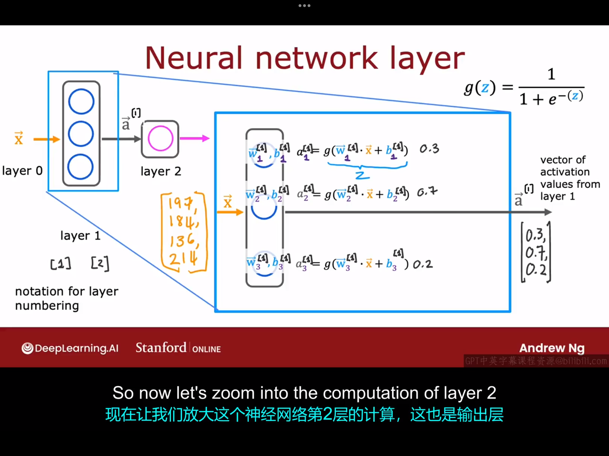
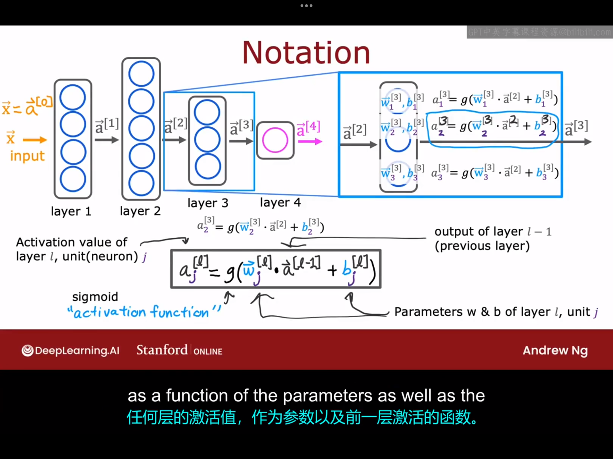
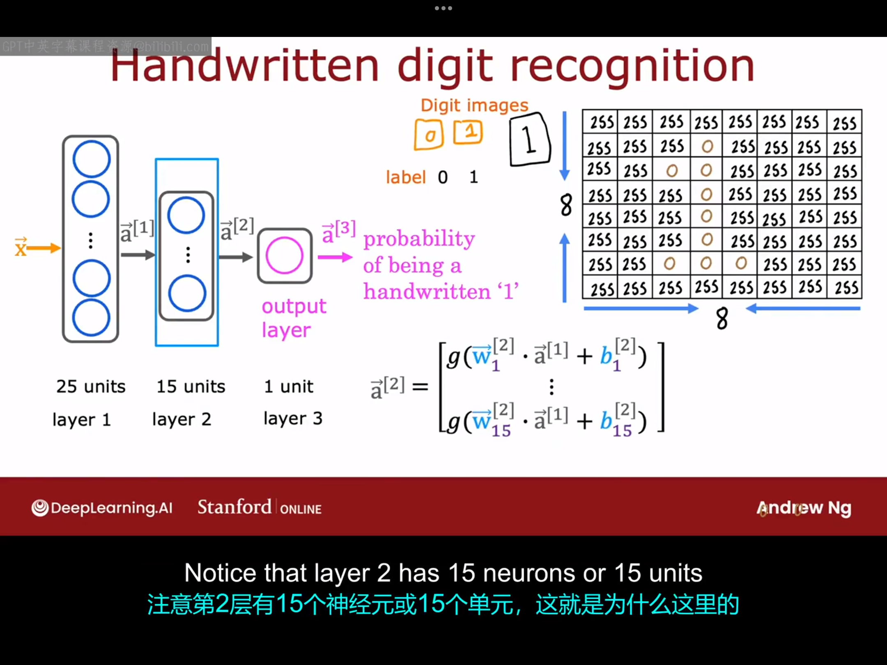

# 2.1 神经网络层 （neural network layer）
一个神经网络是由一层一层的人工神经元构成的，本节课将向你展示每层神经元具体是如何工作的。假设这里有一个神经网络如下图所示，我们先重点关注一下该神经网络的隐藏层具体是如何工作的：

这里仍以"预测一件衣服是否会成为爆款"为例，该例中神经网络的输入是一个$4 \times 1$的向量$\vec{x}$，然后该向量会被输入到下层那个含有三个神经元的隐藏层，隐藏层中的每个神经元实际上就是一个以$\vec{x}$为输入的小型逻辑回归单元。分析隐藏层中的第一个神经元：该神经元包含两个参数——$w_1,b_1$(这里的下标表明它们是第一个神经元的中的参数)，它的作用是输出一个激活值$a_1^{[1]}$（这里的上标表示a属于第一隐藏层）,在此例中，$a_1^{[1]}=g(\vec{w}_1^{[1]} \cdot \vec{x}+b_1^{[1]})=\frac{1}{1+e^{-(\vec{w}_1^{[1]} \cdot \vec{x}+b_1^{[1]})}}$。第二、三个神经元的分析过程与第一个同理。隐藏层的输出是一个$3 \times 1$的向量，记为$\vec{a}^{[1]}$，该向量会被输入输出神经元，输出神经元再经过一次逻辑回归运算可得最终输出结果，即$a^{[2]}=g(\vec{w}_1^{[2]} \cdot \vec{a}^{[1]}+b_1^{[2]})$,在得到$a^{[2]}$的值后，还有可选择执行的最后一步：选定一个阈值（比如0.5），若$a^{[2]}>0.5$，则预测$\hat{y}=1$,该商品会畅销，反之不会畅销。如果最后一步不执行，那么直接最终得到结果$a^{[2]}$就是该商品会成为畅销品的概率。

以上就是神经网络的工作原理，即每一层输入一个数字向量并应用一堆逻辑回归单元然后经过计算得到另一个数字向量，就这样层层传递下去，直到得到你最终输出层的结果，这就是神经网络做出的预测（当然，你也可以选取一个阈值与输出结果做比较，得到预测的$\hat{y}$）。

# 2.2 更复杂的神经网络

本节课我们来学习一下具有多个隐藏层的更复杂的神经网络，它与单层神经网络的原理基本相同，如下图所示：

这里强调一下图中的几个基本概念:
1.输入向量又称为神经网络的第0层，用$\vec{a}^{[0]}$表示。
2.第L层第j个神经元对应的激活值的通式：
$$
a_j^{[L]}=g(\vec{w}_j^{[L]} \cdot \vec{a}^{[L-1]}+b_j^{[L]})
$$
在神经网络的上下文中，函数g还有另外一个名字——激活函数（activition function）,到目前为止，你看到的唯一激活函数是sigmoid函数。但下周，我们将看看合适将其他函数插入到g函数的位置，而不是sigmoid函数。

# 2.3 推理：预测（向前传播）

本节课我们会将前面所学知识结合起来，构建一个算法，让您的神经网络进行推理或预测，这是一个被称为前向传播的算法，下面就让我们一起来看一下。

这里我们将借用一个手写数字识别的例子来加以说明，为了简单起见，假设我们只需要区分数字“0”和“1”。假设输入的图片是由$8 \times 8$个像素组成的图片，其在计算机中的表示就是一个$8 \times 8$的表格，如下图所示：
图中255表示明亮的白色像素，0表示黑色像素，不同的数字表示黑白色之间的不同灰度。给定这64个输入特征后，我们将使用一个具有两个隐藏层的神经网络，第一个隐藏层具有25个神经元，第二个隐藏层具有15个神经元，最后的输出层输出这是0还是1的概率。

该神经网络的输入是一个$64 \times 1$的向量$\vec{x}$，第一个隐藏层以$\vec{x}$为输入，输出$\vec{a}^{[1]}$，第二个隐藏层以$\vec{a}^{[1]}$为输入，输出$\vec{a}^{[2]}$，输出层以$\vec{a}^{[2]}$为输入，输出结果$\vec{a}^{[3]}$(输出层只有一个神经元，故输出结果是标量)是一个概率。最后你也可以选择0.5作为阈值，以得出二分类标签（该数字是不是1，答案为“是”or“否”），如果$a^{[3]}>0.5$,则可预测$\hat{y}=1$，得到结果:该手写数字是1，否则则得到结果：该手写数字不是1。顺便说一下，本例中所有神经元的激活函数都是sigmoid函数。

该神经网络的计算是从左到右进行的，故这个算法也称为前向传播算法。若仔细观察该神经网络你会发现，隐藏层中位置靠前的层的神经元数量较多，越接近输出层的隐藏层包含的神经元的数量越少，这也是在选择神经网络架构时的一个相当典型的选择，你以后会看到更多这样的例子。