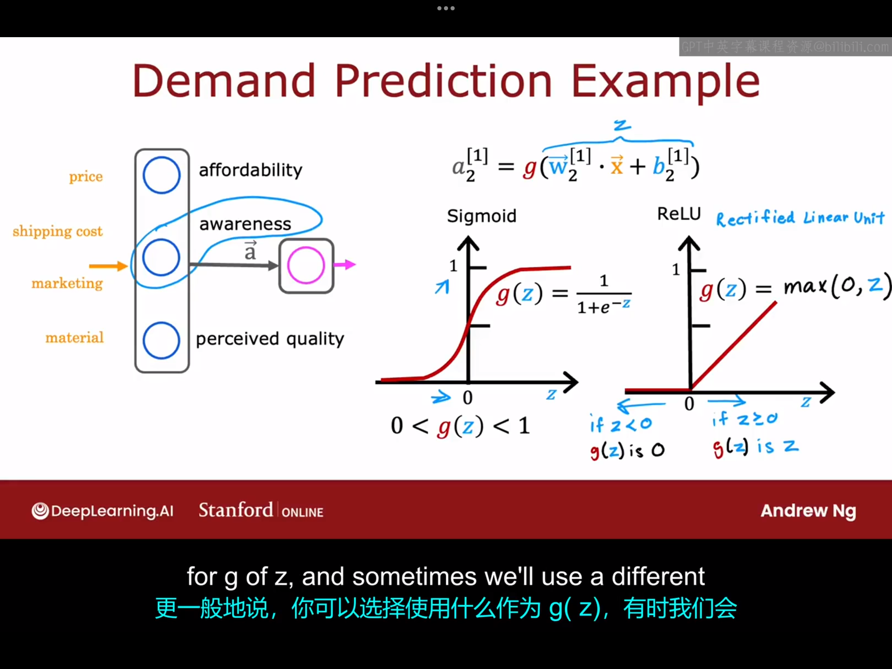
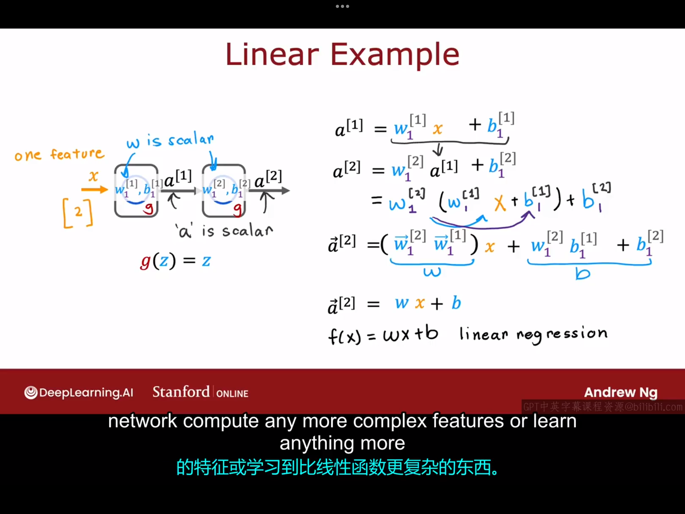
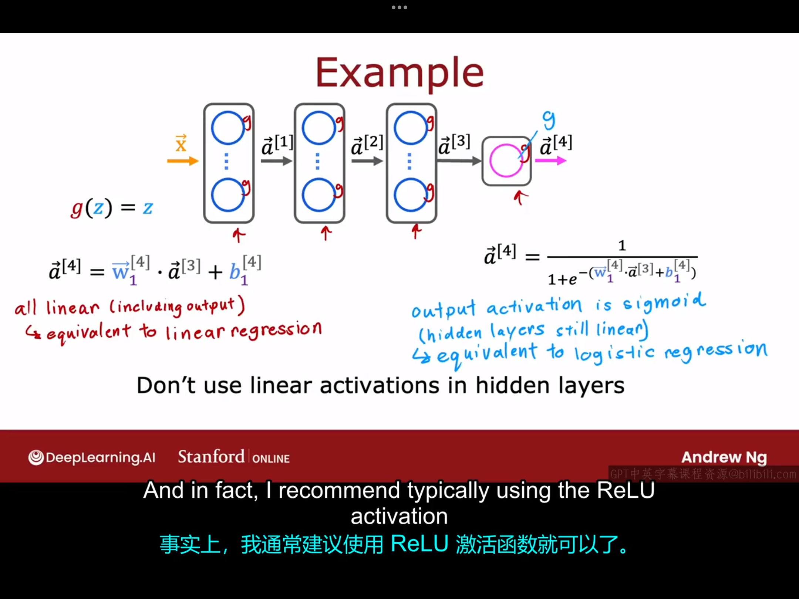

# 8.1 激活函数sigmoid的替换
到目前为止，我们在所有节点、隐藏层、输出层中使用的激活函数一直都是sigmoid激活函数，这是因为我们目前卫视总是将神经网络中的每个神经元都看成了一个小型逻辑回归单元。事实证明，在不同的场景下，合理选择不同的激活函数，可以让你的神经网络更加强大。

我们继续以之前的需求预测为例：

在前面的课程中，我们假设了客户对于这件商品的认知度也是二元的，即认知度的取值也只有"0"和"1"。但实际情况往往并不是这样，人们对一件商品的认知可以划分为很多等级：毫无了解、了解一点、了解较多、非常了解等。与其将认知度建模为只能取0或1，不如将其建模为可以取任意的非负实数。我们在之前的课上根据二元建模选取sigmoid为激活函数，但根据刚才的讨论，现在的认知度可以取为一个0到无穷大之间的正数，在这种情况下，神经网络中的激活函数通常选取为ReLU（线性修正单元，rectified linear unit）函数，该函数的数学表达式为：
$$
g(z)=max(0,z)
$$
其函数图像为上图最右边的小图所示。如果一个神经元中的激活函数为ReLU函数，那么该神经元的激活值为$a=g(\vec{w} \cdot \vec{x}+b)=max(0,\vec{w} \cdot \vec{x}+b)$
下图中给出了神经网络中较常用的激活函数：

第一个是线性激活函数，$g(z)=z$，有时我们使用线性激活函数，人们会说我们没有使用任何激活函数，因为$a=g(z)=\vec{w} \cdot \vec{x}+b$,有了这些神经网络，你就可以构建更加强大的神经网络。

# 8.2 选择激活函数（activation functions）
本节课我们将介绍如何为神经网络中的每个神经元选取合适的激活函数。我们将从输出层介绍起，然后再介绍隐藏层，事实证明，根据目标标签或真实标签Y的不同，输出层的激活函数会有一个相当自然的选择。

1.首先来看输出层：
- 如果你处理的是一个二分类问题，那么，sigmoid函数几乎总是最自然的选择。
- 如果你处理的是一个回归问题，且输出有正有负，那么你可以选择线性激活函数。（例如预测股票的涨跌）
- 如果你处理的是一个回归问题，且输出是非负的，那么你可以选择ReUL函数式作为激活函数。（例如预测房价）

2.下面来看隐藏层：
事实证明，ReLU激活函数是目前许多从业者在训练神经网络时最常见的选择。更多地选择ReLU函数而不是sigmoid函数的原因是——事实证明，选用ReLU函数作为激活函数时代码运行更快。代码运行更快的具体原因如下（）：
1.使用ReLU函数比sigmoid函数计算量更小，ReLU函数只需要计算max(0,z),而sigmoid函数却包括了指数运算和求负一次方的运算。
2.对于ReLU函数，函数只在$x<0$的区间函数是平坦的，而对于sigmoid函数来说，函数在$|x|$足够大时都是平坦的，而代价函数里面就会包括激活函数，激活函数平坦的部分也会导致代价函数平坦，在这些地方，梯度下降的速度较慢。

此外，你在其他地方可能还会看到其他激活函数，比如tanh激活函数，leaky ReLU激活函数等，每隔几年，研究人员可能就会提出一种新型的激活函数，但其实本课程介绍的三个激活函数已经足够你在大部分情况下使用了。

# 8.3 我们为什么需要激活函数

本节课我们将介绍一下为什么我们需要激活函数，为什么隐藏层的所有神经元如果同时使用线性逻辑函数会导致神经网络的失效？

下图举了一个简单的例子：

如图中所示，如果一个神经网络中隐藏层的所有神经元的激活函数和输出层的所有神经元的激活函数都选取为线性激活函数，那么这一整个神经网络模型就和线性回归模型无异。可以证明，对于如下图所示的复杂的神经网络来说，如果隐藏层内所有的激活函数都被选为线性激活函数，那么：
- 如果输出层的激活函数是线性激活函数，那么此神经网络与普通的线性回归模型无异
- 如果输出层的激活函数是sigmoid函数，那么此神经网络模型与普通的逻辑回归模型无异。

以上内容就解释了我们为什么不能只用线性激活函数，实际上，对于大部分的神经网络，使用ReLU激活函数就可以了。