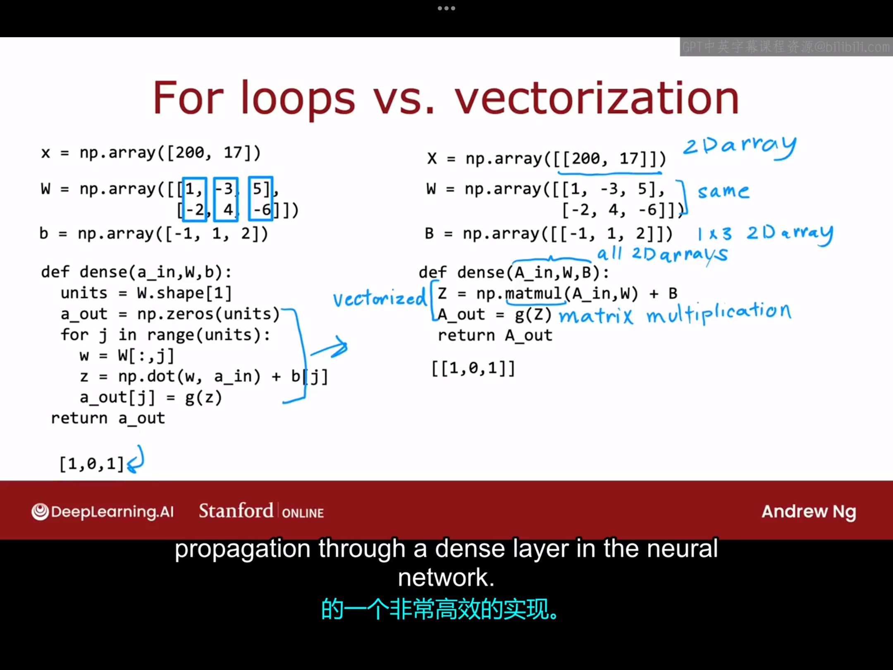
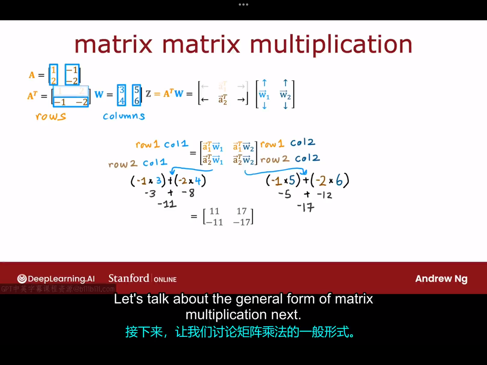
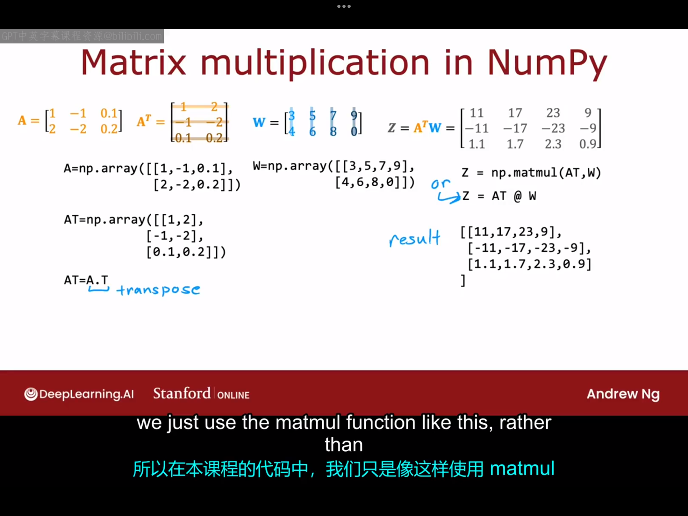
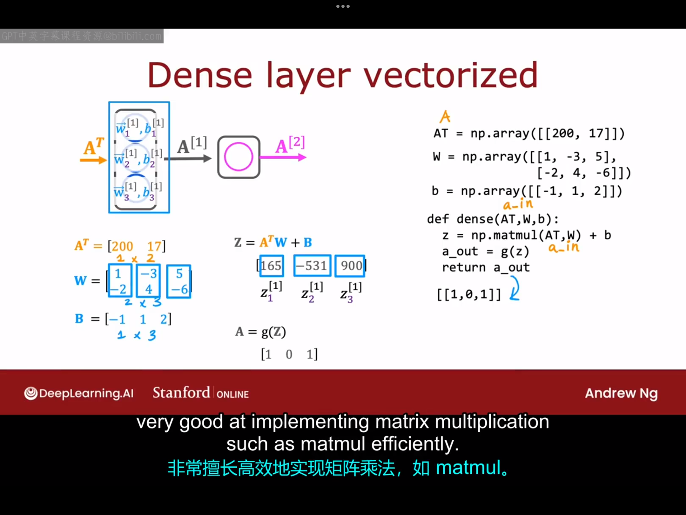

# 6.1 神经网络如何高效实现
将前面神经网络前向传播代码中的for循环向量化，显著提升代码运行速度，以下是向量化的具体实现：


# 6.2 矩阵乘法

# 6.3 矩阵乘法规则
略
# 6.4 矩阵乘法代码
调用numpy库的矩阵乘法的代码实现：

一个具体的神经网络的向量化代码的实现（各数据如下图所示）：

```python
import numpy as np
AT=np.array([[200,17]])
W=np.array([
    [1,-3,5],
    [2,4,-6],
    ])
b=np.array([[-1,1,2]])
def dense(AT,W,b):
    Z=np.matmul(AT,W)+b
    A_out=1/(1+np.exp(-Z))
    return A_out

print(dense(AT,W,b)) #[[1.00000000e+000 2.45261912e-231 1.00000000e+000]]
```
