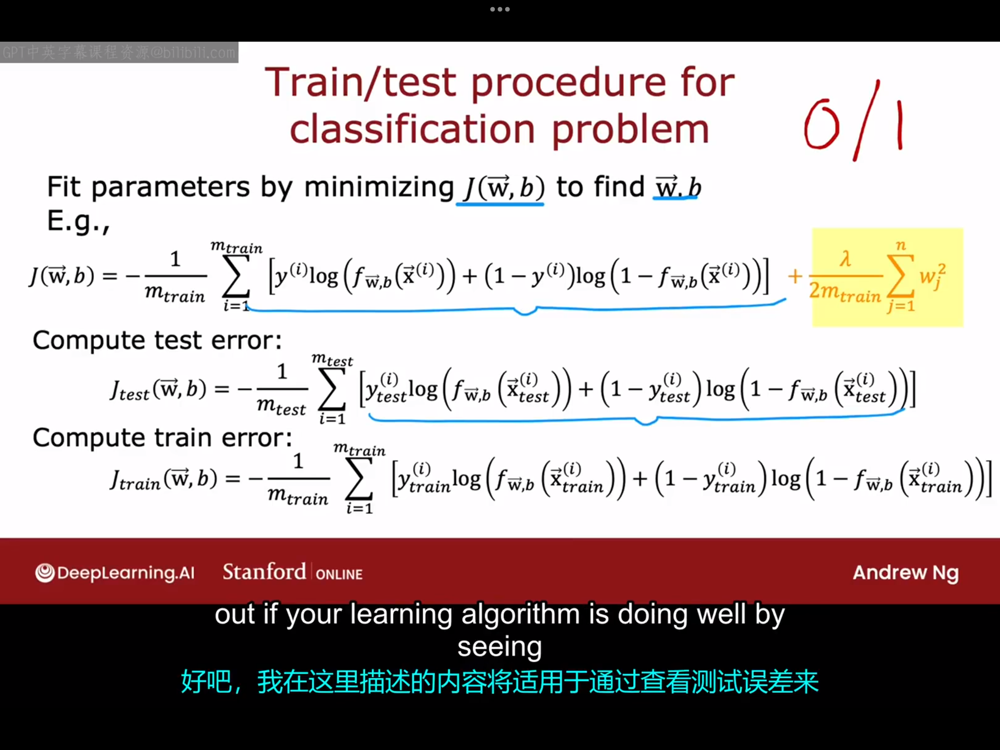

# 11.2 决定下一步尝试什么
目前为止，我们已经学习了很多机器学习算法，比如线性回归、逻辑回归、神经网络，下一周我们将学习决策树模型。所以你现在已经掌握了一些机器学习工具，那我们应该如何高效利用这些工具呢，下面将给出一些关于如何构建机器学习系统的建议。本周我们将花很多时间讨论你可以使用的不同诊断方法，以指导你如何改进算法的性能，但首先，让我们先看看如何评估你的学习算法性能。

# 11.2 模型评估
本节课我们将学习如何评估一个模型。我们继续以房价预测为例：

我们之前为了预测房价曾经建立过一个四次函数模型，该模型虽能很好地拟合训练集，但实际上它非常缺乏泛化能力，所以我们不得不考虑额外选择其他特征。但目前有个问题是：如果只选用多项式特征，那么价格-特征的函数图很好画，很容易通过图像直观判断模型的拟合效果。但如果选择一些其他额外的特征（比如图中列出的四个特征），我们绘制$f(\vec{x})$的图像会变的困难，我们需要一些更系统的方法来评估模型的表现。

这里我们先介绍一种评估模型的方法：假设某任务的数据集中包含十组数据，我们可以选择前七组（数据量的70%或80%均可）作为训练集（training set），后三组（数据量的30%或者20%）作为验证集（test set）。假如该任务中我们建立的是一个线性回归模型，用于训练模型的、包括正则化项的代价函数为：
$$
J(\vec{w},b)=\frac{1}{2m_{train}} \sum_{i=1}^{m_{train}}(f(\vec{x}^{(i)})-y^{(i)})^2+\frac{1}{2m_{train}} \sum_{j=1}^{n}w_j^2
$$
在用训练集中的数据训练好模型后，我们可以通过下面两个式子来计算该模型在训练集和验证集上的误差分别是多少：
$$
J_{test}(\vec{w},b)=\frac{1}{2m_{test}} \sum_{i=1}^{m_{test}}(f(\vec{x}^{(i)})-y^{(i)})^2
\\
J_{train}(\vec{w},b)=\frac{1}{2m_{train}} \sum_{i=1}^{m_{train}}(f(\vec{x}^{(i)})-y^{(i)})^2
$$
***注：这两个式子都不必包括正则化项。***
上面我们举的例子是以线性回归为背景的，但实际上，上述方法也同样适用于逻辑回归问题，具体细节如下图所示：

在计算完训练误差与测试误差后，我们就可以根据这两个数据来评估你的模型是否表示良好。
但实际上，在将机器学习应用于分类问题时，实际上还有一种更常用的j测试和j训练集的定义，即不使用逻辑损失函数来计算测试误差和训练误差，而是测量算法误分类的测试集和训练集的比例。具体细节如下图所示：

综上，将数据集分为训练集和单独的测试集，为你提供了一种系统评估学习算法效果的方法。

# 11.3 模型选择与训练，训练/交叉验证/测试集
在上一个视频中，您了解了如何使用测试集来评估模型的性能。在本视频中，我们将对这个概念进行进一步的细化，使您能够使用一种技术来自动选择适合您的机器学习任务的好模型。

对于一个机器学习任务，你可能会尝试选择不同次数的多项式模型，如上图所示。拟合不同的模型进而得到不同的参数，然后求得在测试集上的损失值。我们可以依次尝试d=1、d=2直到d等于某个数（例如d=10）并计算出在不同d下的测试集上的损失，然后选择最小损失对应的模型作为最佳的模型。

但实际上，上述方法是有一定的缺陷的。我们经过上述方法选择出来的模型在测试集上的损失值可能是真实的泛化损失值的乐观估计（意味着测试集上的损失小于泛化数据上的损失）。因为在该方法中，我们实际上引入了一个新的参数：d，d的取值是由训练集确定的，所以该模型在泛化数据上对应的实际损失值可能比在测试集上的损失值会更大一些。

我们可以采用如下改进方法：
不再将数据分成两个子集，而将数据分为三个子集，分别是：训练集、交叉验证集（cross validation set，又称验证集、开发集）、测试集：

将数据集分为这三个子集后，我们可以分别计算出模型在三个自己上的损失值（不包括正则化项），然后用这三个值去评估你的学习算法，进而选择最合适的那个。例如，你仍然可以选择十个模型，然后用训练集确定参数，再在交叉验证集上计算出代价函数的值，然后选择在交叉函数集上的代价函数值最小的那个模型作为最佳模型。最后，如果你想一般性地给出该模型泛化代价的估计值，你可以用该模型在测试集上的代价函数来代替。

以上模型选择过程也适用于选择其他类型的模型，例如:选择神经网络架构。比如你在某次分类任务中设计了如下三种神经网络：

你任然可以通过训练集确定参数，然后检测不同神经网络在交叉验证集的表现（由于是分类任务，这里一般使用错误分类的比例来评估性能），最后将模型应用于验证集以评估其泛化能力。

