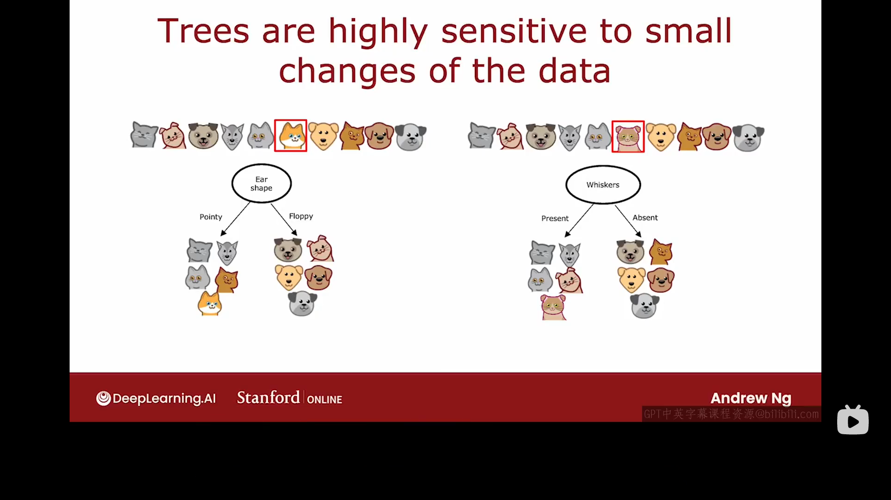
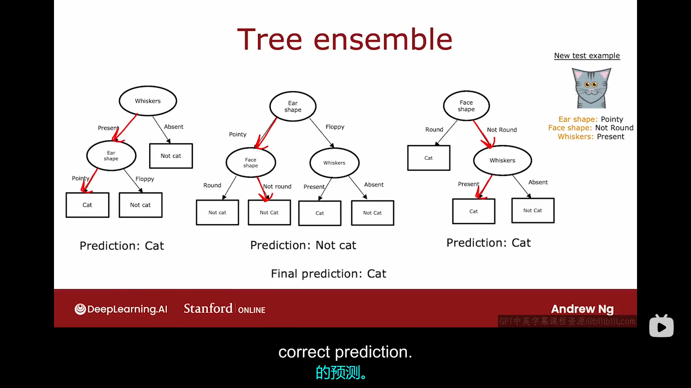
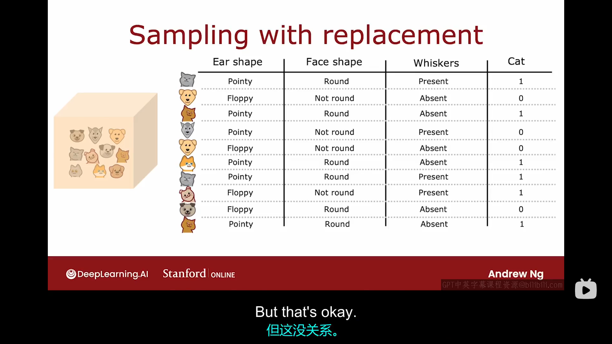
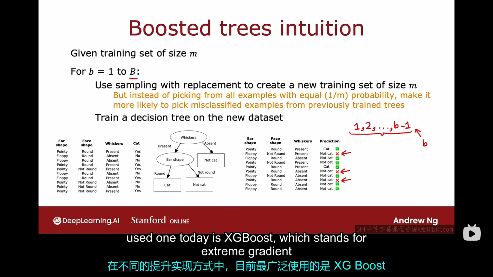
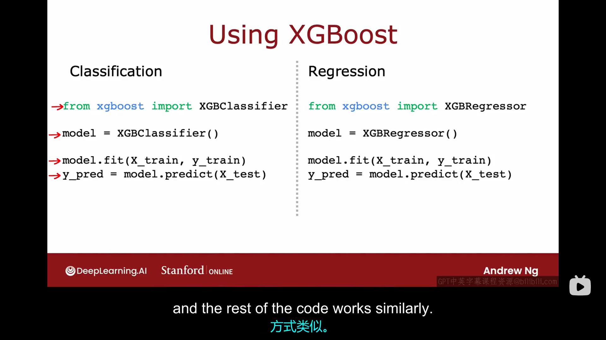

# 17.1 使用多个决策树
使用单一决策树的一个弱点是，决策树对数据的微小变化非常敏感。解决这一问题的一个方法是构建不止一棵决策树，而是构建许多决策树，我们称之为树集成。
我们举一个例子来说明这件事，按照之前的数据集，我们在根节点处选择的特征都是"Ear shape"，假设现在数据集中有一个数据发生了变化，有一只动物从尖耳、圆脸、无胡须变成了垂耳、圆脸、有胡须。仅仅改变一个样本特征，根节点处信息增益最大的分割特征就从"Ear shape"变成了"Whiskers"，结果就导致了你在左右分支得到的子集完全不同。所以仅改变一个样本就导致了算法在根节点处产生了不同的分割方式，进而导致了完全不同的决策树模型，这说明你的算法不够鲁棒。

这也就意味着，如果你每次训练的不是单一的决策树，而是一整批不同的决策树（这就是我们所说的树集成），那你每次的预测可能会更加准确。
下面给出了树集成(tree ensemble)的示意图，它是多个树的集合：

如果你现在有上图中示意的那个由三个数组成的树集成,还有一个如上图中右侧所示的新样本。如果你把这个新样本分别输入这三个树，那么这三个树将依次给出"Cat"，"Not cat"，"Cat"的预测，由于做出"Cat"的预测比"Not cat"的多，故我们可以给出最终预测:"Cat"。
使用树集成就是让所有树对预测结果进行投票，它增加了预测结果的鲁棒性。

# 17.2 有放回抽样（Sampling with replacement）
构建树集成需要一种被称为有放回抽样的技术，关于有放回抽样技术的基本知识我们已经很熟悉了，此处不再赘述。
现在我们一起来看看如何将有放回抽样应用于构建树集成。假设现在有十个动物样本被放在一个黑箱中。我们每次从黑箱中有放回地抽取一个小动物并记录下它的特征,共抽取十次，并将数据记录成表格，某十次抽取后记录的表格可能如下图所示：

图中的十个样本组成了一个新的训练集，并且这个训练集中很可能包含多个完全相同的样本，但这完全没关系。
有放回抽样能让你构建一个全新的训练集，它有点类似但又不同于你的原始训练集。事实证明，这将是构建树集成的关键模块。
# 17.3 随机森林算法
本节课我们将介绍随机森林算法，它是一种非常强大的树集成算法，其效果远优于单一决策树。
假设你想要构建一个包含B棵决策树的树集成，你的训练集中有m个数据，那么你的可以每次有放回地随机抽样m次组成一个包含m个训练样本的训练集，然后使用该训练集构建一个决策树，重复该步骤B次，你就可以得到一个包含B个决策树的树集成了。事实证明，将B设置得更大永远不会损害性能，但是当B超过某一阈值后，你获得的收益会越来越小，实际使用中，将B设置为64-128之间的任何一个数即可。以上算法被称为袋装决策树算法，这个算法有一个修改版本，修改后的算法叫做随机森林法，其效果会更好。

以上的袋装决策树算法存在一个明显的问题是，即使你使用了有放回的抽样方法，有些时候不同决策树根节点及根节点附近的节点的分割特征可能仍然是相同的。随机森林算法对此做出的改进是：随机森林算法尝试在每一个节点上随机化特征选择，这可以使你的决策树变得更加地不同，从而给出更准确的预测。

随机森林算法的一个特点是，如果你在为每个节点选择分割特征时，共有N个特征可用，（例如，在我们之前举的猫猫分类的例子中，N=3。）随机森林算法告诉我们不必使用所有的N个特征，选择这N个特征的一个随机子集即可（假设子集中的元素为K个）。换句话说，在某节点处，你会选择K个特征作为允许的特征，然后从这K个特征中选择信息增益最高的那个特征作为分割特征。当N很大时，例如N等于几十、几百、上千时，K的一个常见选择是$K=\sqrt{N}$，
# 17.4 XGBoost (extreme gradient boost)
一直以来，机器学习从业者尝试了多种方法来构建决策树和决策树集成，到目前为止，最常用的方法就是XGBoost。它运行速度快，开源实现易于使用，在许多机器学习应用和竞赛中取得了巨大的成功，下面我们来看看它是如何实现的。

上图是构建袋装决策树森林算法的步骤，该算法要求我们每次从m个样本中随机有放回地抽取m次，将抽取出的样本看成一个新的训练集，并在这个新训练集的基础上训练一个决策树，然后重复上述步骤B次。而XGboost算法对此步骤做出的改进是：除了第一次抽取时抽中每个样本是等概率的，第二次及其之后的每次抽取抽中每个样本的概率不再相等，哪些在之前的决策树中被误分类的样本被抽中的概率更大一些。这类似于训练与教育领域的“刻意练习”这一概念。在XGBoost算法中，我们将查看所有我们之前已经训练好的决策树，看看我们仍然没有做好的地方。然后在构建下一颗决策树时，我们将更多地关注我们还没有做好的样本。事实证明，这将给你的算法性能带来不小的提升。特别地，当你在构建第B棵决策树时，你更应关注在第1棵、第2棵、......第B-1棵决策树上表现不太好的样本。具体增加某些样本被抽中的概率所涉及到的数学细节是十分复杂的，但你没必要为此而担心。在不同的提升实现方式中,目前最广泛使用的是XGBosst。此外，XGBoost还提供了良好的默认分割标准和停止分割的标准。而且XGBoost还内置了正则化来防止过拟合。实际上，XGBoost给不同的训练样本分配了不同的权重，因此它无需生成大量随机选择的训练集，这使得它比有放回抽样更加高效。XGboost的具体实现方式十分复杂，故大多数机器学习从业者会选择使用开源的XGBoost库。
你可以通过下图中的方式来使用XGBoost库：

左图对应于使用决策树模型实现分类任务，右图对应于使用决策树模型实现回归任务。
# 17.5 什么时候使用决策树模型
决策树，包括树集成，以及神经网络都是功能十分强大的学习算法。在不同的场景下，这几种方法我们应该如何选择呢？
- 决策树和树集成通常在表格数据（有时也被称为结构化数据上）表现良好，例如，在房价预测例子中，我们可以将房屋的特征和对应的价格绘制成表格，然后用决策树模型来处理。
- 不建议在非结构化数据上使用决策树和树集成（例如视频、音频、文本等），你不太可能以电子表格的方式存储它们。正如我们稍后即将看到的，神经网络往往在非结构化数据上表现良好。
- 决策树和树集成的一个很大的优点就是它们的训练速度非常快。
- 最小决策树时人类可以理解的。例如，如果你正在训练一个单一的决策树，以及该决策树只有几十个节点，你完全可以打印出决策树，以理解它是如何做出决策的。
- 树集成的一个小缺点是它比单一决策树更贵，当你预算非常非常有限时，你可以选择单一决策树，但除此之外，希望你更多地使用树集成。
- 与决策树和树集成相比，神经网络在任何数据（包括结构化数据、非结构化数据，甚至是结构化和非结构化数据的混合数据）上的表现都很好。
- 但神经网络的训练过程比决策树慢。
- 神经网络的另外一个巨大的优势是它可以使用迁移学习。对于一些只包含少量数据集的应用，迁移学习使得神经网络可以先在大型数据集上进行预训练，这对提升算法性能非常重要。
- 最后，如果你正在构建一个使用多个机器学习模型协同工作的系统，将多个神经网络串联起来并进行训练可能比多个决策树更容易。实际上，如果你将多个神经网络串联起来训练，那么你可以使用梯度下降同时训练它们。但是，对于决策树的训练，你一次只能训练一个决策树。
  
至此，本课程中我们学习的所有算法都是监督学习算法，我们将在第三部分开始介绍无监督学习算法。