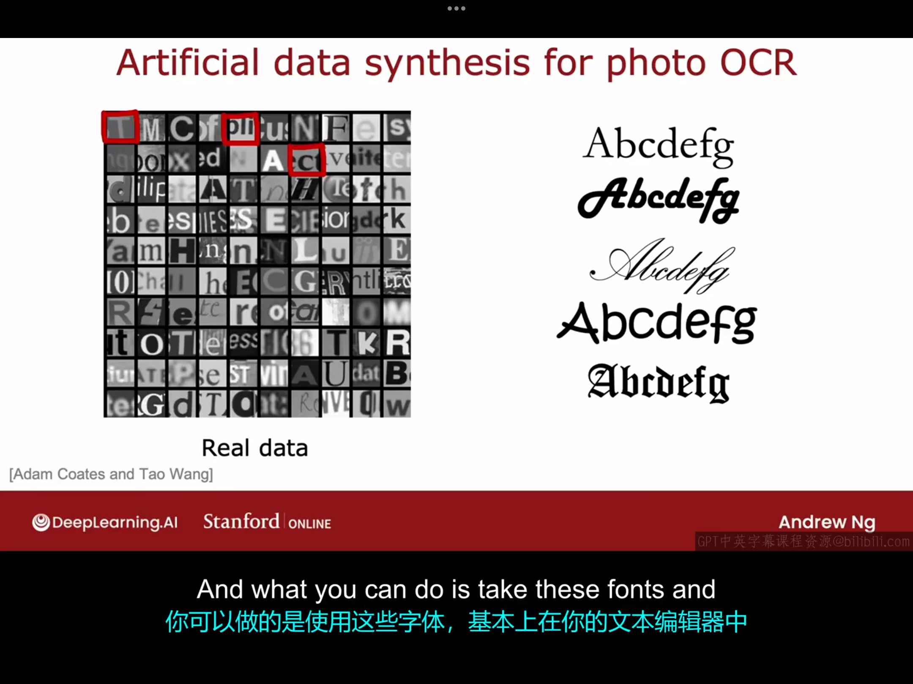
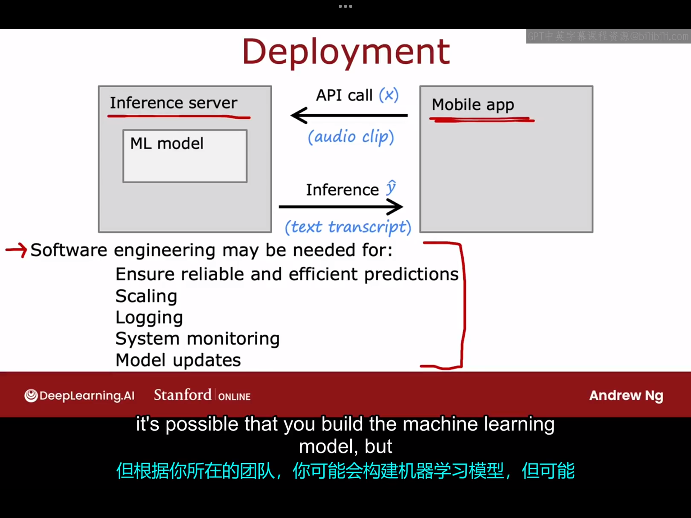

# 13.1 iterative loop of ML development
机器学习系统开发的迭代循环：

一般的机器学习开发过程就是不断按照上图一步步循环调试你的机器学习算法直到它达到令人满意的水平。

# 13.2 错误分析
在帮助你运行诊断、选择下一步尝试的方法以提高学习算法性能方面，我认为偏差、方差可能是最重要的概念，而错误分析可能排在第二位，让我们来看看这意味着什么。

本节课以垃圾邮件分类为例。假设你有$m_{cv}=500$的交叉验证集，而你的算法错误分类了这500个交叉验证样本中的100个。错误分析过程是指手动查看这100个样本，并尝试从中获得算法出错的洞察。具体来说，我们会尝试着将被算法错误分类的样本分成具有共同属性或者特征的几类，并统计每一类中被错误分类的邮件数目，如下图所示：

依据上图中的假设，我们可以注意到第一类和第四类影响最大（被误分类的邮件数很多），而第二类影响很小（被误分类的邮件数很少）。这里有个点值得关注，即上述分类之间并不是互斥的，例如，一个邮件可能既有错误拼写，也有不寻常的路由等。这里我们假设交叉训练集中有500个数据，其中100个被错误分类了。假设交叉验证集中有5000个数据，其中1000个被错误分类了，但你可能没时间手动查看1000个错误分类的邮件，这时你可以从中随机抽取一两百份邮件手动查看。错误分析的目的是通过手动检查一组你的算法错误，为下一步改进算法指明方向。有时，它还可以告诉你哪些错误足够罕见，不值得花费过多久精力去修复。但是，错误分析有一定的局限性。对于人类容易完成的任务（例如垃圾邮件分类），错误分析很容易完成。但对于人类也不容易完成的任务（例如预测每个人在网站上会点击哪个广告），错误分析则不容易实现。

# 13.3 添加数据
本节课以及下面几节课介绍的是一些机器学习中的技巧，这些技巧可能并不是在每个场景下都适用，但由于机器学习的应用场景十分多元（例如，在某些问题中，人类可能更擅长标签；而在另外一些问题中，人类可能更擅长获取数据），掌握不同的技巧可能会在处理不同的问题上帮助到你。

在绝大多数的机器学习任务中，人们都想尽可能地获得更多的数据。但尝试获取所有类型的更多数据可能是费时且费力的。相反，添加更多错误分析(error analysis)可能认为有帮助的数据可能会更加高效。例如，如果你现在有一堆未被标记的邮件（为被标记为垃圾邮件或非垃圾邮件），你可以快速浏览并找到更多药品垃圾邮件的例子，这可能会比尝试添加所有类型的电子邮件数据更能提升你的学习算法的性能。

除了添加全新的训练样本(x,y)外，还有一种广泛用于图像和音频数据的处理技巧，可以显著增加你的训练集大小，这种技术被称为数据增强，我们要做的是利用现有的训练数据来创建新的训练样本。

例如，如果你现在正在构建一个用于A-Z字母识别的机器学习系统，但你现在只有一个字母A的原始数据，那么你可以对该原始图像进行一些处理以获得一些新的训练数据，这些处理手段包括对原图像进行旋转、放大、缩写、调整对比度、镜像反转（这个只适用于近似为轴对称图形的字母）等，如下图所示：

还有一种更高级的数据增强方法，你可以在字母A上放置一个网格，通过引入这个网格的随机扭曲，你可以创建一个更丰富的字母A样本库。这种扭曲样本的过程将一个样本变成了更多的训练样本，你可以将其输入学习算法，帮助它更稳健地学习什么是字母A。

这种数据增强的想法也同样适用于语音识别，例如，你可以在原始的语音样本数据上添加一些嘈杂的背景音（例如拥挤的人群声、汽车噪声）以获取新的训练数据，或者将原始语音经过手机录音后将手机上的录音作为新的训练样本，如下图所示：

数据增强的一个关键是，你对数据所做的更改或扭曲应接近测试集中可能出现的噪音或扭曲类型。相反地，如果在原始数据的基础上做一些无意义的噪音或扭曲，这通常作用不太大。下面这张图中的例子就可以很好地说明这一点：

故数据增强的一个重点就在于你如何修改或扭曲你的原始数据以获得接近测试集中可能出现的数据的新数据。

除了数据增强外，添加数据的另外一种方法是数据合成。数据合成不是修改原始数据获取新数据，而是创建全新的样本。例如，以照片光学字符识别（photo ocr）为例，你应该如何构建一个ocr（光学字符识别）算法来读取如下图所示的文本：

实际上，上图中的文本读取到计算机中可能是这样的：

照片ocr识别的一个关键步骤是能够查看如图中红色方块圈出来的小图像并识别中间的字母。如果你去你计算机大粪文本编辑器，你会发现它有很多不同的字体，如下图右半图所示：

所以为这个任务人工创建数据的一种方法是，使用这些字体，在文本编辑器中输入随机文本，并使用不同的颜色、对比度和非常不同的字体进行截图，你可能会得到如下图中右边所示的合成数据：

因此，通过这种合成数据生成，你可以为你的照片OCR任务生成大量图像或样本。编写代码来生成逼真的合成数据可能需要很多工作，但当你花时间这样做时，它有时可以帮助你为你的应用程序生成大量数据，并极大地提升你的平均性能。合成数据生成最常用于计算机视觉任务，较少用于其他任务，音频任务也不多。

一个完整的机器学习系统由模型和数据集组成，发展新的的机器学习算法和获取更多的数据都可以帮助改善你的机器学习系统的性能。

# 13.4 迁移学习：使用其他任务中的数据
对于数据量不大的应用，迁移学习是一种非常棒的技术，它允许你使用来自不同任务的数据来帮助你，让我们来看看迁移学习具体是如何工作的。

假设你想实现数字0~9的识别任务，但你没有很多这些手写数字的标签数据。假设你找打了一个包含100万张猫、狗、汽车等图片的大型数据集，它包含1000种类别。你可以先在这个大型数据集上训练一个神经网络，以图像x为输入，学习识别这1000个不同的类别。在这个过程中，你最终会学习到神经网络第一层的参数$w^{[1]},b^{[1]}$，第二层的参数$w^{[2]},b^{[2]}$,第三层的参数......要应用迁移学习，你可以复制这个神经网络，保留参数$w^{[1]},b^{[1]},w^{[2]},b^{[2]}......$，但对于输出层，你会将原来的1000个神经元换成10个神经元，如下图所示：
注意，参数$w^{[5]},b^{[5]}$不能从原神经网络复制过来，因为这一层的维度已经改变，所以你需要从头训练这一层的参数。在迁移学习中，你可以使用除了输出层以外的其他所有层的参数，将之前的这些参数作为起点，然后运行一个优化算法（例如梯度下降或者Adam算法）使这个神经网络顶部的值初始化参数。具体来说，有以下两种方法来训练参数：
- 方法一：只训练输出层的参数，也就是说保持参数$w^{[1]},b^{[1]}$到$w^{[4]},b^{[4]}$不变，然后使用梯度下降法或者Adam优化算法，只更新$w^{[5]},b^{[5]}$以降低成本函数，
- 方法二：训练网络中的所有参数，但选择原神经网络中的参数$w^{[1]},b^{[1]}$到$w^{[4]},b^{[4]}$作为初始值进行优化。
  
如果你有一个非常非常小的训练集，那么第一种选择更好一点。如果你有一个稍微大点的训练集，那么第二种选择可能会好一点。从直观上来理解，如果训练一个神经网络用来识别猫、汽车、人等，它将有望学习到一些处理图像输入的位置靠前的神经网络层的合理参数集，然后通过将这些参数转移到新的神经网络中，新的神经网络从一个更好的起点开始，因此只需稍加学习，就有望达到一个相当好的模型。首先在大数据集上进行训练，然后在较小的数据集上进一步调整参数，这两步是被称为监督预训练的步骤。具体一点，第一步，如果你在非常大的数据集（比如100万张与任务不太相关的图像）上训练神经网络。第二步称为微调，你使用初始化的参数或者从监督预训练中获得的参数，进一步运行梯度下降来微调权重，以适应你需要实现的手写数字识别的具体应用。因此，如果即使你只有一个很小很小的数据集，你的神经网络通过从数百万张不太相关的数据集中学习，实际上可以大大提升你的算法性能。迁移学习的一个好处是，你可能不需要亲自进行监督预训练。

对于许多神经网络，已经有研究人员在大规模图像上训练了神经网络，并将他们训练好的神经网络发布在互联网上，免费供任何人下载和使用。这意味着，你不必亲自执行第一步，只需下载别人可能花费数周时间训练的神经网络，然后用你自己的输出层替换原输出层，并执行方法一或方法二来微调神经网络，以便快速获得一个在你的任务上表现良好的神经网络。

但迁移学习为什么会有效呢？你为什么可以使用通过训练识别猫、狗、汽车获得的参数来帮助你识别手写数字这样的东西呢？这很容易让人联想到前面我们说过，如果你正在训练一个神经网络来检测图像中的不同物体，那么神经网络的第一层可能会学习检测图像中的边缘。我们认为这些是图像中的一些低级性质。神经网络的下一层然后学习将边缘分组以检测角点，它学会了检测一些简单的形状。神经网络的下一层可能学会了检查更加复杂但任然通用的形状，如基本曲线等：
预训练的一个限制是，图像类型x在预训练和微调步骤中必须相同，如果你想实现一个图像识别的任务，那么预训练步骤训练的神经网络也必须是一个有着相同类型输入的神经网络。相反，如果你想要构建一个用于处理音频识别系统，那么在一个图像上预训练的神经网络对音频识别可能就不会有太大帮助。

总结一下迁移学习的两个步骤：
- 步骤一：下载一个在大型数据集上预训练的神经网络，其输入类型与你的应用相同。
- 步骤二：在你的数据上进一步训练或者微调神经网络
# 13.5 机器学习项目的完整周期
本节课我们将以语音识别为例来说明构建一个机器学习项目的完整周期：
- 第一步：确定项目范围。换句话说，就是决定项目的具体内容和你想要解决的问题。
- 第二步：收集数据。你需要决定训练机器学习系统需要哪些数据，并进行工作以获取音频和对应的标签。
- 第三步：训练模型，在你开始训练模型并进行错误分析后，结果可能会告诉你需要返回上一步收集更多数据，即可能是收集更多类型的数据，也可能只是收集特定类型的数据，你可能会在第二步和第三步之间循环多次。
- 在你训练的模型足够好之后，你就可以将其部署到生产环境中，供自己或者他人使用。当你在部署一个系统时，你还需要确保继续监控系统的性能，并在性能下降时维护系统以恢复性能。如果你在部署系统后发现效果不达预期，你可能得继续返回第二步或者第三步。实际上，如果用户同意并且你有权限使用生产部署中的数据，有时这些来自工作中的语言系统的数据可以为你提供更多数据，从而继续改进系统的性能。

下面我们来具体讨论一下第四步部署模型的更多细节。部署该模型的一个常见方式是将你的机器模型实现到一个服务器上，这里将其称为推理服务器，他的工作是调用你的机器学习模型，即你训练好的模型，以便进行推理。举个例子，假设你的团队实现了一个移动应用，假设是一个搜索软件。当用户向该软件中输入一段语音时，移动应用可以向推理服务器发起一个api调用，将输入的音频片段传递给你的推理服务器，然后返回模型的预测结果。在这个例子中，预测结果将是录音对应的转录后的文本。相关示意图如下：
当然，为了实现以上功能，你还需要一些软件工程来编写所有执行这些操作的代码。
# 13.6 公平、偏见与伦理
略