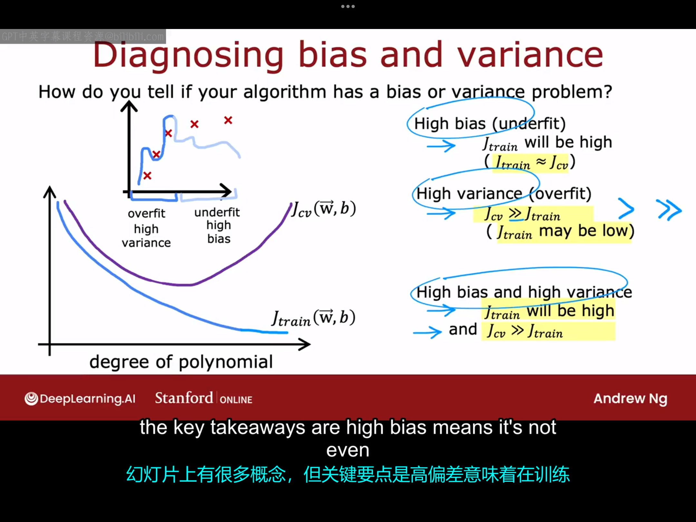
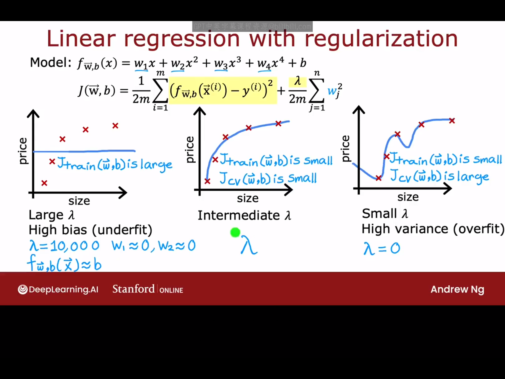
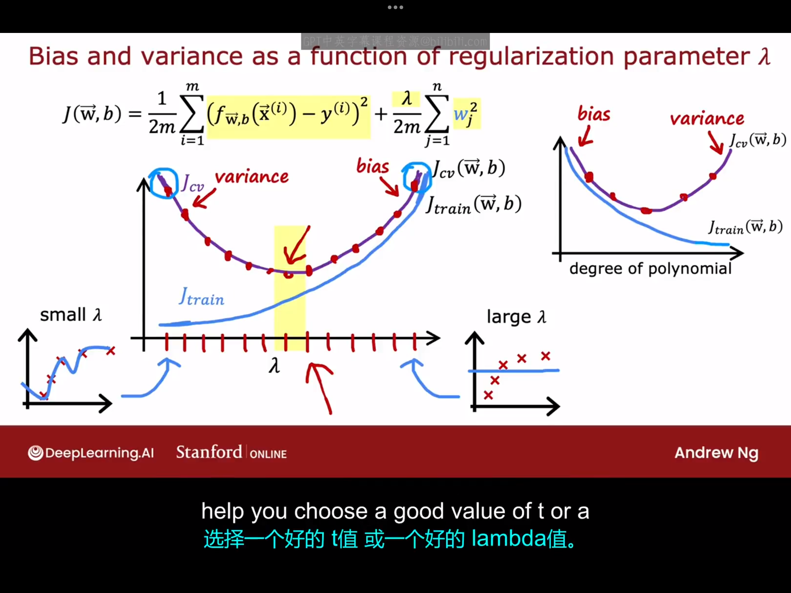
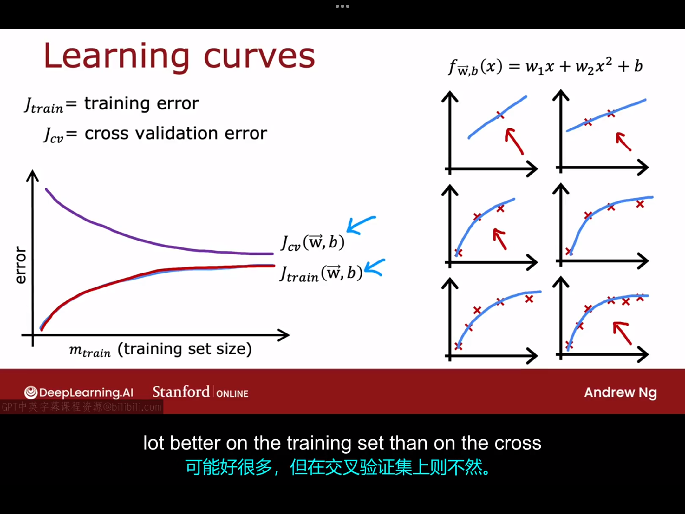
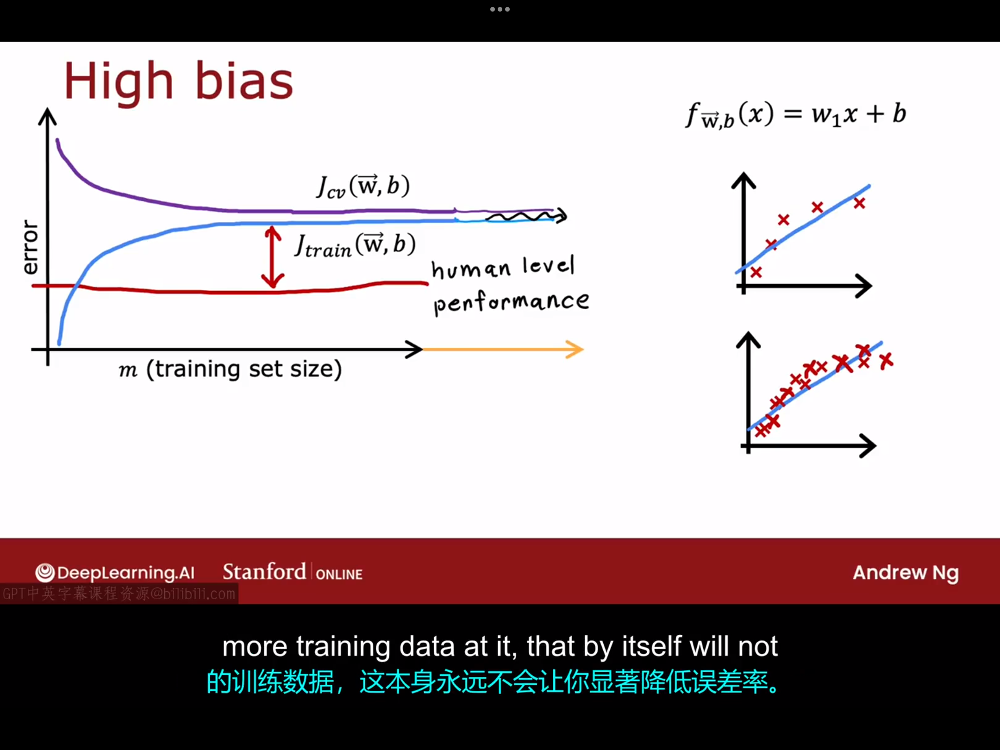
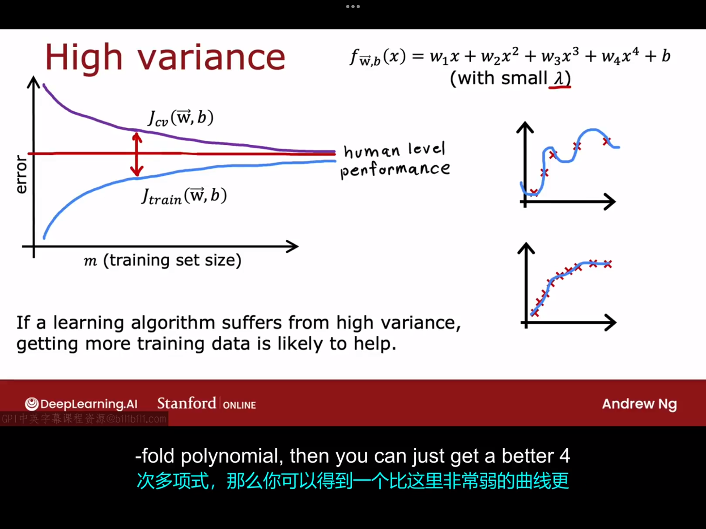
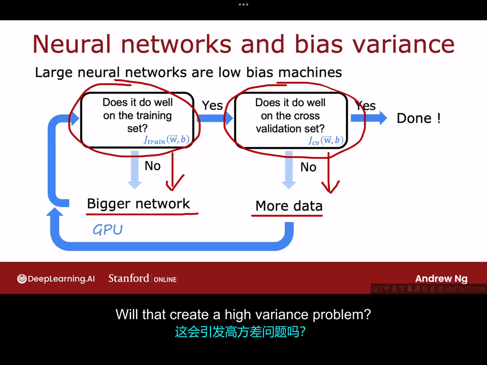
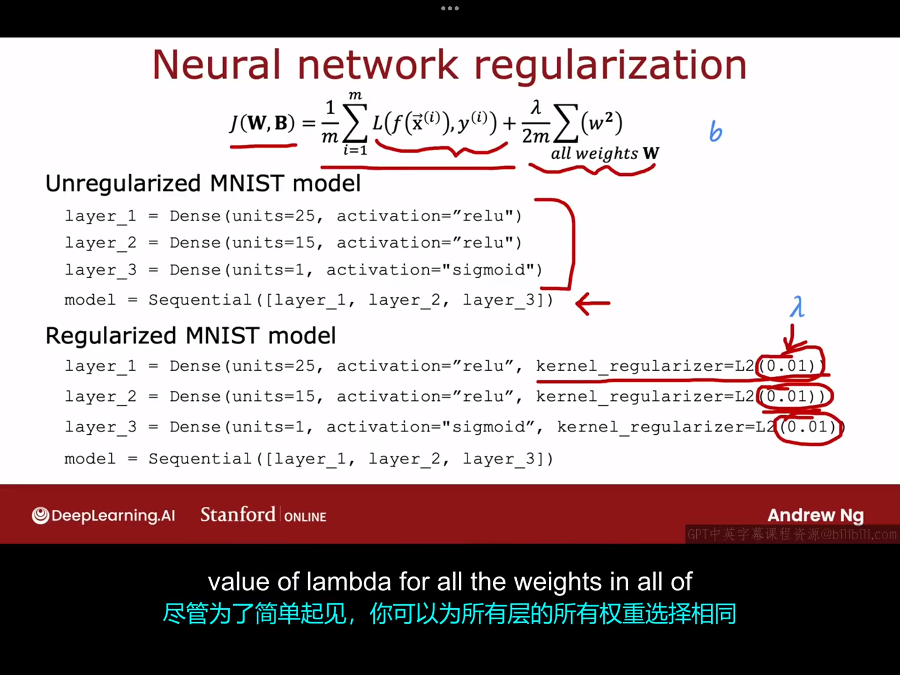

# 12.1 诊断偏差与方差
查看学习算法的偏差和方差可以很好地指导你下一步应该如何调整你的算法。本课程中第一次接触偏差与方差是在过拟合与欠拟合那里。在那时，我们使用的是关于某一个特征的多项式模型，预测输出与特征的函数关系图很容易画出来，我们当时可以根据函数图来判断是高方差还是高偏差。但如果一旦涉及到多特征，函数图不再容易绘制，我们这时如果想判断算法是否具有高偏差或者高方差，只能根据你的算法在训练集和交叉验证集上的表现来判断。
- 如果$J_{train}$较小，$J_{cv}$较小，对应于“just right”
- 如果$J_{train}$较大，$J_{cv}$较大，对应于“high bias”
- 如果$J_{train}$较小，$J_{cv}$较大，对应于“high variance”
  
$J_{train}$、$J_{cv}$随（模型的）多项式次数的大致变化图如下所示：

# 12.2 正则化与偏差/方差
本节课我们学习介绍正则化参数$\lambda$对学习算法偏差与方差的影响，这将有助于你选择合适的正则化参数$\lambda$。

我们依旧以之前的房价预测为例（假设我们使用的是一个四次模型）：

这里选择合适的$\lambda$的过程就类似于之前选择合适的多项式次数d的过程：先预设一系列$\lambda$的值，然后根据每个$\lambda$的值训练模型得到模型中的各个参数，然后在交叉验证集上计算损失函数的值，选择最小的代价函数值对应的那个$\lambda$作为最合适的正则化参数。最后，如果你想报告泛化误差的值，你可以用该模型在测试集上的误差近似代替。
$J_{train}$、$J_{cv}$随$\lambda$的大致变化图如下所示：

# 12.3 建立表现基准
前面的课程中我们判断高偏差还是高方差主要是根据$J_{test}$和$J_{cv}$的高和低来判断，那么具体的高和低的衡量标准是什么呢？本节课我们将以语音识别为例来说明这一点。
语音识别任务中我们是用未正确识别的比例来衡量误差的，例如，如果说某个训练集的训练误差是10.8%，这意味着它在89.2%的训练集上完美转录，，但在10.8%的训练集上出现了错误。如果继续测量语音识别算法在单独的交叉验证集上的表现，假设它得到了14.8%的误差。所以，如果你只看这些数字，似乎算法存在高误差问题。但事实证明，在衡量用于语音识别的模型误差是大还是小时，另一个指标也很重要——那就是人类在该任务重中的表现。假设人类在该任务中的识别误差是10.6%（因为必须得考虑实际应用场景下的噪声问题），这时候我们就没有理由认为语音识别算法在训练集上的10.8%识别误差是高误差，因为如果人类的误差都有10.6%，我们就不该期望算法在此任务中可以表现的更好。所以，衡量一个算法误差的高低，更合理的方法是把它和人类表现做对比。在这个例子中，算法的误差比人类只低0.2%，考虑到人类很擅长语音识别，实际上我会对该算法在训练集上的表现很满意。但现在有个问题是$J_{train}$比$J_{cv}$低不少，所以这个算法更大的问题是它可能具有高方差（而非我们之前认为的高偏差）。

所以在评估模型时，建立一个评判基准很重要，也就是说你希望你的算法达到什么误差水平，而建立误差基准的常见方法：
- 如果人类在某些任务上很擅长（比如语音识别、图像识别等），可以人类表现为基准
- 可以竞争算法的误差为基准
- 可以依靠自身经验建立基准

在建立基准、求得$J(train)$和$J(cv)$后,将三者值进行比较，如果基准和$J_{train}$差距明显，说明算法可能存在高误差，如果$J_{train}$和$J_{cv}$差距明显，说明算法可能存在高方差。

顺便说一下，你的算法可能同时存在高方差与高偏差，尽管这种情况并不会经常发生。

# 12.4 学习曲线

学习算法是一种帮助理解你的学习算法在经验量增加时的表现的方法，这里的经验指的是，例如，算法所拥有的训练样本数量。
下图给出了一般情况下$J_{train}$和$J_{cv}$随着训练集样本数量变化的变化趋势

让我们更进一步地考虑，如果你的算法具有高偏差，其对应的情况如下图所示：

通过学习曲线我们可以看到，无论训练样本的数量如何增大，$J_{cv}$在经过一段时间的下降后终究会趋于平稳（且会一直高于人类在此任务中表现的误差），也就是说，值增加训练集的大小并不会明显地改变算法的高偏差情况。这就是为什么，在投入大量的精力收集更多的训练数据之前，检查你的学习算法是否具有高偏差是很有必要的。如果它确实具有高偏差，你可能需要做一些别的事情，而不仅仅是给它投喂更多数据。

如果你的算法存在高方差呢？高方差下的学习曲线可能如下图所示：

从图中我们可以看到，当算法具有高方差时，增加训练集的大小可能会有很大帮助。

因此，如果你正在构建一个机器学习系统，你也可以尝试绘制出机器学习曲线。
如果你使用这种方法可视化，那么你可以借此判断你的算法是具有高偏差还是高方差。但绘制学习曲线的缺点是，它在计算上相当昂贵，需要训练使用不同大小子集的模型。因此，在实践中我们通常并不这样做。

# 12.5 再次决定下一步做什么
总结一下：
- 获取更多训练样本,有助于解决高方差
- 选用更少的特征，有助于解决高方差
- 选择额外的特征，有助于解决高偏差
- 尝试额外的多项式特征（例如$x_1^2,x_2^2,x_1x_2$等），有助于解决高偏差
- 增加正则化系数$\lambda$，有助于解决高方差
- 减小正则化系数，有助于解决高偏差
# 12.6 偏差/方差与神经网络

前面已经看到，高偏差或者高方差在某种意义上都是不好的，因为它们会损害算法性能。神经网络之所以如此成功的原因之一是，神经网络与大型数据集相结合，为我们提供了一种新的方式来解决高偏差和高方差的问题。

如果你听到一个机器学习工程师谈论偏差-方差权衡问题（the bias variance trade-off），他们指的可能是对于某一项任务而言，如果选择一个过于简单的模型可能会导致高偏差，如果选择一个过于复杂的模型可能会导致高方差，你必须在二者之间做出权衡.但事实证明，神经网络为我们提供了一种摆脱这种偏差和方差困境的方法。

事实证明，大型神经网络在小型到中等规模的数据集上训练时，是低偏差的机器。也就是说，如果你使用的神经网络足够大，你几乎总能很好地拟合你的训练集，只要你的训练集不是巨大的。根据这一特点，我们可以采用以下方法设计一个神经网络。

理论上来说，上述方法大多数情况下是可行的。但在实际应用时却存在一定的约束，例如：1.神经网络过大的话需要高额的训练成本。2.庞大的数据集难以获取。

有个问题值得我们注意，那就是神经网络如果太大是否会导致高方差的问题？事实证明，一个经过适当正则化的大型神经网络通常会表现得和较小的神经网络一样好，甚至更好。另一种说法是，只要你适当地正则化，几乎永远不会因为使用更大的神经网络而受到伤害（除了会减慢你的训练和推理过程）。神经网络中实现正则化的代码如下所示：

