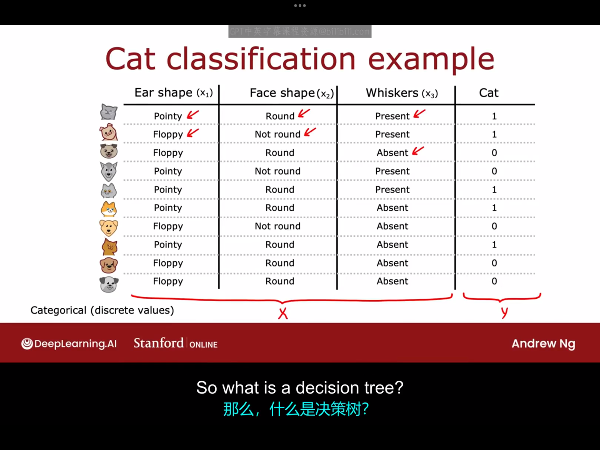
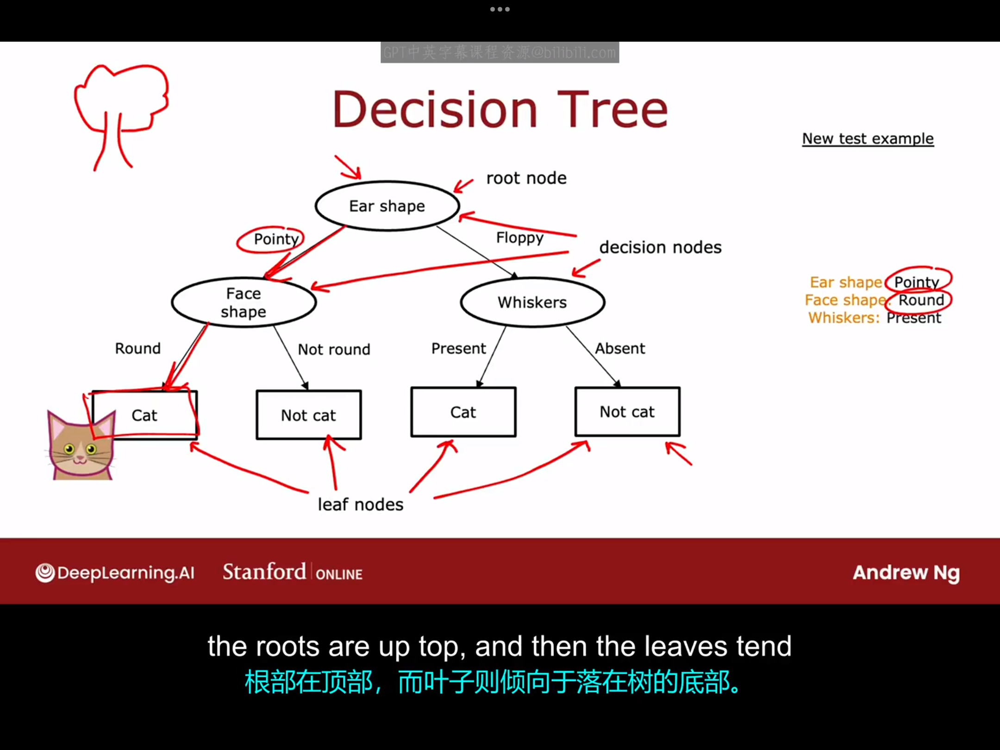
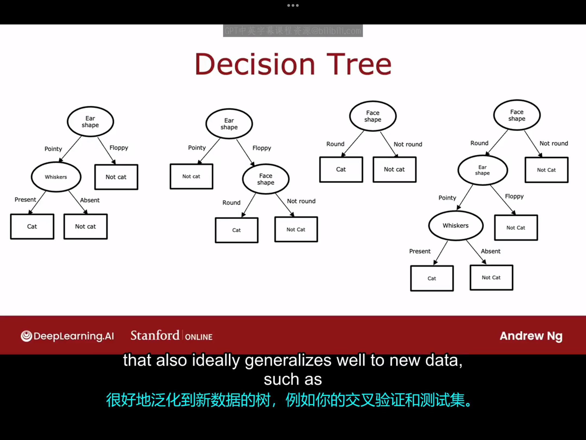
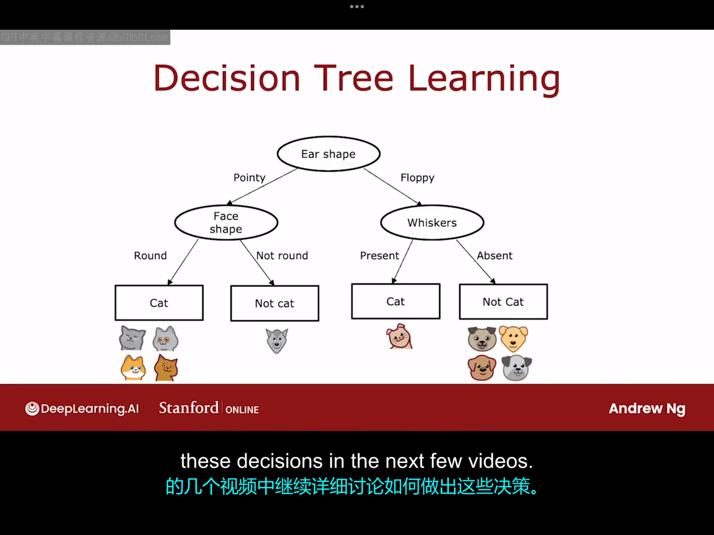

# 15.1 决策树模型
决策树及其集成算法是非常强大且广泛应用于许多应用中的学习算法，也被许多人用于赢得机器学习竞赛。尽管决策树取得了许多成功，但其在学术界并未受到太多关注。

为了介绍决策树模型，我将用一个猫分类的例子贯穿始终。假如你正在经营一个猫领养中心，你希望实现一个分类器，该分类器能通过几个特征来快速判断一个动物是不是猫。现有一个包含十个样本的数据集如下图所示：

这里的输入特征是第一到三列，只取分立值，想要预测的输出变量是最后一列，取值也只能为0和1。

那么，什么是决策树。下图给出了一个模型示例，你可能在训练了一个决策树学习算法后得到这个模型：

下面我们将通过一个例子来使你对计算机科学中的“树”的定义也有所了解。
上图中的每个椭圆和矩形都称为树的节点(node)，这个模型的工作方式是这样的：
如果你有一个新的测试样本————一只尖耳、圆脸、有胡须的动物。它将通过以下步骤被分类：
- 该动物首先位于根节点（root node）处(ear shape)，由于该动物的耳朵形状是"pointy"，故其向左移动到达节点(Face shape)。
- 到达face shape这一节点后，由于该动物的脸型是"round"，故该动物向左移动到达节点"cat"，这就说明算法推测该动物是一只猫猫。

该决策树模型中每部分对应的术语：
- Ear shape:根节点(root node)
- Face shape、Whiskers:决策节点(decision nodes)
- 最下面的四个矩形框：叶节点(leaf nodes)

以上只是一种可能的决策树模型，下图中列出了其他可能的决策树模型：

在这些不同的决策树中，有些在训练集或交叉验证集和测试集上表现的更好，有些则表现的更差。因此，决策树学习算法的任务是，从所有可能的决策树中，尝试挑选一个在训练集上表现良好，并且理想情况下也能很好地泛化到新数据的树，例如你的交叉验证集和测试集。因此，对应同一个应用我们可以构建多种决策树，那么如何让算法根据训练集学习一个特定的决策树呢？我们将在下个视频中看到这一点。
# 15.2 学习过程
本节课我们仍然使用上一节课的数据集来讨论问题。构建决策树算法的第一步就是决定根节点是什么，假设我们这里选择根节点为"ear shape"，然后根据此特征将训练集内的样本分为两类（左、右各有五只动物），这里我们只分析从根节点延伸出的左边那枝的情况（另外一支同理）。我们选取左边的决策节点为"Face shape"，然后根据样本对应的特征将样本再次分为两类，在此次分类完成后，我们注意到圆脸对应的所有动物全是猫咪，而非圆脸对应的所有动物都不是猫咪。故此时我们可以依此创建两个叶节点"Cat"和"Not cat"实现预测。这就是构建一个决策树的过程，相关示意图如下图所示：

通过以上过程我们可以看到，我们在算法的各个步骤必须做出一些关键决策，下面我们来看看这些关键决策是什么，以及后面的几个视频我们会详细介绍如何做出这些决策。
- 关键决策1：我们应如何选择每个节点处的特征？（maximize purity）
  答：对于这个问题，我们一般希望最终的分类结果具有最大的纯度（所谓纯度，就是希望得到尽可能接近全是猫或者全是狗的子集）如果你能得到一个高纯度的例子子集，那么你就可以预测是猫或者不是猫，并且大部分情况下都是正确的。下个关于熵(entropy)的视频将介绍不纯度以及如何减小不纯度
- 关键决策2：决定何时停止分裂。
  答：
  1.在我们刚才的例子中，当有一个节点下全是猫，另一个节点下全不是猫的时候我们停止了分裂。
  2.实际上，如果进一步分裂节点会导致树超过最大深度，那么你此时也可以选择停止分裂。你可以设置一个参数来决定树允许生长的最大高度。在决策树中，某个节点所处的深度是指从根节点到达该节点所需的步数。需要合理控制决策树的最大深度的原因是，一方面不会因为树太大而变得难以管理，另一方面可以有效防止过拟合。
  3.另一个你可能用来决定停止分裂的标准是，如果继续分裂导致的纯度分数（purity score）的改进低于某个阈值，也就某次分裂后你虽然看到了纯度的降低，但如果受益太小，那你此时也可能会选择停止分裂
  4.如果某节点下的例子数量低于某一个阈值，那么你也可以选择停止分裂。例如，如果某次分裂后，某节点中的样本一共只包含三只动物，其中两只是狗，一只是猫，那么此时为了减小过拟合的风险，我们也可以选择停止分裂。由于这里狗的数量大于猫，所以我们将在这里做出"Not cat"的预测。
  