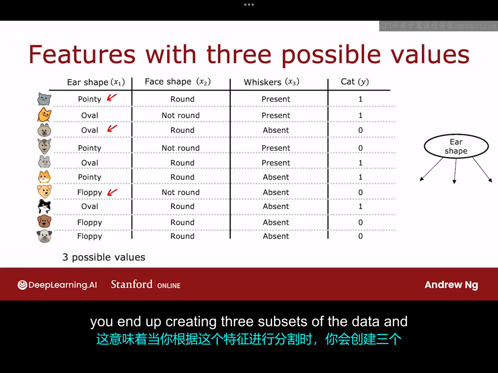
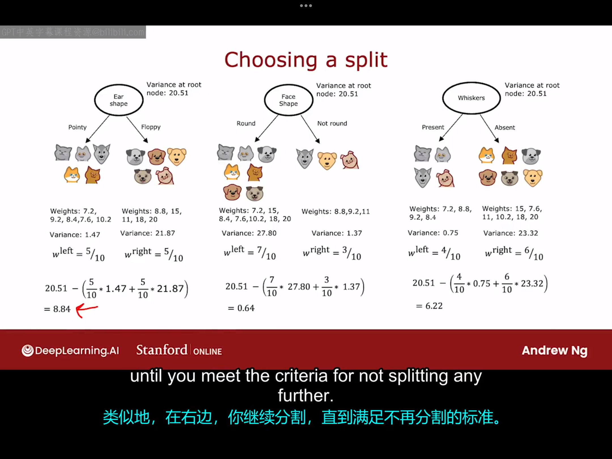

# 16.1 测量纯度 (measuring purity)
在这个视频中，我们将探讨一种测量样本集纯度的方法，如果样本全是同一类别，那么纯度是非常高的。但如果一个样本包含的东西并不属于同一类别，那我们应该如何量化这个样本的纯度呢？
我们将使用一个称为熵的函数来测量样本集的不纯度，它的定义为：
$$
H(p_1)=-p_1\log_2(p_1)-p_0\log_2(p_0)
$$
其中，$p_1$为样本中正例的比例，$p_0=1-p_1$，熵的函数图像如下图所示：

当$p_1$=1或0时，熵为0。当$p_1$=1/2时，熵最大，为1。按照惯例，在计算熵时，我们使用以二为底的对数，而不是以e为底的对数，这只是为了使熵的最大值为1。还有一点需要强调，在计算熵的过程中，可能会出现"$0\log0$"，$\log0$是无定义的，但为了计算熵的需要，我们统一将$0\log0$视为0。

实际上，你可能会发现，这里的熵的定义有点类似于之前我们学到的逻辑回归中损失函数的定义。再次强调一下，熵函数是用来描述样品不纯度的函数。
# 16.2 选择分裂：信息增益（information gain）
在构建决策树的过程中，我们决定在某个节点具体使用哪个特征进行分裂主要是取决于哪种分裂方法最能减小熵，或者减小不纯度，或者最大化纯度。在决策树学习中，熵的减少称为信息增益。本节课我们将学习如何计算信息增益，从而选择在决策树的每个节点上使用哪个特征进行分割。

让我们以根节点的选择为例，具体计算如下图所示：

上图给出了在根节点处分别选择"Ear Shape"，"Face Shape","Whiskers"作为分割特征后分别对应的熵的情况。我们现在面临的问题是，给定这三个在根节点上使用的特征选项，我们如何判断哪一个效果更好？事实证明，与其直接比较这些熵的数值，不如对他们进行加权平均。与这些分割相关的每个都有两个数字，左子分支的熵和右子分支的熵。为了做出选择，我们通过加权平均的方法将这两个数字合并单一的数字，这样就方便我们从这三个选择中挑出看起来最好的一个选择。我们将通过加权平均来合并这两个数字，这时因为在一个子分支中拥有低熵的重要性也取决于有多少例子进入了左、右子分支，因为如果在一个子分支中有大量的例子，那么确保该子分支的熵值低似乎更加重要。具体的加权方法也已经在图中给出，这里不再赘述。但实际上，我们在构建决策树的过程中，并不是直接选择加权结果平均最小的方案，我们会对公式做一些修改，以符合决策树构建的惯例，但这并不会改变结果。我们并不是直接计算这个加权平均熵，而是计算与未分割时的熵的减小值。因此，如果我们回到根节点，我们在根节点一共十个样本，包含五只猫和五只狗，所以在根节点我们$p_1=0.5,H(p_1)=1$，因此，我们需要的最终结果并不是加权平均熵，而是$H(p_1=0.5)$减去加权平均熵所得到的结果（即信息增益）。那么为什么我们需要的不是加权平均熵而是信息增益呢？事实证明，决定何时不再进一步分割的停止准则之一是信息增益过低。如果熵的减少量太少，你就没有必要冒着决策树太大难以管理和过拟合的风险去进行下一步分割。我们可以设定一个阈值，如果信息增益小于该阈值，就决定不再进一步分割。

现在我们来介绍一下信息增益的更正式的定义，如下图所示：

现在你已经知道了如何计算信息增益，故你已经可以决定如何在每个节点上选择一个特征进行分割。
# 16.3 综合应用前几节课的知识
计算信息增益可以帮助你决定在每个节点应该选择什么特诊进行分类，让我们把这种方法用在决策树的多个地方，以便弄清楚如何完整地构建一个决策树。
下面介绍构建一个决策树的具体过程：
1.从根节点开始，包括所有训练样本，计算所有可能特征的信息增益，并选择信息增益最高的特征进行分裂。
2.选择根节点对应的特征后，根据所选特征将数据集分成两个子集，树的左右分支创建完成。
3.继续在树的左分支和右分支上重复分裂过程，直到满足停止标准。下图给出了一个完整的决策树的例子：

实际上，决策树的构建过程中包含了递归算法（recursive algorithm）。因为左、右子树的构建过程就是根节点分裂过程的不断递归，根节点构建决策树的方式是通过在左子分支和右子分支上构建其它较小的决策树。因此，在构建决策树时，你可以通过构建较小的决策树然后再将它们组合在一起来构建整个决策树。这就是为什么有时候你查看决策树的软件实现，有时会看见对递归算法的引用.如果你不是使用库而是想从头开始实现来实现决策树模型，那么递归算法是一个必要的步骤。
理论上，你也可以通过构建交叉训练集来选择像最大深度这样的参数（不过在实践中，开源库有更好的方法来帮助你确定这一参数）。

# 16.4 使用独热编码（one-hot encoding）的分类特征
到目前为止，我们所举的例子中特征的取值都只有两个，但如果你的特征可以取两个以上的离散值呢？在这段视频中，我们将探讨如何使用独热编码来处理这类特征。
假设之前的十个动物样本的新特征如下所示：

我们可以从图中注意到，这张图的Ear shape那一栏的取值不再仅限于"Pointy"和"Floppy"，还多了一个"Oval"，这意味着你根据这个特征在进行分割时，你会创建三个数据子集，并为决策树构建三个子分支。但在本视频中我将介绍一种新的方法来处理某个特征具有两个以上可能取值的情况，即使用独热编码。
具体地，我们不再使用可以取三个可能值的耳朵形状作为特征，而是创建三个新的特征，其中一个特征是，这只动物是否有尖耳(Pointy)。第二个是，它有聋拉的耳朵吗(Floppy)？第三个是，它有椭圆形的耳朵吗？具体的图示如下图所示：

从上图中我们可以注意到，在描述耳朵形状的三个特征对应的三列中，每一行的三个数字中有且仅有一个数字等于1，这就是这种特征构造方法被称为独热编码的原因。
总结：通过独热编码，你可以让决策树处理多个离散值的特征。你还可以将此应用于神经网络或线性回归或逻辑训练。但是，如果遇到可以连续值而不是少数离散值的特征，决策树又应该如何处理它们呢？我们将在下个视频中看到这一点。
# 16.5 连续值特征
本节课我们将学习如何改进决策树算法使得其可以处理特征取连续值的情况。我修改了猫咪了领养中心的数据集，增加了一个新的特征，即体重（平均而言，猫的体重可能比狗轻一点，故体重也是一个有用的特征），具体情况如下图所示：

那么，如何让决策树使用这样的特征呢？也就是说，如何实现基于体重特征的分裂呢？一种常用的方法是我们根据体重是否小于或等于某个值来分割数据（也就是选定一个阈值）。在考虑基于体重的分割时，我们应该尝试多个阈值，然后选择效果最好的那一个。所谓效果最好，这里指的是获取信息增益最大的那一个。我们可以选择如下几个阈值并计算出它们对应的信息增益：

在更一般的情况下，我们实际上不会只尝试三个值，而是会尝试x轴上的多个值。一种惯例是根据权重或者这个特征的取值对所有示例进行排序，并取排序列表中训练示例之间的所有中间值作为这里的阈值。这样，如果你有十个训练样本，你将测试9个不同的阈值，然后选择那个能给你带来最高信息增益的那个阈值。
# 16.6 回归树（可选）
到目前为止，我们只讨论了决策树作为分类算法。在这个可选视频，我们将决策树推广为回归算法，以便它们可以预测一个数值。本节课我们使用的例子是使用动物的一些分立特征来预测动物的体重，具体的数据集如下所示：

在这里，我已经为了这个回归问题构建了一棵树，其中根节点根据耳形进行分割，然后左右子树根据脸型进行分割（在决策树中，选择左右子树分割相同的特征并没有错。如果分割算法选择这样做，那是完全没问题的）。如果你已经在训练算法中决定了这些分割，那么每个叶节点对应的情况如下图所示：

对于这棵决策树，如果有一个测试样本达到四个叶节点中的某一个，那么该决策树给出的预测就是该叶节点下的所有动物的平均体重。

如果你要从头开始使用这个数据集构建决策树来预测体重，关键决策就变成了如何选择要分割的特征，下面将举个例子来说明。

在选择根节点处的的分裂特征时，你可以选择"Ear Shape"或"Face Shape"或"Whiskers"中的一个，对应的图示如下图所示：

现在的问题是，给定这三个可能的特征在根节点进行分割，你应该选择哪一个特征来给出动物体重的最佳预测？在构建回归树模型时，我们不再试图减少熵，而是试图减少数据子集中y值的体重的方差（加权平均方差），具体的计算结果如上图所示。对于回归树，你会选择给出最大加权平均方差减少的特征，故根据图中计算结果我们应选择耳朵形状作为分割，然后再以相同的步骤去实现回归树的剩下的部分，这样你就可以用回归树实现回归功能了。
