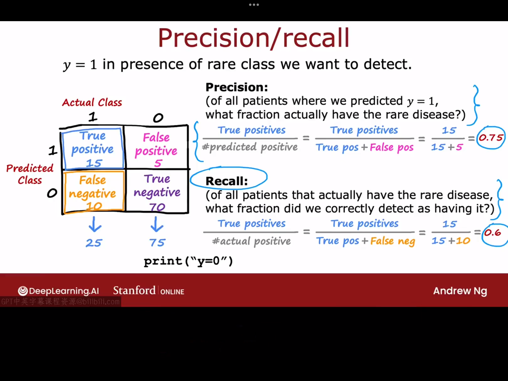
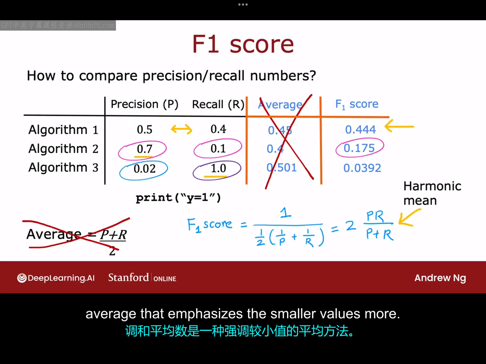

# 14.1 倾斜数据集的误差指标
如果你正在处理一个机器学习应用，其中正例与负例的比例非常偏斜，远非50-50，那么事实证明，像准确率这样的常见误差指标效果不好。假设你正在训练一个二元分类器，用于根据实验室测试或其他患者数据检测一种罕见疾病。一因此，如果疾病存在，y=1,否则y=0。假设你发现你在测试集上达到了1%的误差，也就是说你有99%的正确正确诊断率。这种情况乍一听起来好像还挺不错，但如果考虑该疾病是一种十分罕见的疾病，即y=1的概率很低（假设发病率为0.5%），假设你写了一个程序只有这样的一行代码:
```python
print("y=0")
```
显然，这行代码并不涉及任何的学习过程，但该代码的预测结果准确率高达99.5%，但显然我们并不能认为这行代码是一个很好的诊断工具。从这个例子我们可以看出来，如果一个算法的误差是0.5%，另一个算法的误差是1%，还有一个算法的误差是1.2%，我们并不能简单地认为误差为0.5%的算法效果最好，因为它可能给出的不是一个特别有用的预测（例如总是预测y=0）。

在处理倾斜数据集的问题时，我们通常使用不同的误差指标，而不是仅仅使用分类误差来判断你的学习算法的表现。特别地，一对常见的误差指标是精确率（precision）和召回率(recall)，我们将在下图中给出它们的定义：

根据上图中的定义，如果一个算法只能输出"y=0"这一结果，那么"true positive=0"，因此召回率也等于0。一般来说，我们并不认为召回率或准确率恒为0的代码是有用的代码。补充一句，如果一个代码并未预测出任何正例，那严格来说精确率此时并未被定义。但在实践中，如果算法没有预测出甚至一个正例，我们通常会说精确率也为0。因此，计算精确率和召回率有时更容易让你发现你的算法中存在的问题。
关于精确率和召回率的一些更为详细的知识：
- 精确率：
  意义：​衡量预测结果的“准确性”或“可靠性”。​​ 它回答的问题是：“当模型说某个东西是‘正’的时候，它有多大概率是对的？​”
  关注点：​​ 模型预测出的“正例”的质量。精确率高意味着模型预测为正例的结果中，误报（假正例）很少。
 ​高精确率的好处：​​ 当你非常在意避免误报时，高精确率很重要。
 例如：在推荐系统中，给用户推荐商品（预测为正例=推荐）。高精确率意味着你推荐的商品，用户真正感兴趣（是正例）的比例很高，用户体验好。
 例如：在垃圾邮件检测中，高精确率意味着被标记为垃圾邮件的邮件，确实大部分是垃圾邮件，减少了把重要邮件误判为垃圾邮件的风险。
- 召回率:
  意义：衡量模型发现正例的“全面性”或“覆盖率”。​​ 它回答的问题是：“模型把所有真正的‘正’的东西，找出来了多少？​”
  关注点：模型找出所有真实正例的能力。召回率高意味着模型漏掉的正例（假负例）很少。
  ​高召回率的好处：​​ 当你非常在意避免漏报时，高召回率很重要。
 例如：在疾病诊断（尤其是严重疾病）中，高召回率意味着尽可能多地识别出真正的患者（正例），避免漏诊（假负例），即使这意味着可能会有一些健康人被误诊（假正例）需要进一步检查。
 例如：在欺诈交易检测中，高召回率意味着尽可能多地抓住真正的欺诈交易（正例），避免让欺诈交易得逞（假负例），即使这意味着可能会误拦一些正常交易（假正例）需要人工复核。
因此，当你处理稀有类别时，查看精确率和召回率，并确保这两个数值都相当高，这有助于你确信学习算法实际上是有用的。

# 14.2 精确率与召回率的权衡
在理想情况下，我们希望我们的算法同时具有高精确率与高召回率。高精确率意味着如果该算法预测某个人患有该疾病，那么这个人确实有很大概率患有该疾病。高召回率意味着如果存在患有该罕见疾病的患者，算法有很大的可能将他们识别出来。但事实证明，在实践中，精确率与召回率之间通常存在权衡。在本视频中，我们将探讨这种权衡（trading off）以及如何在这两者之间选择一个合适的点。

在之前的逻辑回归的例子中，我们都是选择0.5作为判断的阈值。但如果现在有这样一种疾病，治疗它需要花费昂贵的代价，而且这种病的危害不大，我们只想在非常确定的情况下才预测y=1。这时我们可以选择设置一个更高的阈值。通过提高阈值，你只有在相当确定的情况下才预测y=1.这意味着精确度会增加，因此，提高阈值会导致更高的精确度，但也会导致更低的召回率（因为我们现在更少地预测y=1。

另一方面，假设我们希望避免错过太多罕见疾病的病例，也就是说，我们想要在有疑问时预测y=1,这可能对应于如果某疾病不及时治疗就会对患者造成更严重危害的情况。这种情况下，你可以降低你的阈值，这将导致更高的召回率与更低的准确率。对于许多应用，手动选择阈值以在精确率和召回率之间进行权衡是您最终要做的事情。事实证明，如果你想自动权衡精确率和召回率而不是自己去做这件事情，还有另一个称为F1分数的指标，有时用于自动结合精确度和召回率，以帮助您选择最好的权衡。精确率和召回率的一个挑战是您现在使用两个不同的指标来评估您的算法。因此，如果您训练了三个不同的算法，并且精确率和召回率如下图所示：
你很难直接一眼看出来具体选择哪一种算法比较好，因为算法一二三各有优点：算法一在精确率与召回率之间做了权衡，算法二具有更高的精确率但同时有更低的召回率，算法三具有超高的召回率但同时有超低的准确率。为了帮助您决定选择哪种算法，找到一种将精确率和召回率折合成单一分数的方法可能会有用。一种结合精确度和召回率的方法是取平均值，但事实证明取最高平均值的方法在这里并不是那么有效。相反，最常见的结合精确度和召回率的方法是计算一个称为F1分数的东西，F1分数是一种结合P和R(精确率和召回率)的方法，但它更强调两个值中较低的那个。因为事实证明，如果一个算法的精确度和召回率非常低，它可能并不是十分有用。计算F1分数的具体公式是这样的：
$$
F_1=\frac{1}{\frac{1}{2}(\frac{1}{p}+\frac{1}{R})}=2\frac{PR}{P+R}
$$
计算三个算法的$F_1$score如上图所示，$F_1$score告诉我们算法一可能比算法二和算法三更好。在数学中，$F_1$score被称为P和R的调和平均数（这是一个更强调较小值的平均数）。
