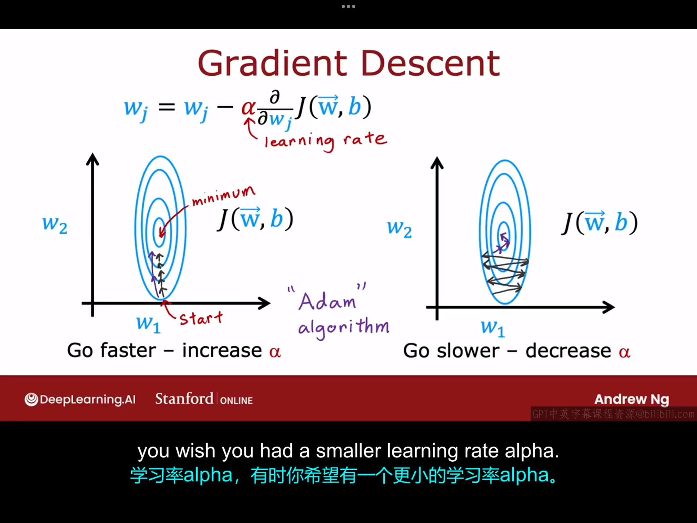
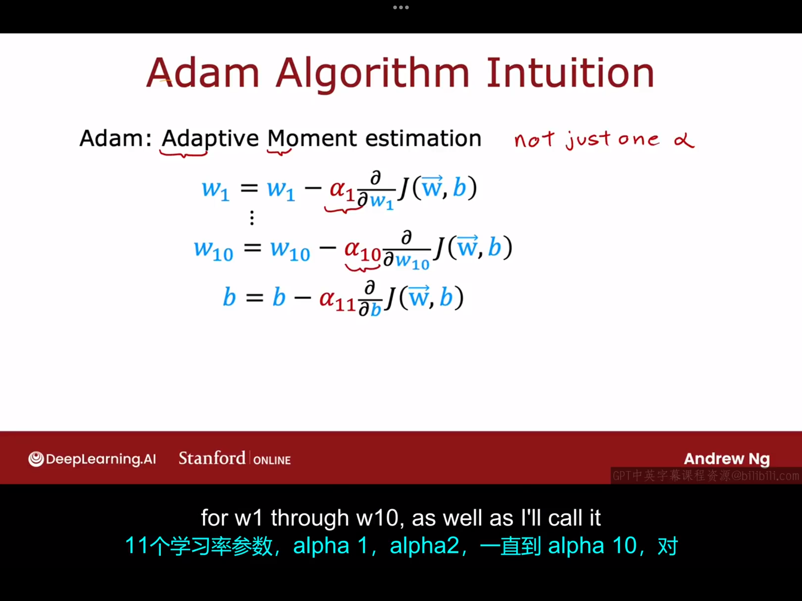
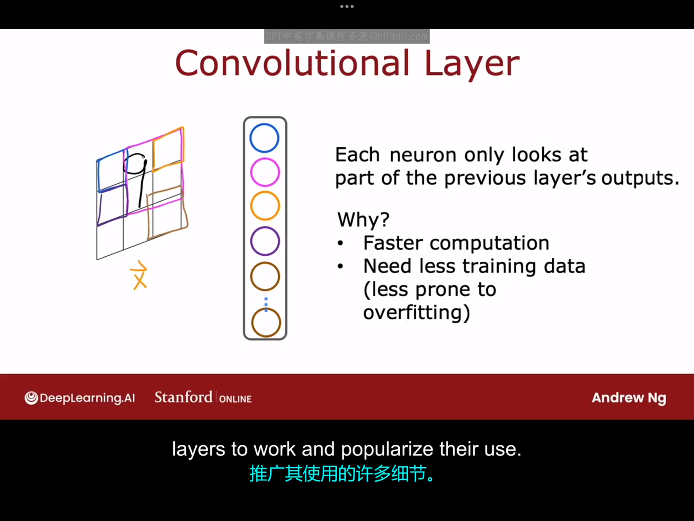
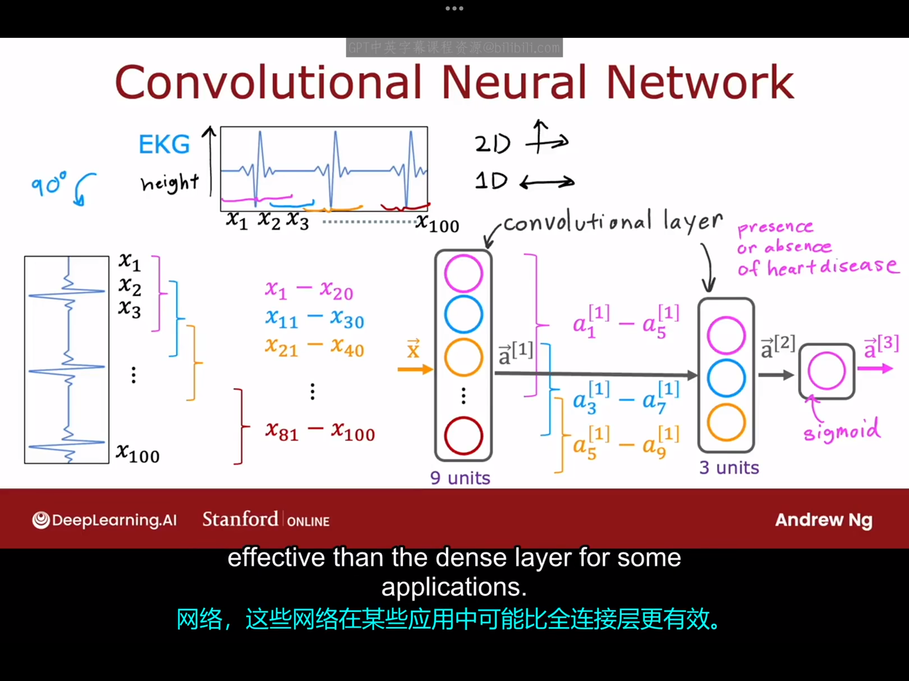

# 10.1 高级优化 
梯度下降是一种广泛用于机器学习的优化算法，是许多算法实现的基础。但是事实证明，现在有一些其它优化算法用于最小化代价函数，他们比梯度下降更好。在本视频中介绍一种比神经网络更快的算法。
在梯度下降算法中，选择1合适的学习率是一件很重要的事情。学习率过小或者过大分别对应下图左右两种情况：

对于左边的情况，梯度下降几乎始终沿着同一个方向，对于这种情况，你可能会想：为什么不把学习率调大一点呢？进一步地，是否会有一个算法可以自动调整学习率的大小使得梯度下降算法更快地完成呢？这个问题的答案是肯定的，确实有一种算法叫Adam（Adaptive Moment Estimation，自适应矩估计）算法，它可以做到这一点。

Adam算法不使用单一的全局学习率$\alpha$，它为模型的每个参数使用不同的学习率。因此，如果你有参数$w_1,w_2,...,w_n$和b，那么实际上会有十一个学习率,如下所示：
对于Adam算法的直观理解：如果参数$w_j$或者b在梯度下降过程中一直沿着同一个方向变化，那么算法会相应地增大$\alpha_j$，如果参数$w_j$或者b在梯度下降过程中来回震荡，那么Adam算法会相应地减小$\alpha_j的值$。Adam算法的具体实现较为复杂，超出了本课程的范围，这里只介绍一下如何使用这个算法。如果想要使用Adam算法，只需要将compile部分的代码改成如下形式即可：
```python
model.compile(optimizer=tf.keras.optimizers.Adam \n
(learning_rate=1e-3),loss=tf.keras.losses.\n
SpareCategoricalCrossentropy(from_logits=True))
# 这里的1e-3是全局初始学习率
```
如今，大多数的从业者都会使用Adam算法而不是梯度下降算法，因为前者运行速度更快。

# 10.2 额外的层类型
目前为止，我们使用的所有神经网络层都是全连接层，其中每一层的每个神经元都从前一层的所有激活中获取输入。事实证明，仅使用全连接层类型，你就可以构建一些非常强大的学习算法，但你也可以在神经网络中选择使用其他类型的层，下面让我们一起来看一下。

例如，你在某些工作中可能会看到的另外一种层的类型称为卷积层，让我们举一个手写数字识别的例子来说明一下：

假设这里的输入是一个印有手写数字"9"的图片，我们要做的是构建一个隐藏层，它将根据这个输入图像x计算不同的激活。假设该隐藏层中的每种颜色的神经元只能查看输入的图片中对应颜色区域内的像素（如图所示）。那我们为什么要这样设计这个隐藏层呢？可能的优点有如下几个：
- 更快的计算速度
- 需要更少的训练数据（减少过拟合的风险）
  
这种神经网络层，即其中的每个神经元只能查看输入图像部分区域的神经网络层，叫做卷积层。下面举一个隐藏层中有多个卷积层的卷积神经网络的例子：

上图描述了完成这样一个任务的卷积神经网络的框架：根据心电图的形状判断该病人是否患有心脏病。这里的处理方法是将心电图的时间轴划分成100等份，以次信号作为输入，隐藏层的第一层有九个神经元，第一个神经元读取第0-20个信号，第二个神经元读取第11-30个信号，依次类推。隐藏层的第二层有三个神经元，具体每个神经元读取前一层的哪几个激活已经在图中清楚标注出来了，输出层是一个sigmoid激活函数，判断病人是否有心脏病。卷积神经网络你需要设置的构架参数主要有：每层有多少个神经元，每个神经元负责读取前一层的哪些激活等。与全连接层相比，卷积层会在某些特定领域表现出很大的优势。


