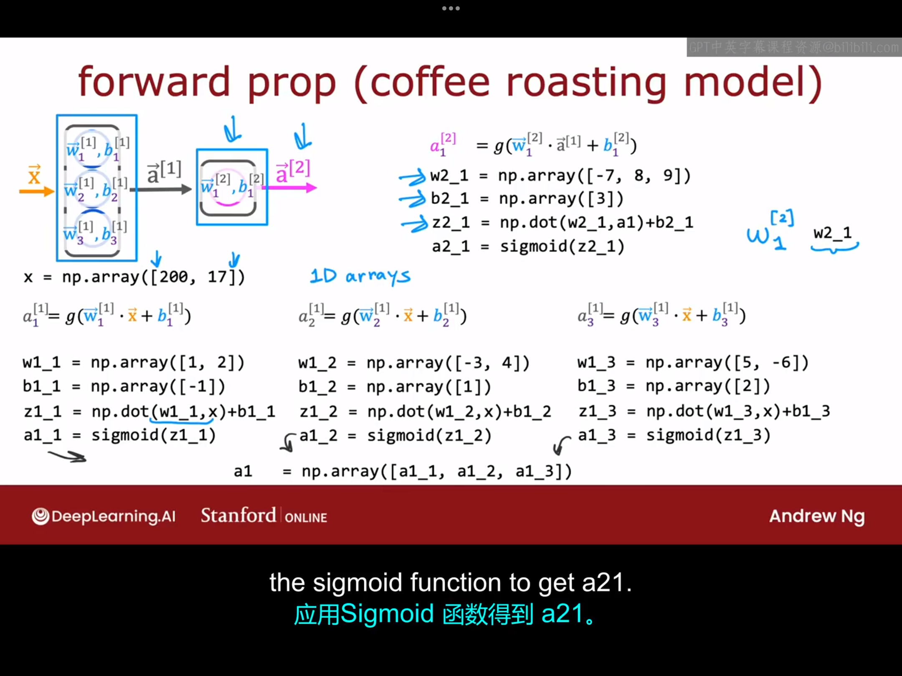
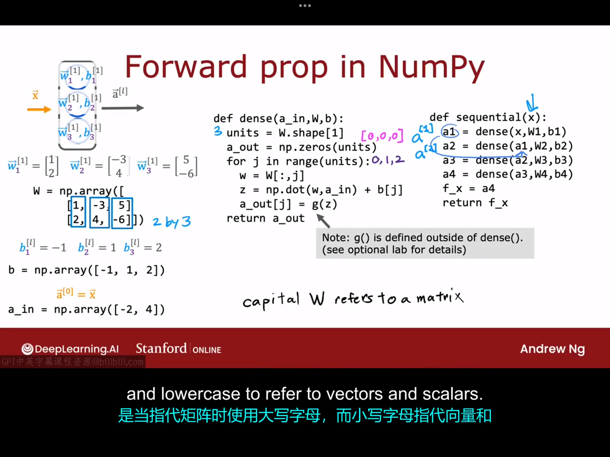

# 4.1 单层向前传播
本节课我们将要教你如何在python中从头实现前向传播，我们仍然以烘焙咖啡为例:

幻灯片上的代码不完全，因为sigmoid函数在函数库中没有，需要借用np.exp()来定义，具体代码如下：
```python
import numpy as np

x=np.array([200,17])

w1_1=np.array([1,2])  #w1_1中第一个1代表上标，第二个1代表下标
b1_1=np.array([-1])
z1_1=np.dot(w1_1,x)+b1_1
a1_1=1/(1+np.exp(-z1_1))

...

...

...

#其余神经元代码同理，此处不再赘述
a1=np.array([a1_1,a1_2,a1_3])
a2=...
```

# 4.2向前传播的通用实现
上节课我们一步步实现了前向传播的神经网络算法，但它需要一个一个地编写每个神经元对应地代码，当神经元数量太多时，这种方法太过麻烦。所以本节课我们将定义两个函数(Dense()、Sequential())，以后就可以通过这两个函数实现python中构建神经网络的一种更通用的方法。假设图中神经网络层中各个神经元中的参数值如下图所示:

```python
W=np.array([     #线性代数中，用大写字母表示矩阵，小写字母表示向量
    [1,-3,5],    #这里幻灯片上的代码应该是少了个逗号。
    [2,4,-6]     #每一列代表某个神经元中的一组参数。
])
b=np.array([-1,1,2])
a_in=np.array([-2,4])

def Dense(a_in,W,b):
    units=W.shape(1)
    a_out=np.zeros(units)
    for j in range(units):
        w=W[:,j]
        z=np.dot(w,a_in)+b[j]
        a_out[j]=g(z)
    return a_out    #注：g() is defined out of Dense()

def Sequential(x):
    a_1=Dense(x,W1,b1)
    a_2=Dense(a_1,W2,b2)
    a_3=Dense(a_2,W3,b3)
    a_4=Dense(a_3,w3,b3)        #假设这个神经网络有四层
    f_x=a4
    return f_x
```